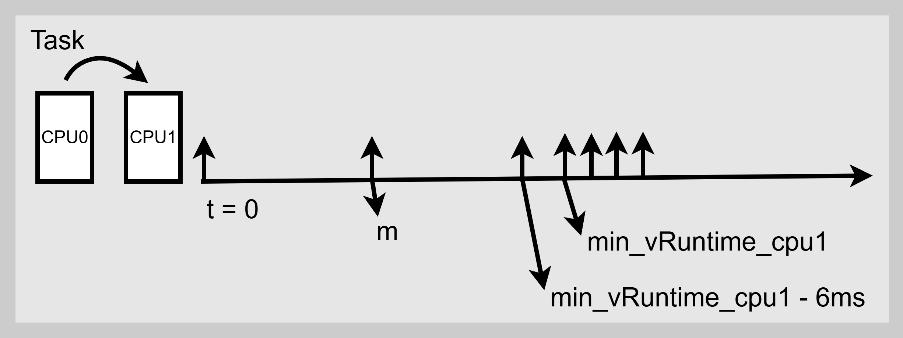
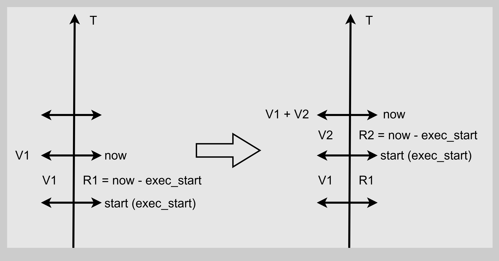
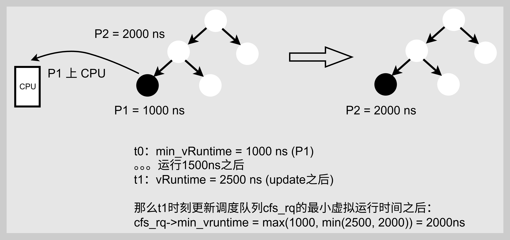
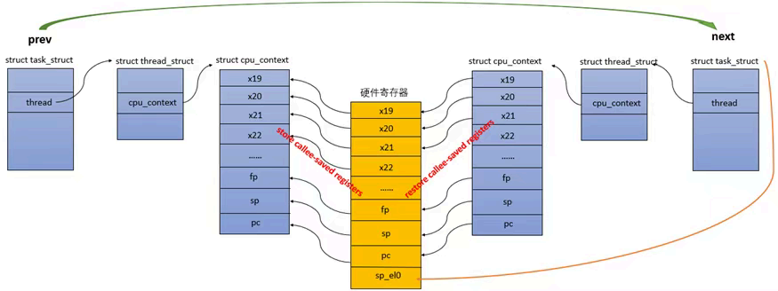

# Linux内核CFS调度算法原理与源码分析

[TOC]

# 0、总结

CFS的公平性本质是 **“按权分配时间，按需补偿延迟”**：

- 按权分配：通过权重比例分配CPU时间（高权重进程实际占用更多）；
- 按需补偿：通过vruntime最小化策略，保证所有进程的虚拟时间轴同步推进，避免低优先级进程饥饿。

这种设计既满足优先级需求，又在宏观上实现了“完全公平”（Completely Fair），是Linux调度器的核心创新。

使用的Linux内核版本：Linux-4.18.10 （后续会升级为比较新的Linux-6.1.5.8版本，在主要流程上两个版本无本质差别，细节上会有一些差别）


# 1、CFS公平调度算法介绍

## 1.1、vruntime计算公式

​	之前分析了linux内核的整体调度系统的原理与流程，这篇文章继续分析一下具体的CFS调度算法的原理与源码。
​	CFS调度队列的核心工作原理是利用Task的虚拟运行时间vruntime作为cfs_rq调度队列的键值key，进行红黑树rbtree的排序，那么这个vruntime具体是什么？具体有哪些特性呢？我们从一下几个角度来考虑：

* vruntime是什么？

    * 答：使用Task的实际运行时间 和 Task根据优先级字段prio对应的权重weight 计算得来的一个一直增加的虚拟运行时间，为了体现在周期 T 时间内，cpu运行N个Task，保证每个Task的运行时间达到 T / N这么一个公平性。

* 如何设置vruntime？

    * ✅ 公式1：Task的实际运行时间 = 调度周期 * (Task权重 / 所有Task总权重)
    * ✅ 公式2：vruntime = Task实际运行时间 * (NICE_0_LOAD / Task权重)
        * NICE_0_LOAD 为 nice = 0 时的权重，数值为1024，在sched_prio_to_weight数组中存储。
    * ✅ 公式3：公式1代入公式2得出 vruntime = 调度周期 * NICE_0_LOAD / 所有Task总权重

    * 真实系统运行时并不会使用 公式1 计算Task的实际运行时间，而是使用 now Time - Task Start Time 得出。通过 **系统当前时间 - 起始时间** 计算 `delta_exec`，CFS 调度器实现了：

        * ✅ **极低开销**：O(1) 时间计算，避免公式化全局更新；

        * ✅ **动态适应性**：自然处理任务增减与休眠唤醒；

        * ✅ **高精度与实时性**：纳秒级计时支持快速抢占与响应；

        * ✅ **架构简洁性**：分离时间测量与优先级处理，契合红黑树调度模型。

* 设置vruntime的时机有哪些？
    * Tick中断、Task创建、Task唤醒等等。
* cfs_rq队列中如何通过vruntime对rbtree中的Task进行排序？
    * 通过红黑树rbtree的特性：
        * 红黑树的中序遍历时递增有序的
        * 最左边叶子节点对应vruntime最小的的sched_entity
        * 红黑树在每次增删改节点时要进行自平衡以保证树的有序。
        * 查找最小vruntime时间复杂度为O(1)，增删改时间负载度为O(logN)


## 1.2、prio变动一级时CPU时间约10%

Task优先级变化一位，cpu时间变化10%的原因：

* 经过工程优化和理论计算得出，Task的优先级每变化一位，其CPU使用时间变化10%符合人类的最小感知时间。


## 1.3、nice为0时权重为1024的原因

nice范围[-20, 19]，对应优先级[100, 139]即普通Task的优先级，其中nice对应的权重为1024的好处：

* 技术优势：1024 == 1 << 10，在乘法除法中可以直接使用移位操作。
* 精度平衡：够大使得计算精度得以保障，不过大使得计算不会溢出。
* 历史传承：符合类Unix系统的传统。
* 标准化：移植友好。


## 1.4、nice变化一位时权重变化1.25

nice值变化一位，权重变化1.25倍的原因：

* 前面说到优先级变化一位，Task使用cpu的时间变化10%，为了保证这个10%的cpu时间，由理论公式计算和实际经验得出。
* Task_A、Task_B的权重相同，则获取cpu时间均为 50%
* 现在Task_A的nice值加一，那么Task_A的cpu使用时间要比Task_B多10%，即有Task_A为55%、Task_B为45%
    * W‘为Task_A改变nice值之后的权重、W为Task_B的权重
    * W' / (W' + W) = 55%
    * W / (W' + W) = 45%
    * 计算得出，W' ≈ 1.22 W
* 由于1.25 = 5 / 4 更加符合计算机世界中的运算过程，那么就选择1.25作为nice变化一位，对应的权重变化比例。


# 2、CFS调度算法的三个特性

## 2.1、负载均衡

定义：在SMP系统中，Task从一个busy cpu迁移到 idle cpu上。



* 其中m为Task在迁移之前的vruntime

* 迁移时，cpu1上的最小vruntime就是min_vRuntime_cpu1，要比Task迁移之前的m打很多，

    如果迁移之后不修改Task的vruntime，那么可能导致cpu1除了Task之外的其他任务出现饥饿情况。

* 那么linux将Task迁移之后的vruntime设置为 min_vRuntime_cpu1 - 6ms，这样迁移之后cpu1上的所有Task都有类似的vruntime，保证相对公平。

负载均衡主要体现在以下即可方面：

* Task的迁移时，从cpu_x迁移到cpu_y时进行负载均衡。
* 周期性负载均衡：在Tick中断中进行负载均衡。
* idle负载均衡：当cpu运行idle Task时，进行负载均衡。


## 2.2、组调度

定义：将cpu的时间分配给一组N个Task。

* UserA中有4个Task，UserB中有1个Task。UserA和UserB的权重相同
    * 按照Task进行cpu时间分配，那么UserA中4个Task得到 80%时间的cpu，而UserB中1个Task只得到 20% 时间的cpu。
    * 按照组调度进行cpu时间分配，UserA中共享50%的cpu时间，UserB中共享50%的cpu时间，符合按照权重分配cpu。

组调度使用的数据结构：

* sched_entity->run_node挂载到cfs_rq->tasks_timeline->rb_root上
* sched_entity->my_rq 表示调度实体对应的是一个调度组，这是调度组维护的cfs调度队列cfs_rq。
* 层层查找，直到找到 sched_entity->my_rq == NULL时，即调度实体表示一个具体的Task。


## 2.3、带宽控制

对每个用户设置cpu的使用时间，用在网络服务器，用户在付费购买使用时间之后才能使用。

```c
struct cfs_rq {
...
#ifdef CONFIG_CFS_BANDWIDTH
    // 是否开启带宽控制
	int runtime_enabled;
    // 剩余使用时间
	s64 runtime_remaining;
	// 是否解除限制：0为解除、1为限制。
    int throttled;
#endif
...
}
```

# 3、vruntime数值的计算

**公式1：实际运行时间计算**

```c
实际运行时间 = 调度周期 × (进程权重 / 所有进程总权重进程权重)
```

**公式2：vruntime基础定义**

```c
vruntime = 实际运行时间 × (NICE_0_LOAD / 进程权重)
```

**公式3：公式变换结果**

```c
// 其中 >> 32 表示二进制右移32位，等效于除以 2^32
inv_weight = 2^32 / weight
vruntime = (delta_exec × NICE_0_LOAD × inv_weight) >> 32
```

内核实现函数：**优化计算函数签名**

```c
__calc_delta(delta_exec, weight, *lw)
```

该函数直接实现公式3的移位优化计算，避免浮点运算。

```c
         公式1
调度周期 + 权重比例 → 实际运行时间(delta_exec)
          │
          │ 公式2/3变换
          ▼
        vruntime
          │
          └─→ 通过inv_weight和移位实现整数优化计算
```

**关键优化点**：
 用 `inv_weight = 2^32 / weight` 和位操作代替除法，将浮点运算转为整数运算，大幅提升计算效率。这是CFS调度器高性能的关键设计。


**总结：**

* 公式1：在时钟中断中使用，这是Task运行时间的最大值，大于这个值就要让出cpu
* 公式1、公式2：在新建Task使用，要为其设置初始 vruntime = 最小vruntime + 理论的vruntime（公式1和2计算得出）
* 公式3：就是运行时计算Task的vruntime


## 3.1、sched_slice 函数计算 公式1

```c
公式1：
    实际运行时间 = 调度周期 × (进程权重 / 所有进程总权重进程权重)
```

```c
// kernel\sched\fair.c

// 目标调度延迟：6ms
unsigned int sysctl_sched_latency			= 6000000ULL;
// 最小时间片粒度：0.75ms
unsigned int sysctl_sched_min_granularity	= 750000ULL;
// 即：8 = 6ms / 0.75ms
static unsigned int sched_nr_latency		= 8;


/*
核心目标：
    - 调度延迟控制 ：确保每个任务在合理时间内都能被调度到
    - 时间片粒度保证 ：避免时间片过小导致频繁上下文切换
模式1：任务数 ≤ 8时，周期固定为6ms
    - 原因 ：任务较少时，可以保证每个任务都能在6ms内被调度一次
    - 时间片计算 ：6ms / 任务数，每个任务至少获得0.75ms
    - 场景1：4个任务
        - 调度周期：6ms（固定）
        - 每个任务时间片：6ms / 4 = 1.5ms > 0.75ms ✓
        - 调度延迟：6ms
模式2：任务数 > 8时，周期为任务数 × 0.75ms
    - 原因 ：任务过多时，如果仍用6ms周期，每个任务的时间片会小于0.75ms
    - 问题避免 ：防止时间片过小导致：
        - 频繁的上下文切换开销
        - 缓存局部性破坏
        - 系统吞吐量下降
    - 权衡 ：牺牲一定的调度延迟来保证最小时间片粒度
    - 场景2：12个任务
        - 如果用6ms周期：每个任务 = 6ms / 12 = 0.5ms < 0.75ms ✗
        - 实际调度周期：12 × 0.75ms = 9ms
        - 每个任务时间片：0.75ms（保证最小粒度）
        - 调度延迟：9ms（可接受的增加）
*/
static u64 __sched_period(unsigned long nr_running)
{
	if (unlikely(nr_running > sched_nr_latency))
		// Task数量 > 8时周期为：Task数量 * 0.75ms
		// unsigned int sysctl_sched_min_granularity = 750000ULL; // 0.75 ms
		return nr_running * sysctl_sched_min_granularity;
	else
		// Task数量 <= 8时周期为：6ms
		// unsigned int sysctl_sched_latency = 6000000ULL; // 6 ms
		return sysctl_sched_latency;
}

// 公式1：实际运行时间 = 调度周期 × (进程权重 / 所有进程总权重进程权重)
static u64 sched_slice(struct cfs_rq *cfs_rq, struct sched_entity *se)
{
	// 计算调度周期
	u64 slice = __sched_period(cfs_rq->nr_running + !se->on_rq);

	for_each_sched_entity(se) {
		struct load_weight *load;
		struct load_weight lw;

		cfs_rq = cfs_rq_of(se);
		load = &cfs_rq->load;

		if (unlikely(!se->on_rq)) {
			lw = cfs_rq->load;

			update_load_add(&lw, se->load.weight);
			load = &lw;
		}
		// 计算实际运行时间 = 调度周期 × (进程权重 / 所有进程总权重)
		// 调度周期：slice
		// 进程权重： se->load.weight
		// 所有进程总权重：load
		slice = __calc_delta(slice, se->load.weight, load);
	}
	return slice;
}

```


## 3.2、calc_delta_fair 函数计算 公式2

```c
公式2：
	vruntime = 实际运行时间 × (NICE_0_LOAD / 进程权重)
```

```c
// kernel\sched\fair.c
// vruntime = 实际运行时间 × (NICE_0_LOAD / 进程权重)
static inline u64 calc_delta_fair(u64 delta, struct sched_entity *se)
{
	if (unlikely(se->load.weight != NICE_0_LOAD))
		// - delta = 实际运行时间（delta_exec）
		// - NICE_0_LOAD = 标准权重（1024）
		// - &se->load = 进程权重结构
		delta = __calc_delta(delta, NICE_0_LOAD, &se->load);

	return delta;
}
```


## 3.3、__calc_delta 函数计算 公式3

```c
公式3：
    inv_weight = 2^32 / weight
    vruntime = (delta_exec × NICE_0_LOAD × inv_weight) >> 32
```

```c
// include\linux\sched.h
#define SCHED_FIXEDPOINT_SHIFT    10

// kernel\sched\sched.h
#ifdef CONFIG_64BIT
# define NICE_0_LOAD_SHIFT	(SCHED_FIXEDPOINT_SHIFT + SCHED_FIXEDPOINT_SHIFT)
# define scale_load(w)		((w) << SCHED_FIXEDPOINT_SHIFT)
# define scale_load_down(w)	((w) >> SCHED_FIXEDPOINT_SHIFT)
#else
# define NICE_0_LOAD_SHIFT	(SCHED_FIXEDPOINT_SHIFT)
# define scale_load(w)		(w)
# define scale_load_down(w)	(w)
#endif

// kernel\sched\fair.c
#define WMULT_SHIFT    32
#define WMULT_CONST    (~0U)  // 2^32 - 1 ≈ 2^32

// 计算 inv_weight = 2^32 / weight
static void __update_inv_weight(struct load_weight *lw)
{
	unsigned long w;

	if (likely(lw->inv_weight))
		return;

	w = scale_load_down(lw->weight);

	if (BITS_PER_LONG > 32 && unlikely(w >= WMULT_CONST))
		lw->inv_weight = 1;
	else if (unlikely(!w))
		lw->inv_weight = WMULT_CONST;
	else
		// WMULT_CONST = (~0U) 即 2^32 - 1 ≈ 2^32
		// inv_weight = 2^32 / weight
		lw->inv_weight = WMULT_CONST / w;
}

// 公式3：vruntime = (delta_exec × NICE_0_LOAD × inv_weight) >> 32
static u64 __calc_delta(u64 delta_exec, unsigned long weight, struct load_weight *lw)
{
    // fact = NICE_0_LOAD >> 10
    u64 fact = scale_load_down(weight);  
    // shift = 32
    int shift = WMULT_SHIFT;

	// 计算 inv_weight = 2^32 / weight
    __update_inv_weight(lw);

    // 防止溢出的优化处理
    if (unlikely(fact >> 32)) {
        while (fact >> 32) {
            fact >>= 1;
            shift--;
        }
    }

    // 核心计算：fact = NICE_0_LOAD × inv_weight
    fact = (u64)(u32)fact * lw->inv_weight;

    // 再次防止溢出
    while (fact >> 32) {
        fact >>= 1;
        shift--;
    }

    // 最终计算:
	// vruntime = (delta_exec x fact) >> shift
	// 			= (delta_exec x NICE_0_LOAD × inv_weight) >> 32
    return mul_u64_u32_shr(delta_exec, fact, shift);
}
```


## 3.4、update_curr 函数更新 vruntime

update_curr 函数主要完成以下功能：

* 1、计算 Task 在 cpu 上的 delta_exec 和 vruntime
* 2、统计 Task 总的 delta_exec 和 vruntime
* 3、更新 cfs_rq 中的 min_vruntime

实际运行时间 和 虚拟运行时间 的更新示意图如下：

```c
// kernel\sched\fair.c

static void update_min_vruntime(struct cfs_rq *cfs_rq)
{
	// t0：选择Task1运行，此时Task1的vtuntime = 1000 ns，Task2变为leftNode，且vruntime = 2000 ns
	// Task1 运行了 1500 ns
	// t1：此时Task1的 vruntime = 2500 ns、Task2的 vruntime = 2000 ns
	struct sched_entity *curr = cfs_rq->curr;
	struct rb_node *leftmost = rb_first_cached(&cfs_rq->tasks_timeline);

	u64 vruntime = cfs_rq->min_vruntime;

	if (curr) {
		if (curr->on_rq)
			vruntime = curr->vruntime;
		else
			curr = NULL;
	}

	if (leftmost) { /* non-empty tree */
		struct sched_entity *se;
		se = rb_entry(leftmost, struct sched_entity, run_node);

		if (!curr)
			vruntime = se->vruntime;
		else
			// 这里选择Task1、Task2的最小值 min(2500, 2000) = 2000
			vruntime = min_vruntime(vruntime, se->vruntime);
	}

	/* ensure we never gain time by being placed backwards. */
	// 这里选择Task1运行之前的1000和刚才的min比较 max(1000, min(2500, 2000)) = 2000
	cfs_rq->min_vruntime = max_vruntime(cfs_rq->min_vruntime, vruntime);
#ifndef CONFIG_64BIT
	smp_wmb();
	cfs_rq->min_vruntime_copy = cfs_rq->min_vruntime;
#endif
}


static void update_curr(struct cfs_rq *cfs_rq)
{
	struct sched_entity *curr = cfs_rq->curr;
	// 1、更新 实际运行时间
	// 1.1、获取当前时间：now
	u64 now = rq_clock_task(rq_of(cfs_rq));
	u64 delta_exec;

	if (unlikely(!curr))
		return;

	// 1.2、计算本次的实际运行时间：delta_exec = now - curr->exec_start;
	delta_exec = now - curr->exec_start;
	if (unlikely((s64)delta_exec <= 0))
		return;

	// 1.3、更新任务的执行开始时间为当前时间：curr->exec_start = now;
	curr->exec_start = now;

	// exec_max = max(R2, R1)
	schedstat_set(curr->statistics.exec_max,
		      max(delta_exec, curr->statistics.exec_max));

	// 1.4、更新总的实际运行时间（不是通过公式1 计算的来的）
	curr->sum_exec_runtime += delta_exec;
	// cfs_rq->exec_clock += delta_exec
	schedstat_add(cfs_rq->exec_clock, delta_exec);

	// 2、更新 虚拟运行时间
	// 2.1、使用时钟获取的，实际运行时间delta_exec 代入公式2(calc_delta_fair) 得到本次虚拟运行时间 vruntime
	// 2.2、更新总的虚拟运行时间 curr->vruntime
	curr->vruntime += calc_delta_fair(delta_exec, curr);

	// 3、更新调度队列中的最小虚拟运行时间
	update_min_vruntime(cfs_rq);

	if (entity_is_task(curr)) {
		struct task_struct *curtask = task_of(curr);

		trace_sched_stat_runtime(curtask, delta_exec, curr->vruntime);
		cgroup_account_cputime(curtask, delta_exec);
		account_group_exec_runtime(curtask, delta_exec);
	}

	// 4、带宽控制，减少可用的时间
	account_cfs_rq_runtime(cfs_rq, delta_exec);
}
```


update_curr 函数中 实际运行时间 和 虚拟运输时间 的更新示意图：




update_min_vruntime 函数中 调度队列最小 虚拟运行时间的更新示意图：



# 4、新建进程 函数调用链

1、初始化调度类相关的变量

2、设置新建进程的 vruntime (根据理论计算出来的相对值)

3、设置进程的状态为 TASK_RUNNING

4、（负载均衡）为新建进程选择空闲CPU

5、将进程的调度实体加入运行队列，处于就绪状态等待被调度

6、检查新建进程是否能够抢占当前进程

```c
// kernel\fork.c
SYSCALL_DEFINE0(fork)
sys_fork
    _do_fork
    	copy_process
    		sched_fork
    			__sched_fork
// 1、初始化调度类相关的变量
                    /*
                     * t --t0------------------------t1---------------->
                     *     exec_start				  now
                     *     prev_sum_exec_runtime	  sum_exec_runtime
                     */
                    // p->se.on_rq = 1 表示在红黑树上
                    p->se.on_rq			= 0;
                    // 进程首次上CPU的时间点
                    p->se.exec_start		= 0;
                    // 进程在CPU上的总运行时间
                    p->se.sum_exec_runtime		= 0;
                    // 上CPU之前的总运行时间
                    p->se.prev_sum_exec_runtime	= 0;
                    // 进程被迁移的次数
                    p->se.nr_migrations		= 0;
                    // 进程的虚拟运行时间
                    p->se.vruntime			= 0;
    			p->sched_class->task_fork(p);
				task_fork_fair	// struct sched_class fair_sched_class->task_fork= task_fork_fair
// 2、设置新建进程的 vruntime (根据理论计算出来的相对值)
                    // 对新建进行进程惩罚，使其vruntime从当前时刻增加一些时间
                    place_entity(cfs_rq, se, 1);
                        // cfs_rq中最小的vruntime + 新建进程se的理论值(公式1+公式2计算得来)
                        // 这里的理论值是说，从此刻开始为周期T的开始，那么新建进程根据优先级、权重，
                        // 理论上在一个周期T之内应该执行的虚拟运行时间
                        // vruntime : 系统从0开始运行到现在的vruntime
                        // sched_vslice(cfs_rq, se) : 表示新建进程计算的在周期T之内应该分配的时间
                        // 两个相加 表示新进进程延后这么长时间，因为系统认为新建进程要靠后一些执行才合理
                        vruntime += sched_vslice(cfs_rq, se);
                        // se->vruntime : 为继承父进程的 vruntime
                        // vruntime : 刚才计算的理论 vruntime
                        // 两者取一个较大者，这样保证新建进程不会抢占原有Task
                        // 因为系统认为新建进程要靠后一些执行才合理，如果是唤醒进程就要先执行
                        se->vruntime = max_vruntime(se->vruntime, vruntime);
					// 再减去 cfs_rq->min_vruntime，转换为相对值，
					// 再后续将Task入就绪队列时，再将其转换为相对值
					// 因为那时的cfs_rq->min_vruntime可能已经变了
					se->vruntime -= cfs_rq->min_vruntime;
    	wake_up_new_task
// 3、设置进程的状态为 TASK_RUNNING
            // 设置TASK_RUNNING状态位，标志着进程进入等待运行的状态
            p->state = TASK_RUNNING;
// 4、（负载均衡）为新建进程选择空闲CPU
			__set_task_cpu(p, select_task_rq(p, task_cpu(p), SD_BALANCE_FORK, 0));
            activate_task
            	enqueue_task
// 5、将进程的调度实体加入运行队列，处于就绪状态等待被调度
                	p->sched_class->enqueue_task(rq, p, flags);
					enqueue_task_fair
                        enqueue_entity(cfs_rq, se, flags);
                            // 新建进程走这里:
							// 目标cpu的min_vruntime + 新建进程se->vruntime计算出来的理论相对值 = 绝对值
                            se->vruntime += cfs_rq->min_vruntime;
// 6、检查新建进程是否能够抢占当前进程
			check_preempt_curr
                if (p->sched_class == rq->curr->sched_class)
            		rq->curr->sched_class->check_preempt_curr(rq, p, flags);
					check_preempt_wakeup // cfs 提供的 sched_class->check_preempt_curr
                        // 一般新建进程不会设置 curr 的 TIF_NEED_RESCHED 标志位
                        // 因为系统考虑 新建进行 要比现有的进程要晚点执行，即优先级不要太高
```


# 5、唤醒进程 函数调用链

1、（负载均衡）为唤醒进程选择空闲的CPU

2、设置进程的vruntime，将进程加入到运行队列

3、设置唤醒抢占标志TIF_NEED_RESCHED 并 将进程标记为 TASK_RUNNING

```c
// kernel\sched\core.c
wake_up_new_task
	try_to_wake_up(p, TASK_NORMAL, 0);
// 1、（负载均衡）为唤醒进程选择空闲的CPU
		cpu = select_task_rq(p, p->wake_cpu, SD_BALANCE_WAKE, wake_flags);
        if (task_cpu(p) != cpu) {
            wake_flags |= WF_MIGRATED;
            set_task_cpu(p, cpu);
        }
// 2、设置进程的vruntime，将进程加入到运行队列
		ttwu_queue(p, cpu, wake_flags);
			ttwu_do_activate(rq, p, wake_flags, &rf);
				ttwu_activate(rq, p, en_flags);
					activate_task(rq, p, en_flags);
						enqueue_task(rq, p, flags);
							p->sched_class->enqueue_task(rq, p, flags);
							enqueue_task_fair
                                enqueue_entity(cfs_rq, se, flags);
                                    // 唤醒进程时执行 cfs_rq->min_vruntime - 6ms
                                    if (flags & ENQUEUE_WAKEUP)	
                                        place_entity(cfs_rq, se, 0);
											if (!initial) {
                                                unsigned long thresh = sysctl_sched_latency;
                                                // 唤醒进程 vruntime = cfs_rq->min_vruntime - 6ms
                                                vruntime -= thresh;
                                            }
                                            // se->vruntime : 为继承父进程的 vruntime
                                            // vruntime : 刚才计算的理论 vruntime
                                            // 两者取一个较大者，这样保证新建进程不会抢占原有Task
                                            // 因为系统认为新建进程要靠后一些执行才合理，如果是唤醒进程就要先执行
                                            se->vruntime = max_vruntime(se->vruntime, vruntime);
                                    // 将唤醒进程入队列
                                    if (!curr)
                                        __enqueue_entity(cfs_rq, se);
                                    // 设置se已经入队列的标志
                                    se->on_rq = 1;
// 3、设置唤醒抢占标志TIF_NEED_RESCHED 并 将进程标记为 TASK_RUNNING
				ttwu_do_wakeup(rq, p, wake_flags, rf);
					check_preempt_curr(rq, p, wake_flags);
						// 讨论cfs调度，所以走这里分支，当前Task和唤醒Task使用同一种调度类，即cfs调度类
                        if (p->sched_class == rq->curr->sched_class)
                            rq->curr->sched_class->check_preempt_curr(rq, p, flags);
							check_preempt_wakeup
                                // 执行抢占
                                preempt:
                                    resched_curr(rq);
                                        if (cpu == smp_processor_id())
                                            // 设置调度标志 TIF_NEED_RESCHED
                                            set_tsk_need_resched(curr);
                                    // LAST_BUDDY 启用LAST指针这个特性，last指针可以指向调度实体
                                    // scale 运行队列中Task数量 > 8
                                    // entity_is_task(se) 调度实体表示的是一个Task，不是调度组
                                    if (sched_feat(LAST_BUDDY) && scale && entity_is_task(se))
                                        // 将last指正指向当前机进程的调度实体
                                        set_last_buddy(se);
					// 将进程标记为 TASK_RUNNING 
					p->state = TASK_RUNNING;
```

其中 last 指针和 next 指针使用场景：


唤醒进程时，其虚拟运行时间的设置原理：


# 6、时钟中断

时钟中断会定期检测当前Task的运行时间是否到达了理论运行时间，如果到达就要设置重新调度的标志TIF_NEED_RESCHED。

```c
// 周期性tick处理
// kernel\time\tick-common.c
tick_handle_periodic
    tick_periodic(cpu);
		update_process_times(user_mode(get_irq_regs()));
			scheduler_tick();
				curr->sched_class->task_tick(rq, curr, 0);
				task_tick_fair
					entity_tick(cfs_rq, se, queued);
                        if (cfs_rq->nr_running > 1)
                            check_preempt_tick(cfs_rq, curr);
                                // 1、自身时间片你抢占
                                // ideal_runtime：计算当前Task在本周期内的理论运行时间
                                ideal_runtime = sched_slice(cfs_rq, curr);
                                // delta_exec 当前Task在本周期内的实际运行时间
                                delta_exec = curr->sum_exec_runtime - curr->prev_sum_exec_runtime;
                                // 实际运行时间 > 理论运行时间 要让出CPU
                                if (delta_exec > ideal_runtime)
                                    resched_curr(rq_of(cfs_rq));
								。。。
                                // 2、系统公平性抢占
                                // 获取cfs_rq调度队列中最饥饿的Task
                                se = __pick_first_entity(cfs_rq);
                                // 计算当前Task的vruntime 和 最饥饿的Task的vruntime 之间的差值
                                delta = curr->vruntime - se->vruntime;
                                // 如果当前Task的vruntime 已经比 最饥饿的Task 多了一个自己的理论运行时间
                                // 就要让出cpu，以防止其他Task饥饿太久。
                                if (delta > ideal_runtime)
                                    resched_curr(rq_of(cfs_rq));

```

```c
// 高精度定时器
// kernel\sched\core.c
hrtick
    rq->curr->sched_class->task_tick(rq, rq->curr, 1);
	task_tick_fair
        entity_tick(cfs_rq, se, queued);
        if (queued)
            // 高精度定时器是在任务的理想时间片到期时精确触发
            // 即当Task的理论运行时间到了之后，直接触发抢占。
            resched_curr(rq_of(cfs_rq));
```

两种定时器的处理差异：

```c
// 在entity_tick中
static void entity_tick(struct cfs_rq *cfs_rq, struct sched_entity *curr, int queued)
{
	// 更新cfs_rq队列的时间
	update_curr(cfs_rq);

	update_load_avg(cfs_rq, curr, UPDATE_TG);
	update_cfs_group(curr);

#ifdef CONFIG_SCHED_HRTICK
	// 开启高精度定时器，且高精度定时器到来，走这里
	if (queued) { // callback： hrtick(struct hrtimer *timer)
		resched_curr(rq_of(cfs_rq));
		return;
	}

	// 开高精度定时器时，但是高精度定时器没有到来
	// !sched_feat(DOUBLE_TICK) == true 表示 不允许双重tick
	// hrtimer_active == true 表示 开启了高精度定时器
	if (!sched_feat(DOUBLE_TICK) &&
			hrtimer_active(&rq_of(cfs_rq)->hrtick_timer))
		return;
#endif

	// 1ms 的周期性tick到来，走这里
	if (cfs_rq->nr_running > 1)
		check_preempt_tick(cfs_rq, curr);
}
```

其中没有开启了DOUBLE_TICK保护机制：

```c
时间线：
0ms    ┌─ 任务A开始运行
       │  高精度定时器设置为20ms后触发
       │
10ms   ├─ 周期性tick触发
       │  → check_preempt_tick() 可能决定抢占
       │  → 设置TIF_NEED_RESCHED
       │
20ms   ├─ 高精度定时器触发
       │  → 也设置TIF_NEED_RESCHED
       │
结果：重复的抢占决策，可能导致调度混乱
```

开启了DOUBLE_TICK保护机制：

```c
时间线（有保护）：
0ms    ┌─ 任务A开始运行
       │  高精度定时器设置为20ms后触发
       │
10ms   ├─ 周期性tick触发
       │  → 检测到hrtimer_active()为true
       │  → 直接return，不执行抢占检查
       │
20ms   ├─ 高精度定时器触发
       │  → 精确的抢占决策
       │
结果：避免冲突，调度决策清晰准确
```


# 7、cfs调度算法

调度算法主要完成以下事情：
1、针对主动让出CPU的Task，需要从对应的就绪队列上删除该Task：deactive_task()。

2、从就绪队列上选择下一个合适的Task。

3、进行上下文切换，主要包括进程空间的切换、和寄存器的切换。


## 7.1、__schedule 函数

具体看《linux内核调度模型的初始化和运行流程分析.md》 中「2.1.7、具体调度schedule函数分析」

```c
// kernel\sched\core.c
static void __sched notrace __schedule(bool preempt)
{
...
    // 获取所在cpu
    cpu = smp_processor_id();
	// 获取cpu对应运行时队列struct rq
    rq = cpu_rq(cpu);
...
    // 更新运行时队列的时间
    update_rq_clock(rq);
...
    // 选择new task
    next = pick_next_task(rq, prev, &rf);
    // 完成task的上下文切换主要有两方面：
	// task的地址空间切换：struct mm_struct
    // task的寄存器切换：r0、sp、fp等等
    rq = context_switch(rq, prev, next, &rf);
... 
}
```


## 7.2、pick_next_task 函数

```c
// kernel\sched\core.c
static inline struct task_struct *
pick_next_task(struct rq *rq, struct task_struct *prev, struct rq_flags *rf)
    // 1、如果所有任务否是cfs，那么直接使用cfs的函数pick_next_task_fair查找next task
    if (likely(prev->sched_class <= &fair_sched_class && rq->nr_running == rq->cfs.h_nr_running)) {
    	p = pick_next_task_fair(rq, prev, rf);
        // 2、如果CFS调度类没有可运行的任务，选择idle任务作为下一个运行任务
		if (!p) {
			p = pick_next_task_idle(rq);
        }
	}
	// 3、按照调度类的优先级顺序，依次从高到底在调度类中查找
	// 下一个优先级最高的task，找到之后即可返回。
	for_each_class(class) {
		// 遍历所有调度类，按优先级从高到低的顺序
		// 调度类优先级顺序通常为：stop > dl > rt > fair > idle
		p = class->pick_next_task(rq); // 调用当前调度类的任务选择函数
		if (p)
			return p; // 如果找到可运行的任务，立即返回
	}
```


## 7.3、context_switch 函数

```c
// kernel\sched\core.c
static __always_inline struct rq *
context_switch(struct rq *rq, struct task_struct *prev,
	       struct task_struct *next, struct rq_flags *rf)
{
...
    // Task地址空间的切换
	switch_mm_irqs_off(prev->active_mm, next->mm, next);
...
    // 切换寄存器和栈
	switch_to(prev, next, prev);
... 
}
```

其中地址空间切换函数 switch_mm_irqs_off：

```c
// include\linux\mmu_context.h
# define switch_mm_irqs_off switch_mm

// arch\arm\include\asm\mmu_context.h
static inline void
switch_mm(struct mm_struct *prev, struct mm_struct *next, struct task_struct *tsk)
	check_and_switch_context(next, tsk);
		cpu_switch_mm(mm->pgd, mm);
		// cpu_switch_mm 具体就是 cpu_v7_switch_mm
		// arch\arm\mm\proc-v7-2level.S
		ENTRY(cpu_v7_switch_mm)
            // 设置TTBR0寄存器，TTBR0指向当前进程的页表基址
            mcr	p15, 0, r0, c2, c0, 0		@ set TTB 0
```

这是arm 64架构下的地址空间切换示意图，arm 32类似：


其中寄存器切换函数switch_to：

```assembly
// arch\arm\include\asm\switch_to.h
#define switch_to(prev,next,last)					\
do {									\
	__complete_pending_tlbi();					\
	last = __switch_to(prev,task_thread_info(prev), task_thread_info(next));	\
} while (0)

// arch\arm\kernel\entry-armv.S
ENTRY(__switch_to)
...
    // TI_CPU_SAVE ：thread_info结构体中用于保存CPU寄存器的偏移量
    add	ip, r1, #TI_CPU_SAVE
	// 保存的寄存器 ：r4-r10（sl=r10）、fp（r11）、sp（r13）、lr（r14）
    ARM(	stmia	ip!, {r4 - sl, fp, sp, lr} )
...
   	// ldmia 指令同时恢复了栈指针（sp）和程序计数器（pc）
	ARM(	ldmia	r4, {r4 - sl, fp, sp, pc}  )
...
ENDPROC(__switch_to)
```

这是arm 64架构下寄存器切换的示意图，arm32类似：

