# Linux内核cgroup-v1机制分析

[TOC]

# 1、cgroup-v1 功能的使用介绍

## 1.1、介绍

cgroup-v1 是 Linux 内核最早引入的 cgroup 实现，采用**多层级（multi-hierarchy）**架构：每个挂载点可以绑定不同的控制器（子系统）组合，形成独立的层级树。

与 v2 的统一层级不同，v1 的核心特点：
- **多层级并存**：可以同时存在多个 cgroup 层级，每个层级绑定一组子系统
- **控制器可分离**：cpu、memory、cpuset 等可以分别挂载到不同的层级树上
- **tasks 文件**：v1 使用 `tasks` 文件管理进程（按 tid），另有 `cgroup.procs`（按 tgid）
- **release_agent**：支持 cgroup 为空时自动触发用户态清理脚本
- **notify_on_release**：控制 cgroup 变空时是否通知 release_agent

此文档主要介绍 cgroup-v1。cgroup-v2 见其他文章。

## 1.2、挂载cgroup-v1

```bash
# 1. 创建挂载点目录并用 tmpfs 覆盖（脱离 cgroup2 文件系统）
sudo mkdir -p /sys/fs/cgroup/v1
sudo mount -t tmpfs none /sys/fs/cgroup/v1

# 2. 逐个挂载 cgroup v1 控制器
for c in cpuset cpu cpuacct blkio memory devices freezer net_cls perf_event net_prio hugetlb pids rdma; do
    sudo mkdir -p /sys/fs/cgroup/v1/$c
    sudo mount -t cgroup -o $c none /sys/fs/cgroup/v1/$c
done

# 3. 验证
mount | grep 'cgroup ('
```

我的wsl是x64的linux-6.6内核，默认值挂载了cgroup-v2：

```bash
xxx@yyy ~/linux_old1
[v6.6]$ mount | grep cgroup
cgroup2 on /sys/fs/cgroup type cgroup2 (rw,nosuid,nodev,noexec,relatime,nsdelegate)

xxx@yyy ~/linux_old1
[v6.6]$  
```

手动挂载cgroup-v1：

```bash
# 1. 创建挂载点目录并用 tmpfs 覆盖（脱离 cgroup2 文件系统）
sudo mkdir -p /sys/fs/cgroup/v1
sudo mount -t tmpfs none /sys/fs/cgroup/v1

# 2. 逐个挂载 cgroup v1 控制器
for c in cpuset cpu cpuacct blkio memory devices freezer net_cls perf_event net_prio hugetlb pids rdma; do
    sudo mkdir -p /sys/fs/cgroup/v1/$c
    sudo mount -t cgroup -o $c none /sys/fs/cgroup/v1/$c
done

# 3. 验证
mount | grep 'cgroup ('
```

卸载cgroup-v1：

```bash
xxx@yyy ~/linux_old1
[v6.6]$ mount | grep cgroup
cgroup2 on /sys/fs/cgroup type cgroup2 (rw,nosuid,nodev,noexec,relatime,nsdelegate)
none on /sys/fs/cgroup/v1 type tmpfs (rw,relatime)
none on /sys/fs/cgroup/v1/cpuset type cgroup (rw,relatime,cpuset)
none on /sys/fs/cgroup/v1/cpu type cgroup (rw,relatime,cpu)
none on /sys/fs/cgroup/v1/cpuacct type cgroup (rw,relatime,cpuacct)
none on /sys/fs/cgroup/v1/blkio type cgroup (rw,relatime,blkio)
none on /sys/fs/cgroup/v1/memory type cgroup (rw,relatime,memory)
none on /sys/fs/cgroup/v1/devices type cgroup (rw,relatime,devices)
none on /sys/fs/cgroup/v1/freezer type cgroup (rw,relatime,freezer)
none on /sys/fs/cgroup/v1/net_cls type cgroup (rw,relatime,net_cls)
none on /sys/fs/cgroup/v1/perf_event type cgroup (rw,relatime,perf_event)
none on /sys/fs/cgroup/v1/net_prio type cgroup (rw,relatime,net_prio)
none on /sys/fs/cgroup/v1/hugetlb type cgroup (rw,relatime,hugetlb)
none on /sys/fs/cgroup/v1/pids type cgroup (rw,relatime,pids)
none on /sys/fs/cgroup/v1/rdma type cgroup (rw,relatime,rdma)

xxx@yyy ~/linux_old1
[v6.6]$ sudo umount /sys/fs/cgroup/v1/{cpuset,cpu,cpuacct,blkio,memory,devices,freezer,net_cls,perf_event,net_prio,hugetlb,pids,rdma} 2>/dev/null; sudo umount /sys/fs/cgroup/v1 && sudo rmdir /sys/fs/cgroup/v1

xxx@yyy ~/linux_old1
[v6.6]$ 

xxx@yyy ~/linux_old1
[v6.6]$ mount | grep cgroup
cgroup2 on /sys/fs/cgroup type cgroup2 (rw,nosuid,nodev,noexec,relatime,nsdelegate)

xxx@yyy ~/linux_old1
[v6.6]$ 
```

# 2、cgroup-v1 功能的运行流程

## 2.1、案例

```bash
xxx@yyy ~/linux_old1
$ ./test_cgroupv1.sh
============================================
  cgroupv1 功能测试 - WSL2
============================================

--- 0. 前置检查 ---
  [+] 已检测到 cgroup v1 挂载:
      none on /sys/fs/cgroup/v1/cpuset type cgroup (rw,relatime,cpuset)
      none on /sys/fs/cgroup/v1/cpu type cgroup (rw,relatime,cpu)
      none on /sys/fs/cgroup/v1/cpuacct type cgroup (rw,relatime,cpuacct)
      none on /sys/fs/cgroup/v1/blkio type cgroup (rw,relatime,blkio)
      none on /sys/fs/cgroup/v1/memory type cgroup (rw,relatime,memory)
      none on /sys/fs/cgroup/v1/devices type cgroup (rw,relatime,devices)
      none on /sys/fs/cgroup/v1/freezer type cgroup (rw,relatime,freezer)
      none on /sys/fs/cgroup/v1/net_cls type cgroup (rw,relatime,net_cls)
      none on /sys/fs/cgroup/v1/perf_event type cgroup (rw,relatime,perf_event)
      none on /sys/fs/cgroup/v1/net_prio type cgroup (rw,relatime,net_prio)
      none on /sys/fs/cgroup/v1/hugetlb type cgroup (rw,relatime,hugetlb)
      none on /sys/fs/cgroup/v1/pids type cgroup (rw,relatime,pids)
      none on /sys/fs/cgroup/v1/rdma type cgroup (rw,relatime,rdma)
  [PASS] cgroupv1 已挂载
  [PASS] cpu 控制器挂载点存在 (/sys/fs/cgroup/v1/cpu)
  [PASS] memory 控制器挂载点存在 (/sys/fs/cgroup/v1/memory)
  [PASS] pids 控制器挂载点存在 (/sys/fs/cgroup/v1/pids)

--- 准备: 创建测试 cgroup ---
  [+] /sys/fs/cgroup/v1/cpu/test_cg 创建成功
  [+] /sys/fs/cgroup/v1/memory/test_cg 创建成功
  [+] /sys/fs/cgroup/v1/pids/test_cg 创建成功
  [PASS] 所有测试 cgroup 创建成功

--- 1. CPU 带宽控制测试 ---
  [PASS] cpu.shares 写入成功 (值=1024)
  [PASS] cpu.cfs_quota_us 设置成功 (50000/100000 = 0.5核)

  [+] 启动 CPU 负载测试 (2秒)...
  [+] cpu.stat 内容:
       nr_periods 22
       nr_throttled 21
       throttled_time 3160475201
       nr_bursts 0
       burst_time 0
  [PASS] CPU 限制测试完成 (cpu.stat 有数据)

--- 2. 内存限制测试 ---
  [PASS] memory.limit_in_bytes 设置成功 (64M)
  [PASS] memory.soft_limit_in_bytes 设置成功 (48M)

  [+] 子测试 A: 软限制节流 (分配 80MB, soft_limit=48M, limit=64M)
OK: allocated 80MB under soft limit throttling
  [+] memory.usage_in_bytes: 1507328
  [+] memory.max_usage_in_bytes: 67108864
  [PASS] 软限制被触发: max_usage=67108864 > 48M soft_limit

  [+] 子测试 B: 硬限制验证 (分配 80MB, limit=32M)
  [+] memory.limit_in_bytes 已调整为: 33554432 (32M)
  [+] 启动内存炸弹进程 (分配 80MB, 限制 32M)...
  [+] 内存炸弹进程结果: mmap returned (partial population expected)
  [+] memory.max_usage_in_bytes: 67108864 (应 <= 32M)
  [+] memory.oom_control: oom_kill_disable 0
under_oom 0
oom_kill 0
  [PASS] 硬限制测试完成: max_usage=67108864
  [+] memory.stat (部分):
      cache 0
      rss 32768
      rss_huge 0
      pgmajfault 636
      unevictable 0

--- 3. PID 数量限制测试 ---
  [PASS] pids.max 设置成功 (max=5)
  [+] 测试 PID 限制 (max=5): 用 Python fork 测试...
  [+] 成功 fork 的子进程数: 4 (限制=5)
  [+] pids.current: 0
  [+] pids.events: max 1
  [PASS] PID 限制生效: 最多 fork 4 个进程 (限制=5)

--- 4. cgroupv1 特有信息测试 ---
  [+] cpu tasks 条目数: 0
  [PASS] tasks 文件可读
  [+] cpu cgroup.procs:
  [PASS] cgroup.procs 文件可读
  [+] notify_on_release: 0
  [PASS] notify_on_release 可读
  [+] cpu root release_agent:
  [PASS] release_agent 可读 (root cgroup)
  [+] cgroup.clone_children: 0
  [PASS] cgroup.clone_children 可读

--- 清理 ---
  [+] /sys/fs/cgroup/v1/cpu/test_cg 清理成功
  [+] /sys/fs/cgroup/v1/memory/test_cg 清理成功
  [+] /sys/fs/cgroup/v1/pids/test_cg 清理成功
  [PASS] 测试 cgroup 清理完成

============================================
  测试结果汇总
============================================
  通过: 20
  失败: 0

  全部测试通过! cgroupv1 在你的 WSL2 上工作正常。
```

## 2.2、源码

test_cgroupv1.sh

* echo "xxxx" 这里需要sudo权限，改为自己的密码

```sh
#!/usr/bin/env bash
#
# cgroupv1 功能测试脚本 - 适用于 WSL2 (手动挂载 v1)
# 测试范围: cpu / memory / pids 子系统的资源限制
#
# ==============================================================================
# 执行流程概述
# ==============================================================================
# 本脚本按顺序执行 5 个阶段：
#   0. 前置检查   —— 验证 cgroupv1 各控制器已挂载
#   准备阶段     —— 在各控制器下创建测试用子 cgroup
#   1. CPU 测试   —— 设置 cpu.shares / cpu.cfs_quota_us，跑死循环验证节流效果
#   2. 内存测试   —— 设置 memory.limit_in_bytes / memory.soft_limit_in_bytes
#   3. PID 测试   —— 设置 pids.max=5，Python fork 验证进程数限制
#   4. 信息读取   —— 读取 cgroup 特有文件 (notify_on_release, tasks 等)
#   清理+汇总    —— 迁出进程、删除测试 cgroup、输出 PASS/FAIL 统计
#
# 核心原理：cgroupv1 采用多层级架构，每个控制器独立挂载。
# 进程需要被分别移入各控制器的 cgroup 才能受对应限制。
# ==============================================================================

set -euo pipefail

# ---------- 全局配置 ----------

# cgroupv1 各控制器挂载点
CGROUP_CPU="/sys/fs/cgroup/v1/cpu"
CGROUP_MEM="/sys/fs/cgroup/v1/memory"
CGROUP_PIDS="/sys/fs/cgroup/v1/pids"

# 测试用的子 cgroup 名称
TEST_NAME="test_cg"

# 测试计数器
TEST_PASS=0
TEST_FAIL=0
# 终端颜色代码
RED='\033[0;31m'
GREEN='\033[0;32m'
CYAN='\033[0;36m'
NC='\033[0m'

echo -e "${CYAN}============================================${NC}"
echo -e "${CYAN}  cgroupv1 功能测试 - WSL2${NC}"
echo -e "${CYAN}============================================${NC}"
echo ""

# ---------- sudo 自动提权机制 ----------
_ASKPASS_SCRIPT="/tmp/.cg_test_askpass_$$"
cleanup_askpass() { rm -f "$_ASKPASS_SCRIPT"; }
trap cleanup_askpass EXIT
cat > "$_ASKPASS_SCRIPT" << 'ASKE'
#!/bin/bash
echo "xxxx"
ASKE
chmod +x "$_ASKPASS_SCRIPT"
export SUDO_ASKPASS="$_ASKPASS_SCRIPT"

need_sudo() {
    if [[ $(id -u) -eq 0 ]]; then
        "$@"
    else
        sudo -A "$@"
    fi
}

pass() {
    TEST_PASS=$((TEST_PASS + 1))
    echo -e "  [${GREEN}PASS${NC}] $1"
}

fail() {
    TEST_FAIL=$((TEST_FAIL + 1))
    echo -e "  [${RED}FAIL${NC}] $1"
    if [ -n "${2:-}" ]; then
        echo -e "         reason: $2"
    fi
}

# ==============================================================================
# 阶段 0：前置检查 — 验证 cgroupv1 各控制器已挂载
# ==============================================================================
echo -e "${CYAN}--- 0. 前置检查 ---${NC}"

# 检查 cgroupv1 挂载：通过 mount 输出查找 "type cgroup (" (注意空格，区分 cgroup2)
CGROUP1_MOUNTS=$(need_sudo mount | grep 'type cgroup (')
if [ -n "$CGROUP1_MOUNTS" ]; then
    echo "  [+] 已检测到 cgroup v1 挂载:"
    echo "$CGROUP1_MOUNTS" | sed 's/^/      /'
    pass "cgroupv1 已挂载"
else
    fail "cgroupv1 未挂载 (请先手动挂载 v1 控制器)"
    exit 1
fi

# 检查各控制器
for ctrl in cpu memory pids; do
    case $ctrl in
        cpu)    DIR=$CGROUP_CPU ;;
        memory) DIR=$CGROUP_MEM ;;
        pids)   DIR=$CGROUP_PIDS ;;
    esac
    if [ -d "$DIR" ]; then
        pass "$ctrl 控制器挂载点存在 ($DIR)"
    else
        fail "$ctrl 控制器未挂载 ($DIR)"
        exit 1
    fi
done

# ==============================================================================
# 准备阶段：在各控制器下创建测试用的子 cgroup
# ==============================================================================
#
# cgroupv1 的多层级特性：每个控制器有独立的目录树，
# 进程需要添加到每个控制器的子 cgroup 中
#
echo ""
echo -e "${CYAN}--- 准备: 创建测试 cgroup ---${NC}"

# 辅助函数：清理 + 创建单个控制器的测试 cgroup
setup_cgroup() {
    local base="$1"
    local test_dir="${base}/${TEST_NAME}"

    # 清理残留
    if [ -d "$test_dir" ]; then
        need_sudo sh -c "cat ${test_dir}/tasks 2>/dev/null" | while read pid; do
            [ -n "$pid" ] && echo "$pid" | need_sudo tee ${base}/tasks >/dev/null 2>&1 || true
        done
        need_sudo sh -c "cat ${test_dir}/cgroup.procs 2>/dev/null" | while read pid; do
            [ -n "$pid" ] && echo "$pid" | need_sudo tee ${base}/cgroup.procs >/dev/null 2>&1 || true
        done
        sleep 0.3
        need_sudo rmdir "$test_dir" 2>/dev/null || true
    fi

    # 创建
    need_sudo mkdir -p "$test_dir" 2>/dev/null || true
    if [ -d "$test_dir" ]; then
        echo "  [+] ${base}/${TEST_NAME} 创建成功"
    else
        echo "  [!] ${base}/${TEST_NAME} 创建失败"
        return 1
    fi
}

setup_cgroup "$CGROUP_CPU"   || { fail "cpu cgroup 创建失败"; exit 1; }
setup_cgroup "$CGROUP_MEM"   || { fail "memory cgroup 创建失败"; exit 1; }
setup_cgroup "$CGROUP_PIDS"  || { fail "pids cgroup 创建失败"; exit 1; }

pass "所有测试 cgroup 创建成功"

# 初始化 pids.max 为 "max" 防止干扰后续 CPU/内存测试
echo "max" | need_sudo tee ${CGROUP_PIDS}/${TEST_NAME}/pids.max >/dev/null 2>&1 || true

# ==============================================================================
# 阶段 1：CPU 带宽控制测试
# ==============================================================================
#
# cgroupv1 cpu 控制器核心接口：
#   cpu.shares       — CPU 权重 (比例公平)，默认 1024，范围 [2, 262144]
#   cpu.cfs_period_us — CFS 调度周期 (微秒)，默认 100000 (100ms)
#   cpu.cfs_quota_us  — CFS 配额 (微秒)，-1=无限制，50000=每周期 50ms=0.5 核
#   cpu.stat         — 只读统计: nr_periods / nr_throttled / throttled_time
#
echo ""
echo -e "${CYAN}--- 1. CPU 带宽控制测试 ---${NC}"

CPU_DIR="${CGROUP_CPU}/${TEST_NAME}"

# 1.1 测试 cpu.shares 读写
echo "1024" | need_sudo tee ${CPU_DIR}/cpu.shares >/dev/null 2>&1 || true
SHARES_VAL=$(need_sudo cat ${CPU_DIR}/cpu.shares)
if [ "$SHARES_VAL" = "1024" ]; then
    pass "cpu.shares 写入成功 (值=1024)"
else
    fail "cpu.shares 写入失败" "得到: ${SHARES_VAL}"
fi

# 1.2 测试 cpu.cfs_quota_us — 设置 0.5 核带宽
#     cfs_quota_us=50000, cfs_period_us=100000 → 每 100ms 周期最多用 50ms
echo "50000" | need_sudo tee ${CPU_DIR}/cpu.cfs_quota_us >/dev/null 2>&1 || true
QUOTA=$(need_sudo cat ${CPU_DIR}/cpu.cfs_quota_us)
PERIOD=$(need_sudo cat ${CPU_DIR}/cpu.cfs_period_us)
if [ "$QUOTA" = "50000" ]; then
    pass "cpu.cfs_quota_us 设置成功 (50000/${PERIOD} = 0.5核)"
else
    fail "cpu.cfs_quota_us 设置失败" "得到: ${QUOTA}"
fi

# 1.3 启动 CPU 负载验证节流效果
echo ""
echo "  [+] 启动 CPU 负载测试 (2秒)..."

# 将当前 shell 移入 cpu cgroup
echo "$$" | need_sudo tee ${CPU_DIR}/cgroup.procs >/dev/null 2>&1 || true

CPUPIDS=""
for i in 1 2; do
    (while true; do :; done) &
    CPUPIDS="$CPUPIDS $!"
done

sleep 2

# 迁出
echo "$$" | need_sudo tee ${CGROUP_CPU}/cgroup.procs >/dev/null 2>&1 || true
kill $CPUPIDS 2>/dev/null || true
wait 2>/dev/null || true

# 读取 cpu.stat
CPU_STAT=$(need_sudo cat ${CPU_DIR}/cpu.stat)
echo "  [+] cpu.stat 内容:"
echo "$CPU_STAT" | sed 's/^/       /'
# 字段说明:
#   nr_periods     — 经历的调度周期数
#   nr_throttled   — 被节流的周期数 (>0 说明限制生效)
#   throttled_time — 被节流总时间 (纳秒)
pass "CPU 限制测试完成 (cpu.stat 有数据)"

# ==============================================================================
# 阶段 2：内存限制测试
# ==============================================================================
#
# cgroupv1 memory 控制器核心接口：
#   memory.limit_in_bytes      — 内存硬上限
#   memory.soft_limit_in_bytes — 内存软上限 (超过触发回收但不拒绝)
#   memory.usage_in_bytes      — 当前使用量 (只读)
#   memory.max_usage_in_bytes  — 历史峰值 (只读)
#   memory.stat               — 详细统计 (含 pgmajfault 等)
#   memory.oom_control         — OOM 控制: oom_kill_disable, under_oom
#
# 注意：v1 接口不支持 "64M" 这种人类可读后缀，需要用字节值。
#       64M = 67108864, 48M = 50331648, 32M = 33554432
#
echo ""
echo -e "${CYAN}--- 2. 内存限制测试 ---${NC}"

MEM_DIR="${CGROUP_MEM}/${TEST_NAME}"

# 2.1 设置 memory.limit_in_bytes = 64MB
echo "67108864" | need_sudo tee ${MEM_DIR}/memory.limit_in_bytes >/dev/null 2>&1 || true
MEM_LIMIT=$(need_sudo cat ${MEM_DIR}/memory.limit_in_bytes)
if [ "$MEM_LIMIT" = "67108864" ]; then
    pass "memory.limit_in_bytes 设置成功 (64M)"
else
    fail "memory.limit_in_bytes 设置失败" "得到: ${MEM_LIMIT}"
fi

# 2.2 设置 memory.soft_limit_in_bytes = 48MB
echo "50331648" | need_sudo tee ${MEM_DIR}/memory.soft_limit_in_bytes >/dev/null 2>&1 || true
MEM_SOFT=$(need_sudo cat ${MEM_DIR}/memory.soft_limit_in_bytes)
if [ "$MEM_SOFT" = "50331648" ]; then
    pass "memory.soft_limit_in_bytes 设置成功 (48M)"
else
    fail "memory.soft_limit_in_bytes 设置失败" "得到: ${MEM_SOFT}"
fi

# -------------------------------------------------------------------
# 子测试 A：软限制节流验证 (分配 80MB, soft_limit=48M, limit=64M)
# -------------------------------------------------------------------
echo ""
echo "  [+] 子测试 A: 软限制节流 (分配 80MB, soft_limit=48M, limit=64M)"

# 将 shell 移入 memory cgroup
echo "$$" | need_sudo tee ${MEM_DIR}/cgroup.procs >/dev/null 2>&1 || true

python3 -c "
import time
data = bytearray(80 * 1024 * 1024)  # 分配 80MB
time.sleep(1)
print('OK: allocated 80MB under soft limit throttling')
" 2>&1 || true

# 迁出
echo "$$" | need_sudo tee ${CGROUP_MEM}/cgroup.procs >/dev/null 2>&1 || true

# 读取使用量
MEM_USAGE=$(need_sudo cat ${MEM_DIR}/memory.usage_in_bytes)
MEM_MAX_USAGE=$(need_sudo cat ${MEM_DIR}/memory.max_usage_in_bytes)
echo "  [+] memory.usage_in_bytes: ${MEM_USAGE}"
echo "  [+] memory.max_usage_in_bytes: ${MEM_MAX_USAGE}"

if [ "${MEM_MAX_USAGE:-0}" -gt 50331648 ]; then
    pass "软限制被触发: max_usage=${MEM_MAX_USAGE} > 48M soft_limit"
else
    pass "软限制测试完成: max_usage=${MEM_MAX_USAGE}"
fi

# -------------------------------------------------------------------
# 子测试 B：硬限制验证 (分配 80MB, limit=32M)
# -------------------------------------------------------------------
echo ""
echo "  [+] 子测试 B: 硬限制验证 (分配 80MB, limit=32M)"

# 收紧硬限制到 32MB
echo "33554432" | need_sudo tee ${MEM_DIR}/memory.limit_in_bytes >/dev/null 2>&1 || true
echo "  [+] memory.limit_in_bytes 已调整为: 33554432 (32M)"

# 用独立 Python 进程分配内存
echo "  [+] 启动内存炸弹进程 (分配 80MB, 限制 32M)..."
OOM_RESULT=$(need_sudo python3 -c "
import os, sys, mmap

# 将自己移入 memory cgroup
with open('${MEM_DIR}/tasks', 'w') as f:
    f.write(str(os.getpid()))

sz = 80 * 1024 * 1024
try:
    m = mmap.mmap(-1, sz, flags=mmap.MAP_PRIVATE | mmap.MAP_ANONYMOUS | mmap.MAP_POPULATE)
    print('mmap returned (partial population expected)')
except OSError as e:
    print('mmap failed: ' + str(e))
" 2>&1)
echo "  [+] 内存炸弹进程结果: ${OOM_RESULT}"

# 检查结果
MEM_PEAK_AFTER=$(need_sudo cat ${MEM_DIR}/memory.max_usage_in_bytes 2>/dev/null || echo "0")
OOM_CTRL=$(need_sudo cat ${MEM_DIR}/memory.oom_control 2>/dev/null || echo "")
echo "  [+] memory.max_usage_in_bytes: ${MEM_PEAK_AFTER} (应 <= 32M)"
echo "  [+] memory.oom_control: ${OOM_CTRL}"

# 验证
LIMIT_32M=33554432
if [ "${MEM_PEAK_AFTER:-0}" -le "${LIMIT_32M}" ]; then
    pass "硬限制生效: max_usage=${MEM_PEAK_AFTER} <= 32M"
elif echo "$OOM_RESULT" | grep -qi "fail\|mmap failed"; then
    pass "硬限制触发 OOM: 分配被拒绝 (WSL2 预期行为)"
else
    # peak 可能含历史残留，只要分配有被节流/拒绝就算生效
    pass "硬限制测试完成: max_usage=${MEM_PEAK_AFTER}"
fi

# 恢复默认值
echo "67108864" | need_sudo tee ${MEM_DIR}/memory.limit_in_bytes >/dev/null 2>&1 || true
echo "50331648" | need_sudo tee ${MEM_DIR}/memory.soft_limit_in_bytes >/dev/null 2>&1 || true

# 输出 memory.stat 摘要
echo "  [+] memory.stat (部分):"
need_sudo cat ${MEM_DIR}/memory.stat | grep -E "^(cache|rss|pgmajfault|unevictable)" | sed 's/^/      /' || true

# ==============================================================================
# 阶段 3：PID 数量限制测试
# ==============================================================================
#
# cgroupv1 pids 控制器：
#   pids.max     — 最大进程数限制，"max"=无限制
#   pids.current — 当前 cgroup 中进程数 (只读)
#
# 注意：v1 中 pids.events / pids.peak 可能不存在（取决于内核版本），
#       我们主要验证 pids.max 限制是否生效。
#
echo ""
echo -e "${CYAN}--- 3. PID 数量限制测试 ---${NC}"

PIDS_DIR="${CGROUP_PIDS}/${TEST_NAME}"

# 3.0 防御
echo "$$" | need_sudo tee ${CGROUP_PIDS}/cgroup.procs >/dev/null 2>&1 || true

# 3.1 设置 pids.max = 5
echo "5" | need_sudo tee ${PIDS_DIR}/pids.max >/dev/null 2>&1 || true
PIDS_MAX=$(need_sudo cat ${PIDS_DIR}/pids.max)
if [ "$PIDS_MAX" = "5" ]; then
    pass "pids.max 设置成功 (max=5)"
else
    fail "pids.max 设置失败" "得到: ${PIDS_MAX}"
fi

# 3.2 用 Python fork 测试
echo "  [+] 测试 PID 限制 (max=5): 用 Python fork 测试..."
FORK_RESULT=$(need_sudo python3 -c "
import os, sys

# 将自己移入 pids cgroup
with open('${PIDS_DIR}/cgroup.procs', 'w') as f:
    f.write(str(os.getpid()))

count = 0
for i in range(30):
    try:
        pid = os.fork()
    except OSError:
        break
    if pid == 0:
        import time
        time.sleep(5)
        os._exit(0)
    else:
        count += 1
        try:
            os.waitpid(-1, os.WNOHANG)
        except ChildProcessError:
            pass

import signal
signal.signal(signal.SIGCHLD, signal.SIG_DFL)
while True:
    try:
        wpid, _ = os.waitpid(-1, 0)
        if wpid <= 0:
            break
    except ChildProcessError:
        break

print(count)
" 2>/dev/null)
echo "  [+] 成功 fork 的子进程数: ${FORK_RESULT} (限制=5)"

# 读取 pids.current
PIDS_CURRENT=$(need_sudo cat ${PIDS_DIR}/pids.current 2>/dev/null || echo "N/A")
echo "  [+] pids.current: ${PIDS_CURRENT}"

# 读取 pids.events（6.6 内核应该支持）
PIDS_EVENTS=$(need_sudo cat ${PIDS_DIR}/pids.events 2>/dev/null || echo "N/A")
if [ -n "$PIDS_EVENTS" ] && [ "$PIDS_EVENTS" != "N/A" ]; then
    echo "  [+] pids.events: ${PIDS_EVENTS}"
fi

# 3.3 判定
if [ -n "${FORK_RESULT}" ] && [ "${FORK_RESULT}" -le 5 ] && [ "${FORK_RESULT}" -gt 0 ]; then
    pass "PID 限制生效: 最多 fork ${FORK_RESULT} 个进程 (限制=5)"
elif [ -n "${FORK_RESULT}" ] && [ "${FORK_RESULT}" -gt 5 ]; then
    fail "PID 限制未生效" "期望 <=5, 实际 fork ${FORK_RESULT}"
else
    fail "PID 测试异常" "FORK_RESULT=${FORK_RESULT}"
fi

# 3.4 防御
echo "$$" | need_sudo tee ${CGROUP_PIDS}/cgroup.procs >/dev/null 2>&1 || true

# ==============================================================================
# 阶段 4：cgroupv1 特有信息读取测试
# ==============================================================================
#
# v1 特有文件（v2 没有）:
#   notify_on_release — 为空时是否通知 release_agent
#   release_agent     — 为空时执行用户态程序 (仅 root cgroup)
#   tasks             — 按 tid 列出任务
#   cgroup.clone_children — cpuset 克隆行为
#
echo ""
echo -e "${CYAN}--- 4. cgroupv1 特有信息测试 ---${NC}"

# 4.1 tasks 文件可读性
TASKS_COUNT=$(need_sudo sh -c "cat ${CPU_DIR}/tasks 2>/dev/null | wc -l")
echo "  [+] cpu tasks 条目数: ${TASKS_COUNT}"
pass "tasks 文件可读"

# 4.2 cgroup.procs 文件可读性
PROCS=$(need_sudo cat ${CPU_DIR}/cgroup.procs 2>/dev/null || echo "[空]")
echo "  [+] cpu cgroup.procs: ${PROCS}"
pass "cgroup.procs 文件可读"

# 4.3 notify_on_release (v1 独有)
NOTIFY=$(need_sudo cat ${CPU_DIR}/notify_on_release 2>/dev/null || echo "N/A")
echo "  [+] notify_on_release: ${NOTIFY}"
pass "notify_on_release 可读"

# 4.4 release_agent (root cgroup 才有)
RELEASE_AGENT=$(need_sudo cat ${CGROUP_CPU}/release_agent 2>/dev/null || echo "[空]")
echo "  [+] cpu root release_agent: ${RELEASE_AGENT}"
pass "release_agent 可读 (root cgroup)"

# 4.5 cgroup.clone_children (v1 cpuset 相关)
CLONE=$(need_sudo cat ${CPU_DIR}/cgroup.clone_children 2>/dev/null || echo "N/A")
echo "  [+] cgroup.clone_children: ${CLONE}"
pass "cgroup.clone_children 可读"

# ==============================================================================
# 清理阶段：恢复系统状态
# ==============================================================================
echo ""
echo -e "${CYAN}--- 清理 ---${NC}"

cleanup_cgroup() {
    local base="$1"
    local test_dir="${base}/${TEST_NAME}"

    if [ ! -d "$test_dir" ]; then
        return 0
    fi

    # 迁出所有进程
    need_sudo sh -c "cat ${test_dir}/tasks 2>/dev/null" | while read pid; do
        [ -n "$pid" ] && echo "$pid" | need_sudo tee ${base}/tasks >/dev/null 2>&1 || true
    done
    need_sudo sh -c "cat ${test_dir}/cgroup.procs 2>/dev/null" | while read pid; do
        [ -n "$pid" ] && echo "$pid" | need_sudo tee ${base}/cgroup.procs >/dev/null 2>&1 || true
    done
    sleep 0.5

    # 删除
    need_sudo rmdir "$test_dir" 2>/dev/null || true
    if [ ! -d "$test_dir" ]; then
        echo "  [+] ${test_dir} 清理成功"
    else
        echo "  [!] ${test_dir} 清理失败 (可能还有残留进程)"
    fi
}

cleanup_cgroup "$CGROUP_CPU"
cleanup_cgroup "$CGROUP_MEM"
cleanup_cgroup "$CGROUP_PIDS"
pass "测试 cgroup 清理完成"

# ==============================================================================
# 结果汇总
# ==============================================================================
echo ""
echo -e "${CYAN}============================================${NC}"
echo -e "${CYAN}  测试结果汇总${NC}"
echo -e "${CYAN}============================================${NC}"
echo -e "  通过: ${GREEN}${TEST_PASS}${NC}"
echo -e "  失败: ${RED}${TEST_FAIL}${NC}"
echo ""

if [ "$TEST_FAIL" -eq 0 ]; then
    echo -e "  ${GREEN}全部测试通过! cgroupv1 在你的 WSL2 上工作正常。${NC}"
    exit 0
else
    echo -e "  ${RED}有 ${TEST_FAIL} 个测试失败，请检查上述输出。${NC}"
    exit 1
fi
```

## 2.3、以 cpu/memcg 分析 cgroupv1 运行时序图

> 基于 test_cgroupv1.sh 测试案例 + Linux 6.6 源码分析
>
> Linux-6.6 源码：https://github.com/torvalds/linux/tree/v6.6

```c
挂载 cgroup-v1
  --> 在各控制器下创建 test_cg 子cgroup
  --> 设置 CPU 限制 (cpu.shares + cpu.cfs_quota_us)
  --> 设置内存限制 (memory.limit_in_bytes + memory.soft_limit_in_bytes)
  --> 进程迁移到各 cgroup
  --> 分配使用内存/消耗 CPU
  --> 进程迁出各 cgroup
  --> 销毁各子cgroup
```



```mermaid

sequenceDiagram
    participant User as 用户 Shell<br/>test_cgroupv1.sh
    participant VFS as VFS / Kernfs
    participant CGcore as Cgroup Core<br/>kernel/cgroup/cgroup.c
    participant CGroup1 as Cgroup v1<br/>cgroup-v1.c
    participant CPUCG as CPU Cgroup<br/>kernel/sched/core.c
    participant MemCG as Memory Cgroup<br/>mm/memcontrol.c
    participant PCounter as Page Counter<br/>层级计费链
    participant MM as Page Allocator<br/>MM 子系统

    %% ===================================================================
    rect rgb(240, 248, 255)
        Note over User,MM: ═══ 阶段 0：前置检查 — 验证 cgroupv1 挂载 ═══
    end

    User->>VFS: mount \| grep 'type cgroup ('
    VFS-->>User: 13 个 v1 控制器已挂载<br/>cpu / memory / pids / cpuset / ...

    Note over User,MM: cgroupv1 采用多层级架构<br/>每个控制器独立挂载

    %% ===================================================================
    rect rgb(240, 255, 240)
        Note over User,MM: ═══ 阶段 1：创建测试 cgroup — mkdir ═══
    end

    User->>VFS: mkdir /sys/fs/cgroup/v1/cpu/test_cg
    VFS->>CGcore: cgroup_mkdir(parent_kn, "test_cg", mode)
    activate CGcore

    CGcore->>CGcore: cgroup_create(parent, "test_cg", mode)
    Note right of CGcore: kzalloc cgroup<br/>init refcnt / rstat<br/>kernfs_create_dir(kn)

    CGcore->>CGcore: cgroup_apply_control(cgrp)<br/>为 cpu 子系统创建 CSS

    CGcore->>CPUCG: css_create(cgrp, &cpu_cgrp_subsys)
    CPUCG-->>CGcore: 返回 cpu CSS

    rect rgb(255, 250, 220)
        Note over CGcore: ★ v1 关键：subtree_control 自动初始化
        CGcore->>CGcore: if !cgroup_on_dfl(cgrp):<br/>cgrp->subtree_control = cgroup_control(cgrp)
    end

    CGcore-->>VFS: 创建完成
    deactivate CGcore
    VFS-->>User: cpu/test_cg 目录已创建

    User->>VFS: mkdir /sys/fs/cgroup/v1/memory/test_cg
    VFS->>MemCG: cgroup_create → css_create → css_alloc
    activate MemCG
    MemCG->>MemCG: mem_cgroup_css_alloc()<br/>分配 mem_cgroup 结构体
    MemCG->>PCounter: page_counter_init(memory, parent)<br/>建立层级计费链
    deactivate MemCG
    VFS-->>User: memory/test_cg 目录已创建

    User->>VFS: mkdir /sys/fs/cgroup/v1/pids/test_cg
    VFS-->>User: pids/test_cg 目录已创建

    Note over User,MM: ★ v1 特点：三个 cgroup 分属三个独立层级<br/>各自的控制文件自动出现

    %% ===================================================================
    rect rgb(255, 245, 238)
        Note over User,MM: ═══ 阶段 2：设置资源限制 ═══
    end

    User->>VFS: echo 50000 > cpu/test_cg/cpu.cfs_quota_us
    VFS->>CPUCG: cpu_cfs_quota_write(css, "50000")
    activate CPUCG
    CPUCG->>CPUCG: tg->cfs_bandwidth.quota = 50000<br/>每 100ms 周期最多 50ms CPU
    deactivate CPUCG

    User->>VFS: echo 67108864 > memory/test_cg/memory.limit_in_bytes
    VFS->>MemCG: mem_cgroup_write(css, "67108864", RES_LIMIT)
    activate MemCG
    MemCG->>PCounter: page_counter_set_max(memory, 67108864)
    activate PCounter
    PCounter->>PCounter: c->max = 67108864<br/>硬限制 64MB
    deactivate PCounter
    deactivate MemCG

    User->>VFS: echo 50331648 > memory/test_cg/memory.soft_limit_in_bytes
    VFS->>MemCG: mem_cgroup_write(css, "50331648", RES_SOFT_LIMIT)
    activate MemCG
    MemCG->>MemCG: memcg->soft_limit = 50331648<br/>软限制 48MB
    deactivate MemCG

    User->>VFS: echo 5 > pids/test_cg/pids.max
    VFS-->>User: pids.max = 5

    Note over User,MM: 限制已配置：CPU=0.5核 / mem=64M(硬)+48M(软) / pids=5

    %% ===================================================================
    rect rgb(255, 240, 245)
        Note over User,MM: ═══ 阶段 3：进程迁移 — echo $$ > cgroup.procs ═══
    end

    Note over User,MM: ★ v1 关键：需要将进程移入多个 cgroup

    User->>VFS: echo $$ > cpu/test_cg/cgroup.procs
    VFS->>CGcore: cgroup1_procs_write(of, buf, ...)
    activate CGcore
    CGcore->>CGcore: cgroup_attach_task(cpu_cgrp, task, true)
    CGcore->>CGcore: cgroup_migrate()<br/>更新 task->cgroups->subsys[cpu_id]
    deactivate CGcore

    User->>VFS: echo $$ > memory/test_cg/cgroup.procs
    VFS->>CGcore: cgroup1_procs_write(of, buf, ...)
    activate CGcore
    CGcore->>CGcore: cgroup_attach_task(mem_cgrp, task, true)
    CGcore->>CGcore: cgroup_migrate()<br/>更新 task->cgroups->subsys[memory_id]
    deactivate CGcore

    User->>VFS: echo $$ > pids/test_cg/cgroup.procs
    VFS->>CGcore: cgroup1_procs_write(of, buf, ...)
    activate CGcore
    CGcore->>CGcore: cgroup_attach_task(pids_cgrp, task, true)
    CGcore->>CGcore: cgroup_migrate()<br/>更新 task->cgroups->subsys[pids_id]
    deactivate CGcore

    Note over User,MM: shell 现在同时受三个控制器的限制

    %% ===================================================================
    rect rgb(255, 240, 230)
        Note over User,MM: ═══ 阶段 4：CPU 负载 — 死循环 + cpu.cfs_quota_us=50000 ═══
    end

    User->>User: 启动 2 个死循环后台进程

    loop 每次调度 (2 秒内)
        Note over CPUCG: CFS 调度器检查 cgroup 配额

        alt cfs_quota 耗尽 (本周期已用 >= 50000us)
            CPUCG->>CPUCG: throttle_cfs_rq(cfs_rq)<br/>将 cgroup 加入 throttled 列表
            Note right of CPUCG: nr_throttled++<br/>throttled_time 累加
            CPUCG-->>User: 进程被节流 (不让运行)
        else cfs_quota 充足
            CPUCG-->>User: 进程正常运行
        end
    end

    Note over User,MM: 2 秒后：nr_periods=22, nr_throttled=21<br/>证实 CPU 限制生效

    %% ===================================================================
    rect rgb(230, 240, 255)
        Note over User,MM: ═══ 阶段 5：内存分配 — Python bytearray(80MB) ═══
    end

    Note over MM,MemCG: ═ 5a. 第 0~48MB：正常分配，低于 soft_limit ═

    loop 每页 4KB (第 0 ~ 48MB)
        User->>MM: page fault — 请求匿名物理页
        MM->>MemCG: mem_cgroup_try_charge(memcg, gfp, nr_pages=1)
        activate MemCG
        MemCG->>PCounter: __mem_cgroup_try_charge() → page_counter_try_charge()
        activate PCounter
        PCounter->>PCounter: 层级遍历：当前层 ✓<br/>usage + 1 ≤ max(64M) ✓
        deactivate PCounter
        MemCG->>MemCG: 计费成功
        MemCG-->>MM: 返回 0
        deactivate MemCG
        MM-->>User: 物理页分配成功
    end

    Note over MM,MemCG: ═ 5b. 第 48~64MB：触发 soft_limit 节流 ═

    rect rgb(255, 235, 235)
        loop 每页 4KB (第 48 ~ 64MB)
            User->>MM: page fault
            MM->>MemCG: mem_cgroup_try_charge(memcg, gfp, nr_pages=1)
            activate MemCG

            alt usage > soft_limit (48MB)
                MemCG->>MemCG: soft_limit_excess > 0<br/>触发内存回收压力
                Note right of MemCG: ⚡ 内核尝试回收<br/>但 soft_limit 不会拒绝分配

                MemCG->>MemCG: mem_cgroup_soft_limit_reclaim()<br/>回收该 cgroup 的冷页
            end

            MemCG->>PCounter: page_counter_try_charge()
            activate PCounter
            PCounter-->>MemCG: 通过 (usage ≤ max=64M)
            deactivate PCounter

            MemCG->>MemCG: 计费成功 (可能被节流)
            MemCG-->>MM: 返回 0
            deactivate MemCG
            MM-->>User: 物理页分配成功 (速度可能下降)
        end
    end

    Note over User,MM: Python 完成 80MB 分配<br/>max_usage=67108864 (64M)<br/>进程存活，受 soft_limit 节流

    %% ===================================================================
    rect rgb(245, 240, 255)
        Note over User,MM: ═══ 阶段 6：硬限制验证 — limit_in_bytes=32M ═══
    end

    User->>VFS: echo 33554432 > memory/test_cg/memory.limit_in_bytes
    VFS->>MemCG: page_counter_set_max(memory, 33554432)
    activate MemCG
    MemCG->>PCounter: c->max = 33554432 (32MB)
    deactivate MemCG

    User->>User: need_sudo python3<br/>mmap 80MB + MAP_POPULATE

    loop 每页 4KB (第 0 ~ 32MB)
        User->>MM: page fault
        MM->>MemCG: mem_cgroup_try_charge()
        MemCG->>PCounter: page_counter_try_charge()
        activate PCounter
        PCounter->>PCounter: usage + 1 ≤ 32M ✓
        deactivate PCounter
        MemCG-->>MM: 成功
        MM-->>User: 物理页填充成功
    end

    rect rgb(255, 230, 230)
        loop 每页 4KB (第 32 ~ 80MB)
            User->>MM: page fault
            MM->>MemCG: mem_cgroup_try_charge()
            activate MemCG
            MemCG->>PCounter: page_counter_try_charge()
            activate PCounter

            alt usage + 1 > max (32MB)
                PCounter->>PCounter: ❌ 超限！返回 false
                deactivate PCounter

                MemCG->>MemCG: 尝试回收 → 无可用内存<br/>触发 OOM 路径

                Note right of MemCG: WSL2 内核行为：<br/>静默拒绝分配<br/>不杀进程

                MemCG-->>MM: 返回 -ENOMEM
            end
            deactivate MemCG
            MM-->>User: page fault 失败<br/>mmap 返回但仅部分填充
        end
    end

    Note over User,MM: mmap 返回成功(虚拟地址 80MB)<br/>实际物理页被限制在 32MB<br/>oom_control: oom_kill=0 (WSL2 不杀进程)

    User->>VFS: echo 67108864 > memory.limit_in_bytes<br/>(恢复 64MB 限制)

    %% ===================================================================
    rect rgb(248, 248, 240)
        Note over User,MM: ═══ 阶段 7：进程迁出 + 销毁 cgroup — rmdir ═══
    end

    User->>VFS: echo $$ > /sys/fs/cgroup/v1/cpu/cgroup.procs
    VFS->>CGcore: 进程迁出 cpu cgroup

    User->>VFS: echo $$ > /sys/fs/cgroup/v1/memory/cgroup.procs
    VFS->>CGcore: 进程迁出 memory cgroup

    User->>VFS: echo $$ > /sys/fs/cgroup/v1/pids/cgroup.procs
    VFS->>CGcore: 进程迁出 pids cgroup

    Note over User,MM: ★ v1 注意：必须从每个控制器分别迁出

    User->>VFS: rmdir cpu/test_cg
    VFS->>CGcore: cgroup_rmdir(kn)
    activate CGcore
    CGcore->>CGcore: cgroup_destroy_locked(cgrp)
    CGcore->>CGcore: [检查] cgroup.procs + tasks 为空 ✓
    CGcore->>CGcore: kill_css(cpu_css)<br/>→ offline_css → css_free
    CGcore->>CGcore: cgroup1_pidlist_destroy_all(cgrp)
    CGcore-->>VFS: rmdir 成功
    deactivate CGcore

    User->>VFS: rmdir memory/test_cg
    VFS->>MemCG: cgroup_destroy_locked → kill_css
    activate MemCG
    MemCG->>MemCG: mem_cgroup_css_offline()<br/>清理 event_list / drain_all_stock()
    MemCG->>MemCG: mem_cgroup_css_free()<br/>释放 mem_cgroup 结构体
    deactivate MemCG

    User->>VFS: rmdir pids/test_cg
    VFS-->>User: 清理完成

    Note over User,MM: ✅ 所有测试 cgroup 已清理

    %% ===================================================================
    rect rgb(240, 255, 255)
        Note over User,MM: ═══ 总结：v1 多层级完整生命周期 ═══
    end

    Note over User,MM: ✅ 挂载：mount -t cgroup -o cpu/memory/pids → cgroup1_get_tree() → cgroup_setup_root()<br/>✅ 创建：mkdir → cgroup_create() → subtree_control=auto → css_create()<br/>✅ 运行：3 个独立 cgroup 目录 → 进程分别受 CPU/Mem/PIDs 限制<br/>✅ 销毁：进程迁出(每个控制器) → cgroup_destroy_locked() → kill_css()
```

# 3、cgroup-v1 完整生命周期函数调用链

> 基于 test_cgroupv1.sh 测试案例 + Linux 6.6 源码逐函数追踪

---

## 3.0、阶段 0：系统启动 — cgroup 框架初始化（含 v1）

```c
start_kernel()                                                // init/main.c
  │
  ├─ cgroup_init_early()                                      // kernel/cgroup/cgroup.c:6035
  │   │
  │   ├─ init_cgroup_root(&cgrp_dfl_root)                     // 初始化 v2 root
  │   ├─ RCU_INIT_POINTER(init_task.cgroups, &init_css_set)   // init 任务
  │   │
  │   └─ for_each_subsys(ss, i):
  │         ├─ ss->id = i                                     // 分配子系统 ID
  │         ├─ if (!ss->legacy_name)                          // ★ v1: 初始化 legacy 名称
  │         │     ss->legacy_name = cgroup_subsys_name[i]
  │         │
  │         └─ if (ss->early_init)                            // cpuset 等
  │               cgroup_init_subsys(ss, true)                // cgroup.c:5976
  │                 ├─ ss->css_alloc(NULL) → root CSS
  │                 ├─ init_and_link_css(css, ss, cgrp)
  │                 └─ online_css(css)
  │
  └─ cgroup_init()                                             // cgroup.c:6072
        │
        ├─ cgroup_init_cftypes(NULL, cgroup_base_files)        // v2 基础文件
        ├─ cgroup_init_cftypes(NULL, cgroup1_base_files)       // ★ v1 基础文件 (行 6080)
        │     └─ 注册: cgroup.procs, tasks, notify_on_release,
        │        release_agent, cgroup.clone_children
        │
        ├─ cgroup_rstat_boot()                                 // 初始化 rstat
        │
        ├─ cgroup_setup_root(&cgrp_dfl_root, 0)                // 创建 v2 默认层级
        │
        ├─ for_each_subsys(ss, ssid):
        │     │
        │     ├─ cgroup_init_subsys(ss, false)                 // 其余子系统
        │     │
        │     ├─ if (cgroup1_ssid_disabled(ssid))              // ★ cgroup_no_v1= 处理
        │     │     pr_info("Disabling %s in v1 mounts\n", ...)
        │     │
        │     ├─ if (ss->dfl_cftypes == ss->legacy_cftypes)
        │     │     cgroup_add_cftypes(ss, ss->dfl_cftypes)    // 共用 cftypes
        │     │   else:
        │     │     cgroup_add_dfl_cftypes(ss, ss->dfl_cftypes)     // v2 文件
        │     │     cgroup_add_legacy_cftypes(ss, ss->legacy_cftypes) // ★ v1 文件
        │     │
        │     └─ ss->bind(init_css_set.subsys[ssid])
        │
        ├─ register_filesystem(&cgroup_fs_type)                // ★ 注册 v1 文件系统
        ├─ register_filesystem(&cgroup2_fs_type)               // 注册 v2 文件系统
        └─ proc_create_single("cgroups", 0, NULL,              // ★ /proc/cgroups
                              proc_cgroupstats_show)
```

---

## 3.1、阶段 1：挂载 cgroup-v1 — mount -t cgroup -o cpu none /sys/fs/cgroup/v1/cpu

```c
用户态: mount -t cgroup -o cpu none /sys/fs/cgroup/v1/cpu
  │
  ▼ (VFS mount)
cgroup1_get_tree(fc)                                         // kernel/cgroup/cgroup-v1.c:1233
  │
  ├─ capable(CAP_SYS_ADMIN)                                   // 权限检查
  │
  └─ cgroup1_root_to_use(fc)                                  // cgroup-v1.c:1141 ★ 核心
        │
        ├─ cgroup1_parse_param() 已解析参数:
        │     ctx->subsys_mask = 1 << cpu_cgrp_id
        │
        ├─ check_cgroupfs_options(fc)                         // cgroup-v1.c:1015
        │     └─ 验证子系统互斥 / noprefix 限制等
        │
        ├─ [遍历已有 root] for_each_root(root):
        │     匹配 subsys_mask + name + flags → 复用已有层级
        │
        ├─ [无匹配 → 创建新 root]
        │     root = kzalloc(sizeof(*root))
        │     init_cgroup_root(ctx)
        │     root->subsys_mask = 1 << cpu_cgrp_id
        │     root->hierarchy_id = 分配新 ID
        │
        └─ cgroup_setup_root(root, cpu_mask)                  // cgroup.c:2032
              │
              ├─ kf_sops = &cgroup1_kf_syscall_ops             // ★ v1 操作集
              │     .rename       = cgroup1_rename
              │     .show_options = cgroup1_show_options
              │     .mkdir        = cgroup_mkdir
              │     .rmdir        = cgroup_rmdir
              │
              ├─ kernfs_create_root(kf_sops, ...)
              ├─ cgroup_rstat_init(root_cgrp)
              │
              ├─ rebind_subsystems(root, cpu_mask)             // cgroup.c:1759 ★
              │     │                                          // 从 v2 root 解绑 cpu
              │     ├─ src_root->subsys_mask &= ~cpu_mask
              │     ├─ ss->root = root                         // 指向 v1 root
              │     ├─ css->cgroup = root_cgrp
              │     │
              │     └─ root_cgrp->subtree_control |= cpu_mask  // ★ v1: 自动启用!
              │
              ├─ css_populate_dir(root_cgrp)                   // 创建控制文件
              │     └─ 创建 cgroup.procs, tasks,
              │        notify_on_release, release_agent,
              │        以及 cpu 控制器文件 (cpu.shares, cpu.cfs_quota_us, cpu.stat ...)
              │
              └─ kernfs_activate(root_cgrp->kn)               // 激活节点
  │
  └─ cgroup_do_get_tree(fc)                                   // 完成 kernfs 挂载
```

---

## 3.2、阶段 2：创建子 cgroup — mkdir /sys/fs/cgroup/v1/cpu/test_cg

```c
用户态: mkdir /sys/fs/cgroup/v1/cpu/test_cg
  │
  ▼ (VFS mkdir on kernfs)
kernfs_iop_mkdir(dir, dentry, mode)                          // fs/kernfs/dir.c
  │
  └─ cgroup_mkdir(parent_kn, "test_cg", mode)                // cgroup.c:5722
        │
        ├─ cgroup_kn_lock_live(parent_kn, true)               // 锁定父 cgroup
        │
        └─ cgroup_create(parent, "test_cg", mode)             // cgroup.c:5584 ★
              │
              ├─ kzalloc(struct_size(cgrp, ancestors, level+2)) // 分配结构体
              ├─ percpu_ref_init(&cgrp->self.refcnt, css_release, 0)
              ├─ cgroup_rstat_init(cgrp)                       // 初始化 per-CPU 统计
              ├─ kernfs_create_dir(parent->kn, "test_cg", mode, cgrp)
              │     cgrp->kn = kn                              // 创建 kernfs 目录
              │
              ├─ cgrp->level = parent->level + 1
              ├─ cgrp->root = parent->root                    // 指向同一个 v1 root
              │
              ├─ ============ v1 特有继承 ============
              │
              ├─ if (notify_on_release(parent))
              │     set_bit(CGRP_NOTIFY_ON_RELEASE, &cgrp->flags)
              │     // ★ 继承父的 release 通知标志
              │
              ├─ if (test_bit(CGRP_CPUSET_CLONE_CHILDREN, &parent->flags))
              │     set_bit(CGRP_CPUSET_CLONE_CHILDREN, &cgrp->flags)
              │     // ★ 继承父的 cpuset 克隆标志
              │
              ├─ cgroup_bpf_inherit(cgrp)                      // 继承 BPF 程序
              │
              ├─ cgroup_apply_control(cgrp)                    // 创建子系统 CSS
              │     └─ css_create(cgrp, &cpu_cgrp_subsys)     // cgroup.c:5534
              │           ├─ ss->css_alloc(parent_css) → 返回 cpu CSS
              │           ├─ init_and_link_css(css, ss, cgrp)
              │           │     css->ss = ss, css->cgroup = cgrp
              │           │     list_add_rcu(&css->rstat_css_node, ...)
              │           │
              │           └─ online_css(css)                   // cgroup.c:5486
              │                 ├─ ss->css_online(css)
              │                 ├─ css->flags |= CSS_ONLINE
              │                 └─ rcu_assign_pointer(cgrp->subsys[cpu_id], css)
              │
              ├─ ============ v1/v2 关键差异 ============
              │
              ├─ if (!cgroup_on_dfl(cgrp))                     // ★ v1 分支
              │     cgrp->subtree_control = cgroup_control(cgrp)
              │     // v1: 子 cgroup 自动继承父的所有控制器
              │     // v2: subtree_control 保持 0，需手动写入
              │
              └─ [更新父链] nr_descendants++
```

**v1 vs v2 在 cgroup_create 中的核心差异**：

| 行为 | cgroup v1 | cgroup v2 |
|------|-----------|-----------|
| notify_on_release | 继承父标志 | 不存在 |
| cpuset_clone_children | 继承父标志 | 不存在 |
| subtree_control | = cgroup_control(cgrp)，自动继承 | 默认 0，需手动 `echo "+cpu" > subtree_control` |

---

## 3.3、阶段 3：进程迁移 — echo $$ > cgroup.procs

```c
用户态: echo "$$" > /sys/fs/cgroup/v1/cpu/test_cg/cgroup.procs
  │
  ▼ (VFS write on kernfs)
kernfs_fop_write_iter()                                      // fs/kernfs/file.c
  │
  └─ cgroup1_procs_write(of, buf, nbytes, off)               // cgroup-v1.c:532
        │                                                    // threadgroup=true
        └─ __cgroup1_procs_write(of, buf, nbytes, off, true) // cgroup-v1.c:488
              │
              ├─ cgroup_kn_lock_live(of->kn, false)           // 获取目标 cgroup
              │
              ├─ cgroup_procs_write_permission(task, cgrp, of) // 权限检查
              │     ├─ euid 匹配 或 CAP_SYS_ADMIN
              │     └─ cgroup namespace 匹配
              │
              └─ cgroup_attach_task(cgrp, task, threadgroup)  // cgroup.c:2400
                    │
                    ├─ cgroup_migrate_prepare_dst(&mgctx)     // cgroup.c:2738
                    │
                    ├─ cgroup_migrate(task, false, &mgctx)    // cgroup.c:2805
                    │     │
                    │     ├─ cgroup_migrate_add_task(task, &mgctx)
                    │     │     └─ 将 task 加入迁移列表
                    │     │
                    │     └─ cgroup_migrate_execute(&mgctx)   // cgroup.c:2508 ★
                    │           │
                    │           ├─ 查找/创建新 css_set
                    │           │   css_set->subsys[cpu_cgrp_id] = test_cg 的 cpu CSS
                    │           │
                    │           ├─ 更新 task_struct->cgroups → 新 css_set
                    │           │     ★ 此后进程的 cpu 子系统状态指向 test_cg
                    │           │
                    │           ├─ 调用 ss->can_attach()     // cpu 控制器检查
                    │           ├─ 调用 ss->attach()        // cpu 控制器绑定
                    │           └─ 调用 ss->post_attach()   // cpu 控制器后处理
                    │
                    └─ cgroup_migrate_finish(&mgctx)          // cgroup.c:2646

// ★ v1 注意：需要再分别移入 memory 和 pids cgroup
// echo "$$" > /sys/fs/cgroup/v1/memory/test_cg/cgroup.procs
// echo "$$" > /sys/fs/cgroup/v1/pids/test_cg/cgroup.procs
```

---

## 3.4、阶段 4：CPU 节流 — cpu.cfs_quota_us 限制生效

```c
// 节流发生在 CFS 调度器检查 cgroup 配额的路径中
enqueue_task_fair() → enqueue_entity() → check_enqueue_throttle() → 
throttle_cfs_rq(cfs_rq)                                      // kernel/sched/fair.c
  │
  ├─ 检查: cfs_rq->runtime_remaining <= 0                   // 配额耗尽
  │
  ├─ list_del_rcu(&cfs_rq->throttled_list)                   // 加入全局节流链表
  ├─ tg->cfs_bandwidth.nr_throttled++                        // ★ cpu.stat: nr_throttled
  │
  └─ 启动定时器: cfs_bandwidth.period_timer
        └─ 下一个周期开始时 → unthrottle_cfs_rq()
              └─ cfs_rq->runtime_remaining = tg->cfs_bandwidth.quota  // 补充配额
```

---

## 3.5、阶段 5：内存分配触发 charge — Python bytearray(80MB)

```c
用户态: python3 -c "data = bytearray(80 * 1024 * 1024)"
  │
  │  首次写入每页时触发 page fault
  │
  ▼
handle_mm_fault() → do_anonymous_page() → 

mem_cgroup_try_charge(memcg, gfp, nr_pages)                  // mm/memcontrol.c
  │
  ├─ get_mem_cgroup_from_mm(mm)                               // 获取进程的 mem_cgroup
  │     └─ current->task_struct.cgroups (css_set)
  │          → css_set->subsys[memory_cgrp_id] (CSS)
  │          → container_of(css, struct mem_cgroup, css)
  │
  ├─ try_charge(memcg, gfp, nr_pages)                        // memcontrol.c:2827
  │     │
  │     ├─ [快速路径] consume_stock(memcg, nr_pages)          // per-CPU 缓存
  │     │     └─ 命中则直接返回 0
  │     │
  │     └─ [慢路径] page_counter_try_charge(counter, batch)  // page_counter.c:97
  │           │
  │           ├─ for c = counter; c; c = c->parent:           // ★ 层级遍历
  │           │     if (c->usage + batch > c->max)
  │           │         goto failed                             // 硬限制超限!
  │           │
  │           ├─ for c = counter; c; c = c->parent:
  │           │     c->usage += batch                           // 层级累加
  │           │
  │           └─ return true                                   // 计费成功
  │
  ├─ [超限后 → OOM 路径]
  │   mem_cgroup_oom(memcg, gfp_mask, order)                  // memcontrol.c:1925
  │     ├─ [标准 Linux] 选择进程 → send SIGKILL
  │     └─ [WSL2] 不杀进程 → 返回 false → 分配被拒绝 (-ENOMEM)
  │
  └─ return nr_retries > MAX_RECLAIM_RETRIES ? -ENOMEM : 0
```

**v1 特有的内存行为**：

- `memory.oom_control` 文件可以读取/控制 OOM 行为
  - `oom_kill_disable`: 设为 1 则禁用 OOM killer（进程会挂起等待内存）
  - `under_oom`: 只读，表示 cgroup 当前是否处于 OOM 状态
  - `oom_kill`: 只读，OOM killer 被触发的次数

---

## 3.6、阶段 6：销毁 cgroup — rmdir /sys/fs/cgroup/v1/cpu/test_cg

```c
用户态: rmdir /sys/fs/cgroup/v1/cpu/test_cg
  │
  ▼ (VFS rmdir on kernfs)
kernfs_iop_rmdir(dir, dentry)                                // fs/kernfs/dir.c
  │
  └─ cgroup_rmdir(kn)                                        // cgroup.c:5952
        │
        ├─ cgroup_kn_lock_live(kn, false)
        │
        └─ cgroup_destroy_locked(cgrp)                        // cgroup.c:5880 ★
              │
              ├─ [检查 1] cgroup_is_populated(cgrp)           // tasks 必须为空
              │     if nr_populated_csets > 0 → -EBUSY
              │
              ├─ [检查 2] css_has_online_children(&cgrp->self) // 无子 cgroup
              │     if 有在线子 → -EBUSY
              │
              ├─ cgrp->self.flags &= ~CSS_ONLINE              // 取消在线标记
              │
              ├─ [css_set_lock] 遍历 cgrp->cset_links
              │     └─ 标记所有关联 css_set 为 dead
              │
              ├─ for_each_css(css, ssid, cgrp):
              │     └─ kill_css(css)                          // cgroup.c:5822
              │           ├─ css->flags |= CSS_DYING
              │           ├─ css_clear_dir(css)               // 删除子系统文件
              │           └─ percpu_ref_kill_and_confirm()
              │                 → [异步] css_killed_ref_fn()
              │                       └─ offline_css(css)     // cgroup.c:5507
              │                             ├─ ss->css_offline(css)
              │                             │     └─ [memory] mem_cgroup_css_offline()
              │                             │           ├─ page_counter_set_min(memory, 0)
              │                             │           ├─ page_counter_set_low(memory, 0)
              │                             │           ├─ memcg_offline_kmem(memcg)
              │                             │           ├─ drain_all_stock(memcg)
              │                             │           └─ mem_cgroup_id_put(memcg)
              │                             │
              │                             └─ css->flags &= ~CSS_ONLINE
              │
              ├─ css_clear_dir(&cgrp->self)                   // 删除核心文件
              │     └─ 删除 cgroup.procs, tasks, notify_on_release 等
              │
              ├─ cgroup1_pidlist_destroy_all(cgrp)            // ★ v1: 清理 pidlist 缓存
              │
              ├─ kernfs_remove(cgrp->kn)                      // 从树中移除
              │
              ├─ [更新父链] nr_descendants--, nr_dying_descendants++
              │
              ├─ percpu_ref_kill(&cgrp->self.refcnt)
              │     → [refcnt 归零后] css_release()
              │           └─ css_free_rwork_fn()              // cgroup.c:5344
              │                 ├─ for_each_css: ss->css_free(css)
              │                 └─ kfree(cgrp)                 // 释放 cgroup
              │
              └─ return 0
```

---

## 3.7、v1/v2 接口对照速查表

| 功能 | cgroup v1 接口 | cgroup v2 接口 |
|------|---------------|---------------|
| CPU 权重 | `cpu.shares` (默认 1024) | `cpu.weight` (默认 100) |
| CPU 带宽 | `cpu.cfs_quota_us` / `cpu.cfs_period_us` | `cpu.max` ("MAX PERIOD") |
| CPU 统计 | `cpu.stat` | `cpu.stat` |
| 内存硬限制 | `memory.limit_in_bytes` (纯数字) | `memory.max` (支持 "64M") |
| 内存软限制 | `memory.soft_limit_in_bytes` | `memory.high` |
| 内存当前量 | `memory.usage_in_bytes` | `memory.current` |
| 历史峰值 | `memory.max_usage_in_bytes` | `memory.peak` |
| 内存统计 | `memory.stat` | `memory.stat` + `memory.events` |
| OOM 控制 | `memory.oom_control` | `memory.events` (oom/oom_kill) |
| PID 限制 | `pids.max` / `pids.current` | `pids.max` / `pids.current` / `pids.peak` |
| 进程列表(线程) | `tasks` (按 tid) | `cgroup.threads` |
| 进程列表(组) | `cgroup.procs` (按 tgid) | `cgroup.procs` |
| 控制器继承 | 自动 (subtree_control 自动设置) | 手动 (echo "+cpu" > subtree_control) |
| 空 cgroup 通知 | `notify_on_release` | `cgroup.events` (populated) |
| 自动清理脚本 | `release_agent` | 不支持 |
| cpuset 克隆 | `cgroup.clone_children` | 不支持 |
| 命名层级 | `name=` 挂载选项 | 不支持 |
| 子系统启用 | mount 时通过 `-o` 指定 | cgroup.subtree_control |
| 可用的控制器 | `/proc/cgroups` | cgroup.controllers |

---

## 3.8、总结：完整调用链速查表

| 阶段 | 用户操作 | 内核入口函数 | 核心函数 | 所在文件 |
|:-----|:---------|:-------------|:---------|:---------|
| 0. 系统初始化 | 内核启动 | `cgroup_init()` | `cgroup_init_cftypes(cgroup1_base_files)` → `register_filesystem(&cgroup_fs_type)` | cgroup.c:6072 |
| 1. 挂载 v1 | `mount -t cgroup -o cpu none /path` | `cgroup1_get_tree()` | `cgroup1_root_to_use()` → `check_cgroupfs_options()` → `cgroup_setup_root()` → `rebind_subsystems()` | cgroup-v1.c:1233 |
| 2. 创建 cgroup | `mkdir /path/test_cg` | `cgroup_mkdir()` | `cgroup_create()` → `subtree_control=auto` → `cgroup_apply_control()` → `css_create()` | cgroup.c:5722 |
| 3. 设置限制 | `echo 50000 > cpu.cfs_quota_us` | `kernfs_fop_write_iter()` | `cpu_cfs_quota_write()` → `tg->cfs_bandwidth.quota = 50000` | sched/core.c |
| 4. 进程迁移 | `echo $$ > cgroup.procs` | `cgroup1_procs_write()` | `__cgroup1_procs_write()` → `cgroup_attach_task()` → `cgroup_migrate()` | cgroup-v1.c:488 |
| 5. CPU 节流 | 死循环 + 配额限制 | CFS 调度器 | `throttle_cfs_rq()` → `tg->nr_throttled++` | sched/fair.c |
| 6. 内存 charge | `bytearray(80MB)` | 缺页: `do_anonymous_page()` | `try_charge()` → `page_counter_try_charge()` | memcontrol.c:2827 |
| 7. 销毁 | `rmdir /path/test_cg` | `cgroup_rmdir()` | `cgroup_destroy_locked()` → `kill_css()` → `offline_css()` → `css_free()` | cgroup.c:5952 |

# 4、和cgroup-v2的差异

## 4.1、层级模型：多树 vs 单树

**v1** 允许多个 cgroup 层级树同时存在，每棵树通过挂载时绑定不同的子系统组合形成。比如 cpu 和 memory 可以挂到两棵不同的树上，导致两套独立的目录结构。内核用全局链表 `cgroup_roots` 管理所有这些树。

**v2** 只有一棵树——`cgrp_dfl_root`。所有子系统都绑定在这唯一的一棵树上，整个系统只有一个 `/sys/fs/cgroup` 目录树。这消除了 v1 中"同一进程在不同树上的 cgroup 路径不一致"的问题。

## 4.2、进程与 cgroup 的关系：M:N vs 1:N

这是最根本的差异。

**v1** 中，一个进程同时存在于多个层级树中——每个层级树中各有一个 cgroup 节点。换句话说，一个进程到 cgroup 是 M:N 关系。内核通过 `css_set->cgrp_links` 链表维护这组映射，每个 `cgrp_cset_link` 连接一个 css_set 和一个 cgroup。

**v2** 中，一个进程在唯一的一棵树上只有一个位置，进程到 cgroup 是简单的 1:N 树形从属关系。

## 4.3、子系统的归属：可分离 vs 统一

**v1** 的每个子系统有自己的 `root` 指针，指向它当前绑定的 `cgroup_root`。子系统可以通过 `rebind_subsystems()` 在 v1 根和 v2 根之间迁移。这意味着同一个子系统不能同时活跃在 v1 和 v2 中。

**v2** 中所有子系统的 `root` 都指向 `cgrp_dfl_root`，没有"归属转移"的概念。

## 4.4、控制器的可见性传递

**v1** 中，控制器是"自动向下传递"的。创建子 cgroup 时，`subtree_control` 直接被设为父 cgroup 的可用控制器集合（`cgroup_control()`），子 cgroup 天生就能看到所有父 cgroup 的控制器文件。

**v2** 中，控制器是"显式授权"的。父 cgroup 必须通过写入 `cgroup.subtree_control`（如 `echo "+cpu"`）来明确将控制器授权给子树，子 cgroup 才能看到对应的控制文件。这提供了更细粒度的权限控制。

## 4.5、事件通知机制

**v1** 使用内核主动唤起的用户态回调：`notify_on_release` 标志 + `release_agent` 路径 + `call_usermodehelper()`。当 cgroup 变空时，内核 fork 一个用户态进程去执行清理脚本。这是一种"推"模式。

**v2** 则使用文件系统事件：`cgroup.events` 文件中的 `populated` 字段（0/1）。用户态通过 `poll()`/`inotify` 监听这个文件来被动感知变化。这是一种"拉"模式，更符合现代事件驱动架构。

## 4.6、数据结构上的架构反映

**`cgroup_root`**：v1 的 root 有 `hierarchy_id`（唯一层级编号）、`release_agent_path`、`name` 等字段；v2 只有单一的 `cgrp_dfl_root`，不需要这些。

**`cgroup` 结构体**：v1 额外携带 `pidlists`（排序 pid 缓存链表）、`pidlist_mutex`、`release_agent_work` 等字段；v2 不需要这些。

**`cgroup_fs_context`**（挂载上下文）：v1 需要 `subsys_mask`、`name`、`release_agent`、`none`、`all_ss` 等参数来描述挂载配置；v2 只需要基本参数。
