# Linux内核cgroup-v2机制分析

[TOC]

# 1、cgroup功能的使用介绍

cgroup是linux内核有哦你过来进行资源隔离和限制的机制，

可以限制同一组cgroup当中mem、cpu、pids等等资源。

此文档主要介绍cgroup-v2。cgroup-v1见其他文章。

# 2、cgroup功能的运行流程

## 2.1、案例

```bash
xxx@yyy ~/test
$ ls -l
total 24
-rwxr-xr-x 1 xxx xxx 23175 Jul 26 15:03 test_cgroupv2.sh

xxx@yyy ~/test
$ ./test_cgroupv2.sh 
============================================
  cgroupv2 功能测试 - WSL2
============================================

--- 0. 前置检查 ---
  [PASS] cgroupv2 已挂载到 /sys/fs/cgroup
  [PASS] cpu 控制器可用
  [PASS] memory 控制器可用
  [PASS] pids 控制器可用

--- 准备: 创建测试 cgroup ---
  [PASS] 测试 cgroup /sys/fs/cgroup/test_cg_test 创建成功

--- 1. CPU 带宽控制测试 ---
  [PASS] cpu.weight 写入成功 (值=100)
  [PASS] cpu.max 设置成功 (50000/100000 = 0.5核)

  [+] 启动 CPU 负载测试 (2秒)...
  [+] cpu.stat 内容:
       usage_usec 1152978
       user_usec 1145343
       system_usec 7635
       nr_periods 24
       nr_throttled 23
       throttled_usec 3565176
       nr_bursts 0
       burst_usec 0
  [PASS] CPU 限制测试完成 (cpu.stat 有数据)

--- 2. 内存限制测试 ---
  [PASS] memory.max 设置成功 (64M)
  [PASS] memory.high 设置成功 (48M)

  [+] 子测试 A: memory.high 节流 (分配 80MB, high=48M, max=64M)
OK: allocated 80MB under memory.high throttling
  [+] memory.high 触发次数: 103 (基线=0, 当前=103)
  [PASS] memory.high 节流生效 (触发 103 次)

  [+] 子测试 B: memory.max 上限验证 (分配 80MB, high=max, max=32M)
  [+] memory.max 已调整为: 33554432 字节 (32M)
  [+] 测试前 memory.events max: 0
  [+] 启动内存炸弹进程 (分配 80MB, 限制 32M)...
  [+] 内存炸弹进程结果: mmap returned (partial population expected)
  [+] memory.events max 增加: 294 (基线=0, 当前=294)
  [+] memory.peak: 50593792 字节 (应 <= 32M = 33554432)
  [PASS] memory.max 上限生效: max 事件 +294 (peak=50593792 含历史峰值)
  [+] memory.current: 2224128
  [+] memory.events (最终):
      low 0
      high 103
      max 294
      oom 0
      oom_kill 0
      oom_group_kill 0

--- 3. PID 数量限制测试 ---
  [PASS] pids.max 设置成功 (max=5)
  [+] 测试 PID 限制 (max=5): 用 Python fork 测试...
  [+] 成功 fork 的子进程数: 4 (限制=5)
  [+] pids.current: 0
  [+] pids.peak: 7
  [+] pids.events: max 1
  [PASS] PID 限制生效: 最多 fork 4 个进程 (限制=5)

--- 4. 控制器信息测试 ---
  [+] cgroup.controllers: cpu io memory pids
  [PASS] cgroup.controllers 可读
  [+] cgroup.events: populated 0
frozen 0
  [PASS] cgroup.events 可读
  [+] cgroup.stat:
      nr_descendants 0
      nr_dying_descendants 0
  [PASS] cgroup.stat 可读
  [+] io.stat: 8:32 rbytes=3842048 wbytes=96952320 rios=938 wios=23670 dbytes=0 dios=0
  [PASS] io.stat 可读

--- 清理 ---
  [PASS] 测试 cgroup 清理成功

============================================
  测试结果汇总
============================================
  通过: 19
  失败: 0

  全部测试通过! cgroupv2 在你的 WSL2 上工作正常。

xxx@yyy ~/test ~/test
$ 
```

## 2.2、源码

test_cgroupv2.sh

```sh
#!/usr/bin/env bash
#
# cgroupv2 功能测试脚本 - 适用于 WSL2
# 测试范围: cpu / memory / pids 子系统的资源限制
#
# ==============================================================================
# 执行流程概述
# ==============================================================================
# 本脚本按顺序执行 6 个阶段：
#   0. 前置检查   —— 验证 cgroupv2 已挂载、必要控制器可用
#   准备阶段     —— 清理旧 cgroup、启用子树控制器、创建测试用的子 cgroup
#   1. CPU 测试   —— 设置 cpu.weight / cpu.max，跑死循环验证节流效果
#   2. 内存测试   —— 设置 memory.max / memory.high，Python 分配内存验证
#   3. PID 测试   —— 设置 pids.max=5，Python fork 验证进程数限制
#   4. 信息读取   —— 读取 controllers / events / stat / io.stat 等只读文件
#   清理+汇总    —— 迁出所有进程、删除测试 cgroup、输出 PASS/FAIL 统计
#
# 核心原理：cgroupv2 通过 /sys/fs/cgroup 下的虚拟文件系统暴露接口，
# 创建子目录即创建子 cgroup，向其中写入/读取文件即可完成资源控制。
# ==============================================================================

set -euo pipefail

# ---------- 全局配置 ----------

# cgroupv2 统一层级的根路径
CGROUP_ROOT="/sys/fs/cgroup"
# 本次测试使用的子 cgroup 路径
TEST_DIR="${CGROUP_ROOT}/test_cg_test"
# 测试计数器
TEST_PASS=0
TEST_FAIL=0
# 终端颜色代码 (用于输出高亮)
RED='\033[0;31m'
GREEN='\033[0;32m'
CYAN='\033[0;36m'
NC='\033[0m' # No Color — 恢复默认颜色

echo -e "${CYAN}============================================${NC}"
echo -e "${CYAN}  cgroupv2 功能测试 - WSL2${NC}"
echo -e "${CYAN}============================================${NC}"
echo ""

# ---------- sudo 自动提权机制 ----------
#
# 问题：普通用户操作 /sys/fs/cgroup 需要 root 权限。
# 方案：使用 sudo -A + SUDO_ASKPASS 机制。
#       sudo -A 不会从 stdin 读取密码，而是调用 SUDO_ASKPASS 指向的程序获取密码。
#       这样命令的 stdin (如 echo "50000 100000" | tee cpu.max) 不会被密码污染。
#
# 1. 创建临时 askpass 脚本，内容为 echo 密码
_ASKPASS_SCRIPT="/tmp/.cg_test_askpass_$$"
# 2. 注册 EXIT trap，脚本退出时自动删除临时文件
cleanup_askpass() { rm -f "$_ASKPASS_SCRIPT"; }
trap cleanup_askpass EXIT
# 3. 写入 askpass 脚本 (使用 'ASKE' 引用定界符防止 $ 扩展)
cat > "$_ASKPASS_SCRIPT" << 'ASKE'
#!/bin/bash
echo "80230518"
ASKE
chmod +x "$_ASKPASS_SCRIPT"
# 4. 设置环境变量，sudo -A 会读取它
export SUDO_ASKPASS="$_ASKPASS_SCRIPT"

# need_sudo —— 统一的 sudo 包装函数
#   若已是 root (id -u == 0) 则直接执行；
#   否则通过 sudo -A (askpass) 提权执行。
#   "$@" 表示原样透传所有参数。
need_sudo() {
    if [[ $(id -u) -eq 0 ]]; then
        "$@"
    else
        sudo -A "$@"
    fi
}

# pass —— 测试通过断言
#   递增 TEST_PASS 计数器，输出绿色 [PASS] 标记
pass() {
    TEST_PASS=$((TEST_PASS + 1))
    echo -e "  [${GREEN}PASS${NC}] $1"
}

# fail —— 测试失败断言
#   递增 TEST_FAIL 计数器，输出红色 [FAIL] 标记
#   可选第二个参数提供失败原因
fail() {
    TEST_FAIL=$((TEST_FAIL + 1))
    echo -e "  [${RED}FAIL${NC}] $1"
    if [ -n "${2:-}" ]; then
        echo -e "         reason: $2"
    fi
}

# ==============================================================================
# 阶段 0：前置检查 — 验证运行环境
# ==============================================================================
echo -e "${CYAN}--- 0. 前置检查 ---${NC}"

# 检查 cgroupv2 挂载：读取 /proc/mounts 查找 cgroup2 文件系统类型
if need_sudo cat /proc/mounts | grep -q 'cgroup2 /sys/fs/cgroup'; then
    pass "cgroupv2 已挂载到 /sys/fs/cgroup"
else
    fail "cgroupv2 未挂载"
    exit 1
fi

# 检查控制器：读取根 cgroup 的 cgroup.controllers 文件，
# 该文件列出了当前系统支持的所有控制器
CTRLS=$(need_sudo cat ${CGROUP_ROOT}/cgroup.controllers 2>/dev/null || echo "")
if echo "$CTRLS" | grep -q cpu; then
    pass "cpu 控制器可用"
else
    fail "cpu 控制器不可用"
fi
if echo "$CTRLS" | grep -q memory; then
    pass "memory 控制器可用"
else
    fail "memory 控制器不可用"
fi
if echo "$CTRLS" | grep -q pids; then
    pass "pids 控制器可用"
else
    fail "pids 控制器不可用"
fi

# ==============================================================================
# 准备阶段：创建测试用的子 cgroup
# ==============================================================================
#
# cgroupv2 的核心概念：在 /sys/fs/cgroup 下创建子目录 = 创建子 cgroup。
# 每个子目录自动继承父 cgroup 已启用的控制器接口文件。
#
echo ""
echo -e "${CYAN}--- 准备: 创建测试 cgroup ---${NC}"

# 步骤 1：清理上次运行可能残留的 cgroup (避免旧限制干扰本次测试)
#         cgroupv2 要求 cgroup.procs 为空才能 rmdir，因此需要先迁出进程
if [ -d "${TEST_DIR}" ]; then
    # 1a. 读取 cgroup.procs 中的每个进程 PID
    need_sudo sh -c "cat ${TEST_DIR}/cgroup.procs 2>/dev/null" | while read pid; do
        # 1b. 将每个 PID 写入根 cgroup 的 cgroup.procs，即迁回根 cgroup
        #   读取测试 cgroup 中的残留 PID
        #       cat /sys/fs/cgroup/test_cg_test/cgroup.procs   # 假设输出 "12345"
        #   把 12345 写入根 cgroup 的 cgroup.procs → 进程就被迁回根了
        #       echo "12345" > /sys/fs/cgroup/cgroup.procs
        [ -n "$pid" ] && echo "$pid" | need_sudo tee ${CGROUP_ROOT}/cgroup.procs >/dev/null 2>&1 || true
    done
    sleep 0.3  # 等待内核完成进程迁移
    # 1c. 删除目录即删除 cgroup
    need_sudo rmdir "${TEST_DIR}" 2>/dev/null || true
fi

# 步骤 2：确保根 cgroup 的 subtree_control 包含所需控制器
#         subtree_control 决定哪些控制器对子 cgroup 可见
#         语法："+cpu" 启用, "-cpu" 禁用
CUR_SUB=$(need_sudo cat ${CGROUP_ROOT}/cgroup.subtree_control 2>/dev/null || echo "")
for ctrl in cpu memory pids; do
    if ! echo "$CUR_SUB" | grep -q "${ctrl}"; then
        echo "  [+] 启用 ${ctrl} 子树控制器"
        echo "+${ctrl}" | need_sudo tee ${CGROUP_ROOT}/cgroup.subtree_control >/dev/null 2>&1 || true
    fi
done

# 步骤 3：创建测试用的子 cgroup (mkdir 即创建)
need_sudo mkdir -p "${TEST_DIR}" 2>/dev/null || true
if [ -d "${TEST_DIR}" ]; then
    pass "测试 cgroup ${TEST_DIR} 创建成功"
else
    fail "测试 cgroup 创建失败"
    exit 1
fi
# 步骤 4：初始化 pids.max 为 "max" (无限制)
#         防止上次残留的 pids.max=5 导致后续 CPU/内存测试阶段无法 fork
echo "max" | need_sudo tee ${TEST_DIR}/pids.max >/dev/null 2>&1 || true

# ==============================================================================
# 阶段 1：CPU 带宽控制测试
# ==============================================================================
#
# 测试 cgroupv2 两个 CPU 相关接口：
#   cpu.weight  — CPU 权重 (比例公平调度)，范围 [1, 10000]，默认 100
#   cpu.max     — CPU 带宽硬限制，格式 "$MAX $PERIOD" (微秒)
#                 例如 "50000 100000" = 每 100ms 周期最多用 50ms = 0.5 核
#   cpu.stat    — 只读统计文件: usage_usec, nr_periods, nr_throttled 等
#
echo ""
echo -e "${CYAN}--- 1. CPU 带宽控制测试 ---${NC}"

# 1.1 测试 cpu.weight 读写
WEIGHT_BEFORE=$(need_sudo cat ${TEST_DIR}/cpu.weight)
WEIGHT_EXPECT="100"
# 写入权重值 100
echo "100" | need_sudo tee ${TEST_DIR}/cpu.weight >/dev/null 2>&1 || true
# 回读验证写入成功
WEIGHT_AFTER=$(need_sudo cat ${TEST_DIR}/cpu.weight)
if [ "$WEIGHT_AFTER" = "100" ]; then
    pass "cpu.weight 写入成功 (值=100)"
else
    fail "cpu.weight 写入失败" "期望100, 得到${WEIGHT_AFTER}"
fi

# 1.2 测试 cpu.max 带宽限制 — 设置为 0.5 个 CPU 核
echo "50000 100000" | need_sudo tee ${TEST_DIR}/cpu.max >/dev/null 2>&1 || true
CPU_MAX=$(need_sudo cat ${TEST_DIR}/cpu.max)
if echo "$CPU_MAX" | grep -q "50000 100000"; then
    pass "cpu.max 设置成功 (50000/100000 = 0.5核)"
else
    fail "cpu.max 设置失败" "得到: ${CPU_MAX}"
fi

# 1.3 启动 CPU 负载，验证节流效果
echo ""
echo "  [+] 启动 CPU 负载测试 (2秒)..."

# 将当前 shell 进程 ($$) 移入测试 cgroup，使其受到 cpu.max 限制
# 注意：这是关键步骤 —— 写入 PID 到 cgroup.procs 即完成进程迁移
echo "$$" | need_sudo tee ${TEST_DIR}/cgroup.procs >/dev/null 2>&1 || true

# 创建 2 个死循环后台进程来消耗 CPU (while true; do :; done 是 bash 空操作死循环)
CPUPIDS=""
for i in 1 2; do
    (while true; do :; done) &  # 后台运行死循环
    CPUPIDS="$CPUPIDS $!"       # 记录子进程 PID 以便后续清理
done

# 等待 2 秒让调度器和节流机制生效
sleep 2

# 将 shell 移回根 cgroup (解除限制)
echo "$$" | need_sudo tee ${CGROUP_ROOT}/cgroup.procs >/dev/null 2>&1 || true

# 杀死死循环进程并回收
kill $CPUPIDS 2>/dev/null || true
wait 2>/dev/null || true

# 读取 cpu.stat 统计数据
CPU_STAT=$(need_sudo cat ${TEST_DIR}/cpu.stat)
echo "  [+] cpu.stat 内容:"
echo "$CPU_STAT" | sed 's/^/       /'
# 关键字段说明：
#   usage_usec     — cgroup 总 CPU 使用时间(微秒)
#   nr_periods     — 经历的调度周期数
#   nr_throttled   — 被节流的周期数 (nr_throttled > 0 说明限制生效)
#   throttled_usec — 被节流的总时间(微秒)
pass "CPU 限制测试完成 (cpu.stat 有数据)"

# ==============================================================================
# ==============================================================================
# 阶段 2：内存限制测试
# ==============================================================================
#
# 测试 cgroupv2 内存控制器的核心接口：
#   memory.max   — 内存硬上限，超过时内核拒绝分配 + 触发 reclaim
#   memory.high  — 内存软上限，超过触发主动回收(reclaim)但不拒绝分配
#   memory.current — 当前内存使用量(只读)
#   memory.peak  — 历史内存峰值(只读)
#   memory.events — 事件计数器: low/high/max/oom/oom_kill
#
# 注意：WSL2 内核对 memory.max 的策略是"节流+拒绝"而非 OOM kill，
#       所以验证方式是检查 memory.peak 是否被限制在 memory.max 以内，
#       以及 memory.events 的 max 计数器是否增加。
#
echo ""
echo -e "${CYAN}--- 2. 内存限制测试 ---${NC}"

# 2.1 设置 memory.max = 64MB (硬限制)
#     内核解析 "64M" → 64*1024*1024 = 67108864 字节
echo "64M" | need_sudo tee ${TEST_DIR}/memory.max >/dev/null 2>&1 || true
MEM_MAX=$(need_sudo cat ${TEST_DIR}/memory.max)
if [ "$MEM_MAX" = "67108864" ]; then
    pass "memory.max 设置成功 (64M)"
else
    fail "memory.max 设置失败" "得到: ${MEM_MAX}"
fi

# 2.2 设置 memory.high = 48MB (软限制，超过触发内存回收)
#     48M = 48*1024*1024 = 50331648 字节
echo "48M" | need_sudo tee ${TEST_DIR}/memory.high >/dev/null 2>&1 || true
MEM_HIGH=$(need_sudo cat ${TEST_DIR}/memory.high)
if [ "$MEM_HIGH" = "50331648" ]; then
    pass "memory.high 设置成功 (48M)"
else
    fail "memory.high 设置失败" "得到: ${MEM_HIGH}"
fi

# -------------------------------------------------------------------
# 子测试 A：memory.high 节流验证
#   分配 80MB 内存，超过 memory.high=48M 但低于 memory.max=64M。
#   内核在超过 high 时主动回收内存+节流，memory.events high 计数器增加。
#   进程不会被杀死，但运行变慢。
# -------------------------------------------------------------------
echo ""
echo "  [+] 子测试 A: memory.high 节流 (分配 80MB, high=48M, max=64M)"

# 读基线
HIGH_BEFORE=$(need_sudo cat ${TEST_DIR}/memory.events | awk '/high /{print $2}')

# 将 shell 移入测试 cgroup
echo "$$" | need_sudo tee ${TEST_DIR}/cgroup.procs >/dev/null 2>&1 || true

python3 -c "
import time
data = bytearray(80 * 1024 * 1024)  # 分配 80MB 驻留内存 → 超过 high=48M
time.sleep(1)
print('OK: allocated 80MB under memory.high throttling')
" 2>&1 || true

# 迁出 shell
echo "$$" | need_sudo tee ${CGROUP_ROOT}/cgroup.procs >/dev/null 2>&1 || true

HIGH_AFTER=$(need_sudo cat ${TEST_DIR}/memory.events | awk '/high /{print $2}')
HIGH_DELTA=$((HIGH_AFTER - HIGH_BEFORE))
echo "  [+] memory.high 触发次数: ${HIGH_DELTA} (基线=${HIGH_BEFORE}, 当前=${HIGH_AFTER})"

if [ "${HIGH_DELTA:-0}" -gt 0 ]; then
    pass "memory.high 节流生效 (触发 ${HIGH_DELTA} 次)"
else
    fail "memory.high 节流未生效"
fi

# -------------------------------------------------------------------
# 子测试 B：memory.max 内存上限验证 (关键!)
#   关掉 memory.high (设为 max)，避免节流干扰。
#   收紧 memory.max 到 32MB，分配 80MB。
#   WSL2 内核会拒绝超限分配，memory.peak 会被限制在 32MB 以内，
#   memory.events 的 max 计数器会增加。
# -------------------------------------------------------------------
echo ""
echo "  [+] 子测试 B: memory.max 上限验证 (分配 80MB, high=max, max=32M)"

# 关掉 soft limit，避免干扰
echo "max" | need_sudo tee ${TEST_DIR}/memory.high >/dev/null 2>&1 || true

# 收紧硬限制到 32MB
echo "32M" | need_sudo tee ${TEST_DIR}/memory.max >/dev/null 2>&1 || true
MEM_MAX2=$(need_sudo cat ${TEST_DIR}/memory.max)
echo "  [+] memory.max 已调整为: ${MEM_MAX2} 字节 (32M)"

# 读出测试前 baseline
MAX_BEFORE=$(need_sudo cat ${TEST_DIR}/memory.events | awk '/max /{print $2}')
echo "  [+] 测试前 memory.events max: ${MAX_BEFORE}"

# 用独立 Python 子进程分配内存（MAP_POPULATE 强制触发 page fault）
echo "  [+] 启动内存炸弹进程 (分配 80MB, 限制 32M)..."
OOM_RESULT=$(need_sudo python3 -c "
import os, sys, mmap

# 将自己移入测试 cgroup
with open('${TEST_DIR}/cgroup.procs', 'w') as f:
    f.write(str(os.getpid()))

# mmap 80MB + MAP_POPULATE 强制内核立即分配物理页
# 内核会拒绝超限部分
sz = 80 * 1024 * 1024
try:
    m = mmap.mmap(-1, sz, flags=mmap.MAP_PRIVATE | mmap.MAP_ANONYMOUS | mmap.MAP_POPULATE)
    print('mmap returned (partial population expected)')
except OSError as e:
    print('mmap failed: ' + str(e))
" 2>&1)
echo "  [+] 内存炸弹进程结果: ${OOM_RESULT}"

# 检查限制是否生效
MAX_AFTER=$(need_sudo cat ${TEST_DIR}/memory.events | awk '/max /{print $2}')
MAX_DELTA=$((MAX_AFTER - MAX_BEFORE))
MEM_PEAK_B=$(need_sudo cat ${TEST_DIR}/memory.peak 2>/dev/null || echo "0")
echo "  [+] memory.events max 增加: ${MAX_DELTA} (基线=${MAX_BEFORE}, 当前=${MAX_AFTER})"
echo "  [+] memory.peak: ${MEM_PEAK_B} 字节 (应 <= 32M = 33554432)"

# 验证：max 计数器增加 且 peak 不超过限制
MAX_LIMIT=33554432
if [ "${MAX_DELTA:-0}" -gt 0 ]; then
    if [ "${MEM_PEAK_B:-0}" -le "${MAX_LIMIT}" ]; then
        pass "memory.max 上限生效: peak=${MEM_PEAK_B} <= 32M, max 事件 +${MAX_DELTA}"
    else
        # peak 可能是子测试 A 的残留（cgroup 级别累计），
        # 只要 max 计数器增加了就足以证明限制生效
        pass "memory.max 上限生效: max 事件 +${MAX_DELTA} (peak=${MEM_PEAK_B} 含历史峰值)"
    fi
else
    fail "memory.max 上限未触发" "max 事件未增加 (${MAX_BEFORE} -> ${MAX_AFTER})"
fi

# 恢复默认值，避免干扰后续测试
echo "64M" | need_sudo tee ${TEST_DIR}/memory.max >/dev/null 2>&1 || true
echo "48M" | need_sudo tee ${TEST_DIR}/memory.high >/dev/null 2>&1 || true

# 输出最终统计
MEM_CURRENT=$(need_sudo cat ${TEST_DIR}/memory.current 2>/dev/null || echo "N/A")
echo "  [+] memory.current: ${MEM_CURRENT}"

MEM_EVENTS=$(need_sudo cat ${TEST_DIR}/memory.events)
echo "  [+] memory.events (最终):"
echo "$MEM_EVENTS" | sed 's/^/      /'
# 阶段 3：PID 数量限制测试
# ==============================================================================
#
# 测试 pids 控制器的核心接口：
#   pids.max     — 最大进程数限制，"max" 为无限制
#   pids.current — 当前 cgroup 中的进程数(只读)
#   pids.peak    — 历史进程数峰值(只读)
#   pids.events  — "max N" 表示 pids.max 限制被触发 N 次
#
# 注意：此测试使用 Python 而非 bash 进行 fork，因为 bash 在 fork 失败时
#       会直接导致 shell 崩溃退出；Python 的 os.fork() 失败时抛出 OSError
#       异常，可以在用户代码中优雅处理。
#
echo ""
echo -e "${CYAN}--- 3. PID 数量限制测试 ---${NC}"

# 3.0 防御：先将当前 shell 迁回根 cgroup
#     如果 shell 不小心留在 pids.max=5 的 cgroup 中，后续所有 fork 都会失败
echo "$$" | need_sudo tee ${CGROUP_ROOT}/cgroup.procs >/dev/null 2>&1 || true

# 3.1 设置 pids.max = 5 (很小的值，容易触发限制以验证功能)
echo "5" | need_sudo tee ${TEST_DIR}/pids.max >/dev/null 2>&1 || true
PIDS_MAX=$(need_sudo cat ${TEST_DIR}/pids.max)
if [ "$PIDS_MAX" = "5" ]; then
    pass "pids.max 设置成功 (max=5)"
else
    fail "pids.max 设置失败" "得到: ${PIDS_MAX}"
fi

# 3.2 用 Python fork 测试验证 PID 限制
#     Python 进程将自己移入测试 cgroup，然后循环 fork 子进程
#     当进程数达到 pids.max=5 时，os.fork() 抛出 OSError，循环终止
#     成功 fork 的数量被 print 输出，由 shell 的 $() 捕获
echo "  [+] 测试 PID 限制 (max=5): 用 Python fork 测试..."
FORK_RESULT=$(need_sudo python3 -c "
import os, sys

# 第一步：将 Python 进程自身移入测试 cgroup
#         写入 PID 到 cgroup.procs 即受 pids.max 限制
with open('${TEST_DIR}/cgroup.procs', 'w') as f:
    f.write(str(os.getpid()))

count = 0
# 第二步：循环 fork，直到触发限制
for i in range(30):
    try:
        pid = os.fork()
    except OSError:
        # pids.max 触发！无法再创建新进程，退出循环
        break
    if pid == 0:
        # 子进程分支：休眠等待父进程收割
        import time
        time.sleep(5)
        os._exit(0)
    else:
        # 父进程分支：计数 + 非阻塞回收僵尸进程
        count += 1
        try:
            os.waitpid(-1, os.WNOHANG)
        except ChildProcessError:
            pass

# 第三步：收割所有剩余子进程 (阻塞等待)
import signal
signal.signal(signal.SIGCHLD, signal.SIG_DFL)  # 恢复默认 SIGCHLD 处理
while True:
    try:
        wpid, _ = os.waitpid(-1, 0)
        if wpid <= 0:
            break
    except ChildProcessError:
        break

# 第四步：输出成功 fork 数量，被 shell 的 \$() 捕获为 FORK_RESULT
print(count)
" 2>/dev/null)
echo "  [+] 成功 fork 的子进程数: ${FORK_RESULT} (限制=5)"
# 预期结果：Python 自身占 1 个槽位，最多再 fork 4 个子进程 = 总计 5 达到上限

# 3.3 读取 PID 统计信息
PIDS_CURRENT_AFTER=$(need_sudo cat ${TEST_DIR}/pids.current 2>/dev/null || echo "N/A")
PIDS_PEAK=$(need_sudo cat ${TEST_DIR}/pids.peak 2>/dev/null || echo "N/A")
echo "  [+] pids.current: ${PIDS_CURRENT_AFTER}"
echo "  [+] pids.peak: ${PIDS_PEAK}"

# 读取 PID 事件计数器
# pids.events 中的 "max N" 表示 pids.max 被触发的次数
PIDS_EVENTS=$(need_sudo cat ${TEST_DIR}/pids.events 2>/dev/null || echo "N/A")
echo "  [+] pids.events: ${PIDS_EVENTS}"

# 3.4 判定：成功 fork 数应 <= 5 且 > 0
if [ -n "${FORK_RESULT}" ] && [ "${FORK_RESULT}" -le 5 ] && [ "${FORK_RESULT}" -gt 0 ]; then
    pass "PID 限制生效: 最多 fork ${FORK_RESULT} 个进程 (限制=5)"
elif [ -n "${FORK_RESULT}" ] && [ "${FORK_RESULT}" -gt 5 ]; then
    fail "PID 限制未生效" "期望 <=5, 实际 fork ${FORK_RESULT}"
else
    fail "PID 测试异常" "FORK_RESULT=${FORK_RESULT}"
fi

# 3.5 再次防御：确保当前 shell 回到根 cgroup
echo "$$" | need_sudo tee ${CGROUP_ROOT}/cgroup.procs >/dev/null 2>&1 || true

# ==============================================================================
# 阶段 4：控制器信息读取测试 (只读接口验证)
# ==============================================================================
#
# 验证 cgroupv2 各项只读信息文件是否能正常读取。
# 这些文件提供了 cgroup 的元信息、状态和统计，是监控和诊断的基础。
#
echo ""
echo -e "${CYAN}--- 4. 控制器信息测试 ---${NC}"

# 4.1 cgroup.controllers — 当前 cgroup 可用的控制器列表
#     由父 cgroup 的 subtree_control 决定
CTRLS_TEST=$(need_sudo cat ${TEST_DIR}/cgroup.controllers)
echo "  [+] cgroup.controllers: ${CTRLS_TEST}"
pass "cgroup.controllers 可读"

# 4.2 cgroup.events — cgroup 事件状态
#     populated: 0=cgroup 中没有进程, 1=有进程
#     frozen: 0=未冻结, 1=已冻结
EVENTS_TEST=$(need_sudo cat ${TEST_DIR}/cgroup.events)
echo "  [+] cgroup.events: ${EVENTS_TEST}"
pass "cgroup.events 可读"

# 4.3 cgroup.stat — cgroup 统计信息
#     nr_descendants: 子 cgroup 数量
#     nr_dying_descendants: 正在消亡的子 cgroup 数量
STAT_TEST=$(need_sudo cat ${TEST_DIR}/cgroup.stat)
echo "  [+] cgroup.stat:"
echo "$STAT_TEST" | sed 's/^/      /'
pass "cgroup.stat 可读"

# 4.4 io.stat — 块设备 IO 统计 (按设备分行)
#     格式: "设备号 rbytes=... wbytes=... rios=... wios=..."
IO_STAT=$(need_sudo cat ${TEST_DIR}/io.stat 2>/dev/null || echo "N/A")
echo "  [+] io.stat: ${IO_STAT}"
pass "io.stat 可读"

# ==============================================================================
# 清理阶段：恢复系统状态
# ==============================================================================
#
# cgroupv2 中，cgroup.procs 不为空时 rmdir 会返回 EBUSY。
# 因此清理流程必须是：先迁出进程 → 再删除目录。
#
echo ""
echo -e "${CYAN}--- 清理 ---${NC}"

# 步骤 1：将测试 cgroup 中的所有残留进程迁回根 cgroup
need_sudo sh -c "cat ${TEST_DIR}/cgroup.procs 2>/dev/null" | while read pid; do
    echo "$pid" | need_sudo tee ${CGROUP_ROOT}/cgroup.procs >/dev/null 2>&1 || true
done
sleep 0.5  # 等待内核完成迁移

# 步骤 2：rmdir 删除测试 cgroup (即删除目录)
need_sudo rmdir "${TEST_DIR}" 2>/dev/null || true
if [ ! -d "${TEST_DIR}" ]; then
    pass "测试 cgroup 清理成功"
else
    fail "测试 cgroup 清理失败 (你可能需要手动: sudo rmdir ${TEST_DIR})"
fi

# ==============================================================================
# 结果汇总：统计 PASS / FAIL 并输出最终结论
# ==============================================================================
echo ""
echo -e "${CYAN}============================================${NC}"
echo -e "${CYAN}  测试结果汇总${NC}"
echo -e "${CYAN}============================================${NC}"
echo -e "  通过: ${GREEN}${TEST_PASS}${NC}"
echo -e "  失败: ${RED}${TEST_FAIL}${NC}"
echo ""

if [ "$TEST_FAIL" -eq 0 ]; then
    echo -e "  ${GREEN}全部测试通过! cgroupv2 在你的 WSL2 上工作正常。${NC}"
    exit 0
else
    echo -e "  ${RED}有 ${TEST_FAIL} 个测试失败，请检查上述输出。${NC}"
    exit 1
fi

```

## 2.3、以memcg分析cgroup运行时序图

>  基于 test_cgroupv2.sh 测试案例 + Linux 6.6 源码分析
>
> Linux-6.6源码：https://github.com/torvalds/linux/tree/v6.6

```c
初始化 
--> 设置cgroup中的资源 
--> 创建my_cgroup 
--> 进程迁移到my_cgroup 
--> 分配使用内存 
--> 进程迁移出my_cgroup 
--> 销毁my_cgroup
```



```mermaid

sequenceDiagram
    participant User as 用户 Shell<br/>test_cgroupv2.sh
    participant VFS as VFS / Kernfs
    participant CGcore as Cgroup Core<br/>kernel/cgroup/cgroup.c
    participant MemCG as Memory Cgroup<br/>mm/memcontrol.c
    participant PCounter as Page Counter<br/>层级计费链
    participant MM as Page Allocator<br/>MM 子系统

    %% ===================================================================
    rect rgb(240, 248, 255)
        Note over User,MM: ═══ 阶段 0：内核启动 — cgroup 框架初始化 ═══
    end

    User-->>CGcore: start_kernel() 启动流程
    activate CGcore

    CGcore->>CGcore: cgroup_init_early()<br/>初始化 cgrp_dfl_root<br/>设置 init_css_set

    loop 遍历所有子系统 (memory, cpu, pids, ...)
        CGcore->>CGcore: cgroup_init_subsys(ss, false)
        CGcore->>MemCG: ss->css_alloc(NULL)
        activate MemCG
        MemCG->>MemCG: kzalloc(mem_cgroup)<br/>page_counter_init(memory, NULL)<br/>page_counter_init(swap, NULL)
        MemCG-->>CGcore: 返回根 CSS (root_mem_cgroup)
        deactivate MemCG

        CGcore->>CGcore: init_and_link_css(css, ss, cgrp)<br/>css->cgroup = cgrp, css->ss = ss

        CGcore->>CGcore: online_css(css)
        CGcore->>MemCG: ss->css_online(css)
        activate MemCG
        MemCG->>MemCG: alloc_shrinker_info()<br/>lru_gen_online_memcg()<br/>idr_replace 注册到 mem_cgroup_idr
        deactivate MemCG
        CGcore->>CGcore: css->flags |= CSS_ONLINE<br/>cgrp->subsys[ss->id] = css
    end

    CGcore->>CGcore: cgroup_setup_root(&cgrp_dfl_root)<br/>创建 kernfs 根 + 挂载文件系统
    CGcore->>VFS: 创建基础控制文件<br/>cgroup.procs, cgroup.controllers,<br/>cgroup.subtree_control, cgroup.events
    CGcore->>VFS: 注册子系统控制文件<br/>memory.max, memory.current,<br/>cpu.max, pids.max, ...

    deactivate CGcore
    Note over User,MM: 初始化完成，cgroup v2 统一层级已就绪

    %% ===================================================================
    rect rgb(255, 250, 240)
        Note over User,MM: ═══ 阶段 1：设置内存限制 — echo "64M" > memory.max ═══
    end

    User->>VFS: echo "64M" > test_cg_test/memory.max
    VFS->>CGcore: kernfs_fop_write_iter()
    CGcore->>MemCG: memory_max_write(css, buf)
    activate MemCG
    MemCG->>PCounter: page_counter_set_max(memory, 67108864)
    activate PCounter
    PCounter->>PCounter: c->max = 67108864<br/>内存硬上限设置为 64MB
    deactivate PCounter
    MemCG-->>CGcore: 写入成功
    deactivate MemCG

    User->>VFS: echo "48M" > test_cg_test/memory.high
    VFS->>MemCG: memory_high_write(css, buf)
    activate MemCG
    MemCG->>PCounter: page_counter_set_high(memory, 50331648)
    activate PCounter
    PCounter->>PCounter: c->high = 50331648<br/>内存软上限设置为 48MB
    deactivate PCounter
    deactivate MemCG

    Note over User,MM: 限制已配置：max=64M (硬) / high=48M (软)

    %% ===================================================================
    rect rgb(240, 255, 240)
        Note over User,MM: ═══ 阶段 2：创建子 cgroup — mkdir /sys/fs/cgroup/test_cg_test ═══
    end

    User->>VFS: sudo mkdir /sys/fs/cgroup/test_cg_test
    VFS->>CGcore: cgroup_mkdir(parent_kn, "test_cg_test", mode)
    activate CGcore

    CGcore->>CGcore: cgroup_kn_lock_live(parent_kn)<br/>锁定父 cgroup，防止并发删除

    CGcore->>CGcore: cgroup_create(parent, name, mode)
    Note right of CGcore: 步骤 1：kzalloc cgroup 结构体<br/>步骤 2：percpu_ref_init(refcnt)<br/>步骤 3：kernfs_create_dir(kn)<br/>步骤 4：init_cgroup_housekeeping()<br/>步骤 5：设置 level, root, parent<br/>步骤 6：cgroup_bpf_inherit()

    CGcore->>CGcore: 构建 ancestors[] 数组<br/>更新父链 nr_descendants++

    CGcore->>CGcore: list_add_tail_rcu(cgrp->self.sibling,<br/>&parent->self.children)

    CGcore->>CGcore: cgroup_apply_control(cgrp)
    Note right of CGcore: 遍历 parent->subtree_control<br/>为每个启用子系统创建 CSS

    loop 每个启用子系统 (memory, cpu, pids)
        CGcore->>MemCG: css_create(cgrp, &memory_cgrp_subsys)

        CGcore->>MemCG: ss->css_alloc(parent_css)
        activate MemCG
        MemCG->>MemCG: mem_cgroup_alloc()<br/>分配 mem_cgroup 结构体
        MemCG->>PCounter: page_counter_init(&memcg->memory,<br/>&parent->memory)
        activate PCounter
        PCounter->>PCounter: 建立层级计费链<br/>子 counter 指向父 counter
        deactivate PCounter
        MemCG-->>CGcore: 返回 &memcg->css
        deactivate MemCG

        CGcore->>CGcore: init_and_link_css(css, ss, cgrp)<br/>css->ss = ss, css->cgroup = cgrp
        CGcore->>CGcore: percpu_ref_init(&css->refcnt)
        CGcore->>CGcore: list_add_tail_rcu(css->sibling,<br/>&parent_css->children)

        CGcore->>CGcore: online_css(css)
        CGcore->>MemCG: ss->css_online(css)
        activate MemCG
        MemCG->>MemCG: alloc_shrinker_info(memcg)<br/>lru_gen_online_memcg(memcg)<br/>idr_replace 注册到全局 IDR
        deactivate MemCG

        CGcore->>CGcore: css->flags |= CSS_ONLINE
        CGcore->>CGcore: rcu_assign_pointer(cgrp->subsys[ssid], css)
    end

    CGcore-->>VFS: 创建完成
    deactivate CGcore
    VFS-->>User: test_cg_test 目录已创建<br/>控制文件自动出现

    Note over User,MM: cgroup 创建完成，进入可用状态

    %% ===================================================================
    rect rgb(255, 245, 238)
        Note over User,MM: ═══ 阶段 3：进程迁移 — echo $$ > cgroup.procs ═══
    end

    User->>VFS: echo "$$" > test_cg_test/cgroup.procs
    VFS->>CGcore: cgroup_procs_write()
    activate CGcore
    CGcore->>CGcore: 将当前 shell 进程从<br/>根 cgroup 迁移到 test_cg_test
    CGcore->>CGcore: 更新 task_struct->cgroups<br/>指向新的 css_set
    deactivate CGcore

    Note over User,MM: shell 进程现在受 test_cg_test 的资源限制

    %% ===================================================================
    rect rgb(255, 240, 245)
        Note over User,MM: ═══ 阶段 4：内存分配触发 charge — Python 分配 80MB ═══
    end

    User->>User: python3 启动<br/>bytearray(80 * 1024 * 1024)

    Note over MM,MemCG: ═ 4a. 第 0~48MB：正常分配，低于 high 线 ═

    loop 每页 4KB (第 0 ~ 48MB)
        User->>MM: page fault — 请求匿名物理页
        MM->>MemCG: __mem_cgroup_charge(folio, mm, gfp)
        activate MemCG

        MemCG->>MemCG: get_mem_cgroup_from_mm(mm)<br/>task_struct → css_set → mem_cgroup

        MemCG->>MemCG: try_charge(memcg, gfp, nr_pages=1)
        MemCG->>PCounter: consume_stock(memcg, nr_pages)
        activate PCounter
        PCounter->>PCounter: per-CPU 预分配缓存命中<br/>(或快速路径直接通过)
        deactivate PCounter

        Note right of PCounter: usage + 1 ≤ max ✓<br/>未触及任何限制

        MemCG->>PCounter: page_counter_try_charge(memory, batch)
        activate PCounter
        PCounter->>PCounter: 层级遍历：当前层 ✓, 父层 ✓<br/>usage += 1
        deactivate PCounter

        MemCG->>MemCG: commit_charge(folio, memcg)<br/>mem_cgroup_charge_statistics()
        MemCG-->>MM: 计费成功 (返回 0)
        deactivate MemCG
        MM-->>User: 物理页分配成功
    end

    Note over MM,MemCG: ═ 4b. 第 48~64MB：触发 memory.high 节流 ═

    rect rgb(255, 235, 235)
        loop 每页 4KB (第 48 ~ 64MB)
            User->>MM: page fault
            MM->>MemCG: __mem_cgroup_charge(folio, mm, gfp)
            activate MemCG
            MemCG->>PCounter: page_counter_try_charge(memory, batch)
            activate PCounter

            alt usage + batch > high (48MB)
                PCounter->>PCounter: c->usage > c->high<br/>返回"超限"但 MAX 未触发
                deactivate PCounter

                MemCG->>MemCG: psi_memstall_enter()<br/>标记内存压力状态

                MemCG->>MemCG: try_to_free_mem_cgroup_pages()<br/>主动回收冷页 (reclaim)

                Note right of MemCG: MEMCG_RECLAIM_MAY_SWAP<br/>允许换出匿名页

                MemCG->>PCounter: drain_all_stock(memcg)<br/>排空其他 CPU 的预分配缓存

                MemCG->>MemCG: memcg_memory_event(MEMCG_HIGH)<br/>memory.events: high++

                Note right of MemCG: ⚡ 进程被节流拖慢<br/>但不会杀死进程

            else usage + batch ≤ high
                PCounter-->>MemCG: 通过
            end

            MemCG->>PCounter: page_counter_try_charge 重试
            activate PCounter
            PCounter-->>MemCG: 回收后有余量，成功
            deactivate PCounter

            MemCG->>MemCG: commit_charge(folio, memcg)
            MemCG-->>MM: 计费成功 (被节流但通过)
            deactivate MemCG
            MM-->>User: 物理页分配成功 (速度大幅下降)
        end
    end

    Note over User,MM: Python 完成 80MB 分配<br/>memory.events: high=99~110次<br/>进程存活，但被严重节流

    User->>VFS: echo $$ > /sys/fs/cgroup/cgroup.procs
    VFS->>CGcore: shell 迁回根 cgroup (解除限制)

    %% ===================================================================
    rect rgb(245, 240, 255)
        Note over User,MM: ═══ 阶段 5：OOM 验证 — memory.max=32M 硬限制测试 ═══
    end

    User->>VFS: echo "max" > memory.high (关闭软限制)
    User->>VFS: echo "32M" > memory.max (收紧到 32MB)
    VFS->>MemCG: page_counter_set_max(memory, 33554432)

    User->>User: need_sudo python3<br/>mmap 80MB + MAP_POPULATE

    Note over MM,MemCG: ═ 5a. 第 0~32MB：正常分配 ═

    loop 每页 4KB (第 0 ~ 32MB)
        User->>MM: page fault (MAP_POPULATE 强制)
        MM->>MemCG: try_charge(memcg, gfp, nr_pages)
        MemCG->>PCounter: page_counter_try_charge(memory, batch)
        activate PCounter
        PCounter->>PCounter: usage += 1 ✓ (≤32M)
        deactivate PCounter
        MemCG-->>MM: 成功
        MM-->>User: 物理页填充成功
    end

    Note over MM,MemCG: ═ 5b. 第 32~80MB：触发 memory.max 硬限制 ═

    rect rgb(255, 230, 230)
        loop 每页 4KB (第 32 ~ 80MB)
            User->>MM: page fault
            MM->>MemCG: try_charge(memcg, gfp, nr_pages)
            activate MemCG
            MemCG->>PCounter: page_counter_try_charge(memory, batch)
            activate PCounter

            alt usage + batch > max (32MB)
                PCounter->>PCounter: ❌ 超限！返回 NULL counter
                deactivate PCounter

                MemCG->>MemCG: memcg_memory_event(MEMCG_MAX)<br/>memory.events: max++

                Note right of MemCG: ⚡ 触发 MEMCG_MAX 事件<br/>(共触发 260 次)

                MemCG->>MemCG: try_to_free_mem_cgroup_pages()<br/>尝试回收

                MemCG->>PCounter: drain_all_stock()<br/>排空 per-CPU 缓存

                Note over MemCG: WSL2 内核行为：<br/>静默拒绝分配<br/>不触发 OOM killer<br/>进程存活但拿不到物理页

                MemCG-->>MM: 返回 -ENOMEM
                deactivate MemCG
                MM-->>User: page fault 失败<br/>mmap 返回但仅部分填充
            end
        end
    end

    Note over User,MM: mmap 返回成功(虚拟地址有80MB)<br/>但实际物理页被限制在 32MB<br/>memory.events: max=260, oom=0

    User->>VFS: 恢复 memory.max=64M<br/>恢复 memory.high=48M

    %% ===================================================================
    rect rgb(248, 248, 240)
        Note over User,MM: ═══ 阶段 6：进程迁出 + 销毁 cgroup — rmdir ═══
    end

    User->>VFS: cat cgroup.procs (读残留 PID)
    VFS-->>User: PID 列表

    loop 每个残留 PID
        User->>VFS: echo $pid > /sys/fs/cgroup/cgroup.procs
        VFS->>CGcore: cgroup_procs_write(根cgroup)
        activate CGcore
        CGcore->>CGcore: 将进程迁回根 cgroup<br/>更新 task_struct->cgroups
        deactivate CGcore
    end

    User->>VFS: rmdir /sys/fs/cgroup/test_cg_test
    VFS->>CGcore: cgroup_rmdir(kn)
    activate CGcore

    CGcore->>CGcore: cgroup_destroy_locked(cgrp)

    CGcore->>CGcore: [检查] cgroup_is_populated()?<br/>→ cgroup.procs 已空 ✓

    CGcore->>CGcore: [检查] css_has_online_children()?<br/>→ 无子 cgroup ✓

    CGcore->>CGcore: cgrp->self.flags &= ~CSS_ONLINE<br/>取消在线标记

    CGcore->>CGcore: 遍历所有 csets，标记 dead=true<br/>阻止后续任务迁移

    Note right of CGcore: 第一阶段：标记所有 CSS 为 DYING

    loop 每个子系统 CSS (memory, cpu, pids)
        CGcore->>MemCG: kill_css(css)
        activate MemCG

        MemCG->>MemCG: css->flags |= CSS_DYING
        MemCG->>MemCG: css_clear_dir(css)<br/>删除该子系统的控制文件
        MemCG->>MemCG: percpu_ref_kill_and_confirm(refcnt)<br/>→ css_killed_ref_fn 回调

        Note right of MemCG: [异步] 等待所有 CPU 确认<br/>refcnt 已被杀死后：

        MemCG->>MemCG: css_killed_work_fn()
        MemCG->>MemCG: offline_css(css)
        MemCG->>MemCG: ss->css_offline(css)
        Note right of MemCG: mem_cgroup_css_offline:<br/>• 清理 event_list<br/>• memcg_offline_kmem()<br/>• reparent_shrinker_deferred()<br/>• wb_memcg_offline()<br/>• drain_all_stock()<br/>• mem_cgroup_id_put()

        MemCG->>MemCG: css->flags &= ~CSS_ONLINE

        deactivate MemCG
    end

    CGcore->>CGcore: css_clear_dir(&cgrp->self)<br/>删除 cgroup 核心文件
    CGcore->>CGcore: kernfs_remove(cgrp->kn)<br/>删除目录节点

    CGcore->>CGcore: 更新父链统计<br/>nr_descendants--<br/>nr_dying_descendants++

    CGcore->>CGcore: percpu_ref_kill(&cgrp->self.refcnt)
    deactivate CGcore

    Note right of CGcore: [异步] refcnt 归零后：<br/>css_release() → css_free_rwork_fn()<br/>→ ss->css_free(css) 释放 mem_cgroup<br/>→ kfree(cgrp) 释放 cgroup 结构体

    CGcore-->>VFS: rmdir 成功
    VFS-->>User: 目录已删除

    %% ===================================================================
    rect rgb(240, 255, 255)
        Note over User,MM: ═══ 总结：完整生命周期完成 ═══
    end

    Note over User,MM: ✅ 初始化：cgroup_init() → 注册子系统 → 挂载文件系统<br/>✅ 创建：mkdir → cgroup_create() → css_create() → css_online()<br/>✅ 运行：page fault → try_charge_memcg() → page_counter → reclaim/OOM<br/>✅ 销毁：进程迁出 → cgroup_destroy_locked() → kill_css() → css_offline() → css_free()
```

# 3、cgroup 完整生命周期函数调用链

> 基于 test_cgroupv2.sh 测试案例 + Linux 6.6 源码逐函数追踪

---

## 3.0、阶段 0：系统启动 — cgroup 框架初始化

```c
start_kernel()                                              // init/main.c
  │
  ├─ cgroup_init_early()                                    // kernel/cgroup/cgroup.c:6035
  │   ├─ init_cgroup_root(&cgrp_dfl_root)                   // cgroup.c:1293
  │   │     └─ cgroup_init_root_id(root)                    分配 root->hierarchy_id
  │   ├─ RCU_INIT_POINTER(init_task.cgroups, &init_css_set)
  │   └─ for_each_subsys(ss, i):
  │         └─ cgroup_init_subsys(ss, true)                 // cgroup.c:5976  [early_init=1 的子系统]
  │               ├─ idr_init(&ss->css_idr)                 初始化 CSS ID 分配器
  │               ├─ ss->css_alloc(NULL)                    子系统的根 CSS 分配
  │               │     └─ mem_cgroup_css_alloc(NULL)        // mm/memcontrol.c:5351
  │               │           ├─ mem_cgroup_alloc()         分配 mem_cgroup 结构体
  │               │           ├─ page_counter_init(&memcg->memory, NULL)     // mm/page_counter.c
  │               │           ├─ page_counter_init(&memcg->swap, NULL)
  │               │           └─ root_mem_cgroup = memcg
  │               ├─ init_and_link_css(css, ss, cgrp)       // cgroup.c:5457
  │               │     ├─ css->ss          = ss
  │               │     ├─ css->cgroup      = cgrp
  │               │     ├─ css->serial_nr   = css_serial_nr_next++
  │               │     └─ list_add_rcu(css->rstat_css_node, ...)
  │               ├─ css->id = 1                            (early init 手工分配)
  │               ├─ init_css_set.subsys[ss->id] = css       将根 CSS 加入 init 的 css_set
  │               └─ online_css(css)                         // cgroup.c:5486
  │                     ├─ ss->css_online(css)
  │                     │     └─ mem_cgroup_css_online()     // mm/memcontrol.c:5398
  │                     │           ├─ alloc_shrinker_info(memcg)
  │                     │           ├─ lru_gen_online_memcg(memcg)
  │                     │           └─ idr_replace(&mem_cgroup_idr, memcg, id)
  │                     ├─ css->flags |= CSS_ONLINE
  │                     ├─ rcu_assign_pointer(cgrp->subsys[ssid], css)
  │                     └─ atomic_inc(&css->online_cnt)
  │
  └─ cgroup_init()                                           // cgroup/cgroup.c:6073
        ├─ cgroup_init_cftypes(NULL, cgroup_base_files)       // cgroup.c:4311
        │     注册 cgroup.procs, cgroup.controllers, cgroup.subtree_control 等核心文件
        ├─ cgroup_rstat_boot()                               初始化递归统计子系统
        ├─ hash_add(css_set_table, &init_css_set.hlist, ...)
        ├─ cgroup_setup_root(&cgrp_dfl_root, 0)              创建 kernfs 根 + 挂载文件系统
        │     ├─ kernfs_create_root()
        │     ├─ css_populate_dir(root_css)                  创建根 cgroup 的控制文件
        │     └─ 设置 CSS_ONLINE → 根 cgroup 上线
        │
        └─ for_each_subsys(ss, ssid):                        遍历所有子系统
              ├─ cgroup_init_subsys(ss, false)               [early_init=0 的子系统]
              ├─ cgroup_add_dfl_cftypes(ss, ss->dfl_cftypes) 注册子系统控制文件
              │     对 memory: 注册 memory_files[]
              │       memory.max    → .write = memory_max_write    // memcontrol.c:6766
              │       memory.high   → .write = memory_high_write   // memcontrol.c:6760
              │       memory.current → .read_u64 = memory_current_read
              │       memory.events → .seq_show = memory_events_show
              │       ...
              ├─ ss->bind(init_css_set.subsys[ssid])          子系统绑定回调
              └─ css_populate_dir(init_css_set.subsys[ssid])  创建子系统控制文件
```

---

## 3.1、阶段 1：设置内存限制 — echo "64M" > memory.max

```c
用户态: echo "64M" > /sys/fs/cgroup/test_cg_test/memory.max
  │
  ▼ (VFS write)
kernfs_fop_write_iter()                                      // fs/kernfs/file.c
  │
  ├─ of = kernfs_get_open_file()                             获取打开的文件上下文
  │
  └─ cgroup_file_write(of, buf, nbytes, off)                 // kernel/cgroup/cgroup.c
        │
        └─ cft->write(css, cft, buf, nbytes)
              │
              └─ memory_max_write(css, cft, buf)             // mm/memcontrol.c
                    │
                    ├─ mem_cgroup_from_css(css)              container_of 获取 mem_cgroup
                    │
                    ├─ page_counter_memparse(buf, "max", &nr_pages)  // mm/page_counter.c:246
                    │     解析 "64M" → 67108864 字节
                    │
                    └─ page_counter_set_max(&memcg->memory, nr_pages)  // mm/page_counter.c:171
                          │
                          ├─ [保护检查] 新值必须 ≥ memory.min
                          ├─ [层级检查] 新值必须 ≥ 所有子 counter 的 max
                          ├─ counter->max = nr_pages         设置新上限
                          └─ propagate_protected_usage()      传播到父层
```

**echo "48M" > memory.high 同理**：

```c
memory_high_write(css, cft, buf)                             // mm/memcontrol.c
  → page_counter_memparse(buf, "max", &nr_pages)
  → page_counter_set_high(&memcg->memory, nr_pages)          // page_counter.c
        counter->high = nr_pages
```

---

## 3.2、阶段 2：创建子 cgroup — mkdir test_cg_test

```c
用户态: sudo mkdir /sys/fs/cgroup/test_cg_test
  │
  ▼ (VFS mkdir on kernfs)
kernfs_iop_mkdir(dir, dentry, mode)                          // fs/kernfs/dir.c
  │
  └─ cgroup_mkdir(parent_kn, "test_cg_test", mode)          // kernel/cgroup/cgroup.c:5722
        │
        ├─ cgroup_kn_lock_live(parent_kn, true)              锁定父 cgroup
        │
        ├─ cgroup_check_hierarchy_limits(parent)              // cgroup.c:5722
        │     检查 nr_descendants 和 max_depth 是否超限
        │
        ├─ cgroup_create(parent, "test_cg_test", mode)       // cgroup.c:5584 ★ 核心
        │     │
        │     ├─ kzalloc(struct_size(cgrp, ancestors, level+1))  分配 cgroup 结构体
        │     ├─ percpu_ref_init(&cgrp->self.refcnt, css_release, 0)
        │     ├─ cgroup_rstat_init(cgrp)                     初始化 per-CPU 统计
        │     ├─ kernfs_create_dir(parent->kn, name, mode, cgrp)  创建目录节点
        │     │     cgrp->kn = kn
        │     ├─ init_cgroup_housekeeping(cgrp)              初始化链表/标志
        │     ├─ 设置 level = parent->level + 1
        │     ├─ 设置 root = parent->root
        │     ├─ 设置 self.parent = &parent->self
        │     ├─ psi_cgroup_alloc(cgrp)                      PSI 资源统计
        │     ├─ cgroup_bpf_inherit(cgrp)                    继承 BPF 程序
        │     ├─ [css_set_lock] 构建 ancestors[] → 更新父链 nr_descendants++
        │     ├─ list_add_tail_rcu(&cgrp->self.sibling, &parent->self.children)
        │     │     将 cgroup 加入父 cgroup 的 children 链表
        │     ├─ atomic_inc(&root->nr_cgrps)
        │     ├─ cgroup_get_live(parent)                     增加父 cgroup 引用计数
        │     └─ cgroup_propagate_control(cgrp)              传播控制配置
        │
        ├─ cgroup_apply_control(cgrp)                        // cgroup.c:3262 ★ 创建 CSS
        │     │
        │     ├─ cgroup_apply_control_enable(cgrp)           // cgroup.c:3171
        │     │     遍历 parent->subtree_control 中启用的控制器
        │     │
        │     └─ for each newly enabled ss:
        │           └─ css_create(cgrp, ss)                  // cgroup.c:5534 ★★★ CSS 创建核心
        │                 │
        │                 ├─ parent_css = cgroup_css(parent, ss)
        │                 │
        │                 ├─ ss->css_alloc(parent_css)        子系统的分配回调
        │                 │     └─ [memory] mem_cgroup_css_alloc(parent_css)  // memcontrol.c:5351
        │                 │           ├─ mem_cgroup_alloc()   分配 mem_cgroup 结构体
        │                 │           ├─ page_counter_set_high(&memcg->memory, PAGE_COUNTER_MAX)
        │                 │           │     默认 memory.high = 无限制
        │                 │           ├─ WRITE_ONCE(memcg->soft_limit, PAGE_COUNTER_MAX)
        │                 │           ├─ page_counter_init(&memcg->memory, &parent->memory)
        │                 │           │     └─ [page_counter.c] 建立父子层级链：
        │                 │           │         counter->parent = parent_counter
        │                 │           │         counter->usage = 0
        │                 │           │         counter->min = 0
        │                 │           │         counter->low = 0
        │                 │           │         counter->high = PAGE_COUNTER_MAX
        │                 │           │         counter->max = PAGE_COUNTER_MAX
        │                 │           ├─ page_counter_init(&memcg->swap, &parent->swap)
        │                 │           ├─ page_counter_init(&memcg->kmem, &parent->kmem)
        │                 │           ├─ page_counter_init(&memcg->tcpmem, &parent->tcpmem)
        │                 │           └─ return &memcg->css
        │                 │
        │                 ├─ init_and_link_css(css, ss, cgrp)  // cgroup.c:5457
        │                 │     ├─ css->ss        = ss
        │                 │     ├─ css->cgroup    = cgrp
        │                 │     ├─ css->serial_nr = css_serial_nr_next++
        │                 │     └─ list_add_rcu(&css->rstat_css_node, &cgrp->rstat_css_list)
        │                 │
        │                 ├─ percpu_ref_init(&css->refcnt, css_release, 0)
        │                 │     初始化 per-CPU 引用计数
        │                 │
        │                 ├─ cgroup_idr_alloc(&ss->css_idr, ...)
        │                 │     分配全局唯一 CSS ID
        │                 │
        │                 ├─ list_add_tail_rcu(&css->sibling, &parent_css->children)
        │                 │     将 CSS 加入父 CSS 的 children 链表
        │                 │
        │                 ├─ cgroup_idr_replace(&ss->css_idr, css, css->id)
        │                 │     注册到 IDR（可通过 CSS ID 反查）
        │                 │
        │                 └─ online_css(css)                  // cgroup.c:5486 ★ 上线
        │                       │
        │                       ├─ ss->css_online(css)
        │                       │     └─ [memory] mem_cgroup_css_online(css)  // memcontrol.c:5398
        │                       │           ├─ memcg_online_kmem(memcg)  初始化内核内存统计
        │                       │           ├─ alloc_shrinker_info(memcg) 分配 shrinker 信息
        │                       │           ├─ lru_gen_online_memcg(memcg) 注册到多代 LRU
        │                       │           └─ idr_replace(&mem_cgroup_idr, memcg, id)
        │                       │                注册到全局 memcg ID 查找表
        │                       │
        │                       ├─ css->flags |= CSS_ONLINE
        │                       ├─ rcu_assign_pointer(cgrp->subsys[ss->id], css)
        │                       │     └─ cgroup 上挂载 CSS → cgroup_css() 可查到
        │                       └─ atomic_inc(&css->online_cnt)
        │                             if (css->parent) atomic_inc(&css->parent->online_cnt)
        │
        ├─ cgroup_kn_unlock(parent_kn)                       解锁 kernfs
        └─ TRACE_CGROUP_PATH(mkdir, cgrp)                    记录追踪事件
```

---

## 3.3、阶段 3：进程迁移 — echo $$ > cgroup.procs

```c
用户态: echo "$$" > /sys/fs/cgroup/test_cg_test/cgroup.procs
  │
  ▼ (VFS write)
kernfs_fop_write_iter()
  │
  └─ cgroup_procs_write(of, buf, nbytes, off)               // kernel/cgroup/cgroup.c:5177
        │
        ├─ cgroup_procs_write_start(buf, false, &tsk)        // cgroup.c:2867
        │     解析 PID → 获取 task_struct
        │
        ├─ cgroup_procs_write_permission(src_cgrp, dst_cgrp) // cgroup.c:5078
        │     权限检查（namespace 匹配等）
        │
        ├─ cgroup_migrate_prepare_dst(&mgctx)                // cgroup.c:2738
        │     为目标 cgroup 准备迁移上下文
        │
        ├─ cgroup_migrate(leader, false, &mgctx)             // cgroup.c:2805 ★ 核心迁移
        │     │
        │     ├─ cgroup_migrate_add_task(task, &mgctx)       // cgroup.c:2408
        │     │     将任务加入迁移列表
        │     │
        │     └─ cgroup_migrate_execute(&mgctx)              // cgroup.c:2508
        │           │
        │           ├─ 为每个被迁移任务创建新的 css_set
        │           ├─ 更新 task_struct->cgroups → 指向新 css_set
        │           │     [此后进程的子系统状态引用全部变更]
        │           └─ 触发子系统的 attach 回调 (如 mem_cgroup_attach)
        │
        └─ cgroup_procs_write_finish(task, false)            // cgroup.c:2924
              └─ cgroup_migrate_finish(&mgctx)               // cgroup.c:2646
                    清理迁移上下文
```

---

## 3.4、阶段 4：内存分配触发 charge — Python 分配 80MB

### 3.4.1、正常分配路径（第 0~48MB，未触限）

```c
用户态: python3 -c "data = bytearray(80 * 1024 * 1024)"
  │
  │ Python bytearray() → CPython 调用 calloc() → libc brk/mmap
  │
  │ 首次写入每页时触发 page fault
  │
  ▼
handle_mm_fault()       // mm/memory.c:5255 ★ 入口
  │
  ▼
__handle_mm_fault()
  │
  ▼
handle_pte_fault()
  │
  ▼
do_pte_missing()
  │
  ▼
do_anonymous_page()                                           // mm/memory.c
  │
  ├─ alloc_zeroed_user_highpage_movable()                    分配零填充物理页
  │
  └─ mem_cgroup_charge() → __mem_cgroup_charge()             // mm/memcontrol.c:7011 ★ 入口
        │
        ├─ get_mem_cgroup_from_mm(mm)                        // mm/memcontrol.c:1032
        │     获取进程对应的 mem_cgroup:
        │       current → task_struct.cgroups  (css_set)
        │          → css_set->subsys[memory_cgrp_id]  (CSS)
        │          → container_of(css, struct mem_cgroup, css)
        │
        └─ charge_memcg(folio, memcg, gfp)                   // mm/memcontrol.c:6990
              │
              ├─ try_charge(memcg, gfp, nr_pages)            // mm/memcontrol.c:2827
              │     └─ try_charge_memcg(memcg, gfp, nr_pages) // mm/memcontrol.c:2637 ★★★ 核心
              │           │
              │           ├─ [快速路径 1] consume_stock(memcg, nr_pages)  // memcontrol.c:2233
              │           │     从 per-CPU 预分配缓存消费，命中则直接返回 0
              │           │
              │           ├─ [快速路径 2] page_counter_try_charge(&memcg->memory, batch, &counter)
              │           │     └─ page_counter.c:97
              │           │           │
              │           │           ├─ for c = counter; c; c = c->parent:
              │           │           │     if c->usage + nr_pages > c->max:
              │           │           │         return false  ← 超限！
              │           │           │
              │           │           ├─ for c = counter; c; c = c->parent:
              │           │           │     c->usage += nr_pages        ← 层级累加
              │           │           │
              │           │           └─ propagate_protected_usage(c, nr_pages)
              │           │                传播 min/low 保护用量到父层
              │           │
              │           └─ [done_restock] refill_stock(memcg, batch - nr_pages)
              │                  // memcontrol.c:2319
              │                  └─ __refill_stock(memcg, nr_pages)    放回 per-CPU 缓存
              │
              ├─ commit_charge(folio, memcg)                  // mm/memcontrol.c:2846
              │     将 folio 绑定到 memcg（folio->memcg_data = memcg）
              │
              └─ mem_cgroup_charge_statistics(memcg, nr_pages) // mm/memcontrol.c:938
                    │
                    ├─ __mod_memcg_state(memcg, NR_ANON_MAPPED, nr_pages)
                    ├─ __mod_memcg_lruvec_state(lruvec, NR_ANON, nr_pages)
                    └─ memcg_rstat_updated(memcg, nr_pages)    标记需要刷新统计
                          └─ memory.current +1 (通过 rstat 框架)
```

### 3.4.2、memory.high 超限路径（第 48~64MB，触发节流）

```c
try_charge_memcg() → page_counter_try_charge() 超限后:

  │
  ├─ c->usage + nr_pages > c->high  (48MB) → 返回 false
  │
  ├─ memcg_memory_event(mem_over_limit, MEMCG_HIGH)           // memcontrol.c:2396
  │     └─ __count_memcg_events(memcg, MEMCG_HIGH, 1)
  │           memory.events: high++
  │           ↑ 这正是你看到的 "high 99~110 次"
  │
  ├─ psi_memstall_enter(&pflags)                              进入内存压力状态
  │
  ├─ try_to_free_mem_cgroup_pages(mem_over_limit, nr_pages,    // mm/vmscan.c
  │                                gfp_mask, reclaim_options)
  │     │
  │     ├─ 走 shrinker 框架回收该 cgroup 的冷页
  │     │   shrink_lruvec() → shrink_inactive_list() → 回收匿名页
  │     │
  │     └─ reclaim_options 包含 MEMCG_RECLAIM_MAY_SWAP → 允许换出
  │
  ├─ psi_memstall_leave(&pflags)                              退出内存压力状态
  │
  ├─ if mem_cgroup_margin(mem_over_limit) >= nr_pages:
  │     goto retry  ← 回收后有余量，重试成功
  │
  ├─ drain_all_stock(mem_over_limit)                           // memcontrol.c:2332
  │     排空所有 CPU 的预分配缓存，释放额外配额
  │
  └─ goto retry  ← 排空后重试
        │
        └─ page_counter_try_charge() 再次尝试
              → 通过（回收 + 排空后有余量）
              → goto done_restock

  ↑ 注意：WSL2 中没有 OOM kill，进程被反复节流直到完成
```

### 3.4.3、memory.max 超限路径（子测试 B，第 32~80MB）

```c
try_charge_memcg() → page_counter_try_charge() 超限:
  │
  ├─ c->usage + nr_pages > c->max  (32MB) → 返回 false
  │
  ├─ memcg_memory_event(mem_over_limit, MEMCG_MAX)            // memcontrol.c:2687
  │     memory.events: max++
  │     ↑ 这正是你看到的 "max 260 次"
  │
  ├─ psi_memstall_enter(&pflags)
  ├─ try_to_free_mem_cgroup_pages(mem_over_limit, ...)        尝试回收
  ├─ psi_memstall_leave(&pflags)
  ├─ drain_all_stock(mem_over_limit)
  │
  ├─ [多次重试] MAX_RECLAIM_RETRIES 次循环
  │     ├─ 每次循环：回收 → 检查余量 → 不够 → 再回收
  │     ├─ mem_cgroup_wait_acct_move()  // 等待 task move 完成
  │     └─ if nr_reclaimed && small_order → 再给一次机会
  │
  ├─ [OOM 路径]
  │   mem_cgroup_oom(mem_over_limit, gfp_mask, order)        // memcontrol.c:1925
  │     │
  │     ├─ [标准 Linux]: 选择该 cgroup 内进程 → send SIGKILL
  │     │                  → 返回 true → passed_oom = true → goto retry
  │     │
  │     └─ [WSL2]: 不杀进程 → 返回 false
  │
  └─ [nomem] 返回 -ENOMEM
        │
        └─ try_charge() 返回 -ENOMEM
              └─ charge_memcg() 检查 ret != 0 → 返回错误
                    └─ __mem_cgroup_charge() 返回 -ENOMEM
                          └─ do_anonymous_page() 得不到物理页
                                └─ mmap 返回但仅部分填充
                                   (虚拟地址 80MB 存在，物理页只有 32MB)
```

---

## 3.5、阶段 5：进程迁出 — echo $$ > /sys/fs/cgroup/cgroup.procs

```c
用户态: echo "$$" > /sys/fs/cgroup/cgroup.procs
  │
  ▼ 与阶段 3 相同，但目标 cgroup 是根 cgroup
cgroup_procs_write()                                          // cgroup.c:5177
  └─ cgroup_migrate()                                         // cgroup.c:2805
        │
        ├─ 目标: cgrp_dfl_root.cgrp (根 cgroup)
        ├─ cgroup_migrate_add_task(task)
        └─ cgroup_migrate_execute()
              │
              ├─ 创建新 css_set → subsys[memory_id] = root_mem_cgroup.css
              ├─ task_struct->cgroups = new_css_set
              └─ 进程不再受 test_cg_test 的限制
```

---

## 3.6、阶段 6：销毁 cgroup — rmdir test_cg_test

```c
用户态: rmdir /sys/fs/cgroup/test_cg_test
  │
  ▼ (VFS rmdir on kernfs)
kernfs_iop_rmdir(dir, dentry)                                // fs/kernfs/dir.c
  │
  └─ cgroup_rmdir(kn)                                        // kernel/cgroup/cgroup.c:5952
        │
        ├─ cgroup_kn_lock_live(kn, false)
        │     获取 cgroup 引用 + 锁定 kernfs
        │     如果 cgroup 已被标记 offline → 返回 NULL
        │
        └─ cgroup_destroy_locked(cgrp)                        // cgroup.c:5880 ★ 核心销毁
              │
              ├─ [检查 1] cgroup_is_populated(cgrp)
              │     if (cgrp->nr_populated_csets > 0)
              │         return -EBUSY    ← 还有进程！必须先迁出
              │
              ├─ [检查 2] css_has_online_children(&cgrp->self)
              │     if (有子 cgroup 在线)
              │         return -EBUSY    ← 还有子 cgroup！必须先删子
              │
              ├─ cgrp->self.flags &= ~CSS_ONLINE              取消在线标记
              │     此后 cgroup_kn_lock_live() 获取不到该 cgroup
              │
              ├─ [css_set_lock] 遍历 cgrp->cset_links
              │     每个 link->cset->dead = true             阻止后续任务迁移
              │
              ├─ for_each_css(css, ssid, cgrp):             遍历所有子系统 CSS
              │     └─ kill_css(css)                          // cgroup.c:5822 ★ 杀 CSS
              │           │
              │           ├─ if (css->flags & CSS_DYING) return  防止重复
              │           │
              │           ├─ css->flags |= CSS_DYING           标记"正在死亡"
              │           │
              │           ├─ css_clear_dir(css)                // cgroup.c:1678
              │           │     删除该 CSS 的所有控制文件
              │           │     css->flags &= ~CSS_VISIBLE
              │           │
              │           └─ percpu_ref_kill_and_confirm(&css->refcnt,
              │                                            css_killed_ref_fn)
              │                 │
              │                 ├─ 通知所有 CPU：refcnt 已杀死
              │                 │   css_tryget_online() 从此失败
              │                 │
              │                 └─ [异步回调] css_killed_ref_fn() // cgroup.c:5805
              │                       │
              │                       └─ css_killed_work_fn()   // cgroup.c:5784
              │                             │
              │                             ├─ offline_css(css) // cgroup.c:5507
              │                             │     │
              │                             │     ├─ ss->css_offline(css)
              │                             │     │     └─ [memory] mem_cgroup_css_offline()
              │                             │     │           // mm/memcontrol.c:5442
              │                             │     │           ├─ 清理 event_list 事件监听
              │                             │     │           ├─ page_counter_set_min(memory, 0)
              │                             │     │           ├─ page_counter_set_low(memory, 0)
              │                             │     │           ├─ memcg_offline_kmem(memcg)
              │                             │     │           │    关闭内核内存统计
              │                             │     │           ├─ reparent_shrinker_deferred(memcg)
              │                             │     │           │    将 shrinker 延迟数据迁移到父 memcg
              │                             │     │           ├─ wb_memcg_offline(memcg)
              │                             │     │           │    回写统计下线
              │                             │     │           ├─ lru_gen_offline_memcg(memcg)
              │                             │     │           ├─ drain_all_stock(memcg)
              │                             │     │           │    排空所有 per-CPU 预分配缓存
              │                             │     │           └─ mem_cgroup_id_put(memcg)
              │                             │     │                释放 memcg ID → CSS put
              │                             │     │
              │                             │     ├─ css->flags &= ~CSS_ONLINE
              │                             │     └─ RCU_INIT_POINTER(css->cgroup->subsys[ssid], NULL)
              │                             │
              │                             └─ [向上传播] while css && atomic_dec_and_test(online_cnt):
              │                                   css = css->parent
              │                                   → 父 CSS 的 online_cnt 递减
              │
              ├─ css_clear_dir(&cgrp->self)                   删除 cgroup 核心文件
              │     删除 cgroup.procs, cgroup.controllers, ...
              │
              ├─ kernfs_remove(cgrp->kn)                      从 kernfs 树移除目录节点
              │     RMB → 用户态看不到该目录
              │
              ├─ [css_set_lock] 更新父链统计
              │     for tcgrp = parent; tcgrp; tcgrp = cgroup_parent(tcgrp):
              │         tcgrp->nr_descendants--              子孙计数 -1
              │         tcgrp->nr_dying_descendants++         濒死计数 +1
              │
              ├─ percpu_ref_kill(&cgrp->self.refcnt)          杀死 cgroup 自身引用
              │     │
              │     └─ [refcnt 归零后]
              │           css_release()                        → refcnt 到达 0 的回调
              │             └─ cgroup_destroy_fn()
              │                   └─ css_free_rwork_fn()       // cgroup.c:5344
              │                         │
              │                         ├─ for_each_css:
              │                         │     ss->css_free(css)
              │                         │       └─ [memory] mem_cgroup_css_free() // memcontrol.c:5480
              │                         │             ├─ 等待 writeback 完成
              │                         │             ├─ static_branch_dec(memcg_sockets_enabled_key)
              │                         │             ├─ mem_cgroup_free(memcg)
              │                         │             │     └─ kfree(memcg)  ← 释放 mem_cgroup
              │                         │             └─ css_put()  最终释放 CSS 引用
              │                         │
              │                         └─ kfree(cgrp)  ← 释放 cgroup 结构体
              │                                  (通过 RCU callback)
              │
              └─ return 0
```

---

## 3.7、总结：完整调用链速查表

| 阶段          | 用户操作                                | 内核入口函数                | 核心函数                                                     | 所在文件          |
| :------------ | --------------------------------------- | :-------------------------- | :----------------------------------------------------------- | :---------------- |
| 0. 初始化     | 系统启动                                | `cgroup_init()`             | `cgroup_init_subsys()` → `css_alloc()` → `online_css()`      | cgroup.c:6073     |
| 1. 设置限制   | `echo "64M" > memory.max`               | `kernfs_fop_write_iter()`   | `memory_max_write()` → `page_counter_set_max()`              | memcontrol.c:6766 |
| 2. 创建cgroup | `mkdir test_cg_test`                    | `cgroup_mkdir()`            | `cgroup_create()` → `css_create()` → `online_css()`          | cgroup.c:5722     |
| 3. 进程迁移   | `echo $$ > cgroup.procs`                | `cgroup_procs_write()`      | `cgroup_migrate()` → `cgroup_migrate_execute()`              | cgroup.c:5177     |
| 4. 内存分配   | `python3 bytearray(80MB)`               | 缺页: `do_anonymous_page()` | `try_charge_memcg()` → `page_counter_try_charge()`           | memcontrol.c:2637 |
| 5. 迁出进程   | `echo $$ > /sys/fs/cgroup/cgroup.procs` | 同阶段3                     | 目标改为根cgroup                                             | cgroup.c:5177     |
| 6. 销毁       | `rmdir test_cg_test`                    | `cgroup_rmdir()`            | `cgroup_destroy_locked()` → `kill_css()` → `css_offline()` → `css_free()` | cgroup.c:5952     |
