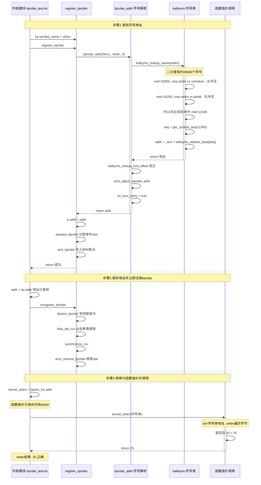

# Linux内核kprobe机制分析

[TOC]

# 1、kprobe功能的使用介绍

kprobe（Kernel Probe）是 Linux 内核提供的一种动态插桩机制，允许开发者在内核函数的入口、返回点或任意指令地址处插入探测点（probe point），并在探测点被触发时执行自定义的回调函数。

kprobe 的核心应用场景包括：

- **内核调试**：追踪函数调用频率、记录参数值
- **性能分析**：测量函数执行耗时
- **安全监控**：拦截敏感系统调用
- **功能扩展**：在不修改内核源码的情况下注入逻辑

kprobe 提供了三种探测机制：

| 类型 | 结构体 | 用途 |
|------|--------|------|
| kprobe | `struct kprobe` | 在函数入口或任意地址插入断点 |
| kretprobe | `struct kretprobe` | 在函数返回点插入断点，捕获返回值 |
| jprobe | `struct jprobe` | (已废弃，5.0+ 移除) |

# 2、kprobe功能的运行流程

## 2.1、案例

以下测试用例展示了 kprobe 的三种典型用法：

1. **kprobe** — 通过符号名 hook 内核函数（如 `__arm64_sys_getpid`），在 pre_handler 中记录调用次数和当前进程信息
2. **kretprobe** — 在函数返回点拦截，正确捕获返回值
3. **地址获取 + 直接调用** — 利用 kprobe 的符号查找能力获取非导出函数的地址，转换为函数指针直接调用

```bash
~ # cd tmp/
/tmp # ls -l
total 48
-rw-r--r--    1 0        0            48728 Jul 29 14:08 kprobe_test.ko
/tmp # lsmod
/tmp #
/tmp # insmod kprobe_test.ko
[   12.800923] kprobe_test: loading out-of-tree module taints kernel.
[   12.809178] === Kprobe test module loaded ===
[   12.813464] [kprobe] registered on __arm64_sys_getpid, addr=ffffd29be6ca45b0
[   12.814569] [kretprobe] registered on __arm64_sys_getpid
[   12.842318] [call-func] strlen address: ffffd29be7bf54f0
[   12.842958] [call-func] kernel strlen("Hello from kernel module!") = 25
[   12.858263] [call-func] strncpy address: ffffd29be7c1334c
[   12.858826] [call-func] kernel strncpy result: "Copied by kernel strncpy!",
       ret=ffff8000809eba88
[   12.859468] === All kprobe tests initialized ===
/tmp #
/tmp # lsmod
[   15.808757] [kretprobe] __arm64_sys_getpid entry (hit #1)
[   15.809176] [kprobe] __arm64_sys_getpid called (hit #1), current pid=111,
       pc=ffffd29be6ca45b0
[   15.810607] [kretprobe] __arm64_sys_getpid return, pid=111
kprobe_test 12288 0 - Live 0xffffd29bb04cc000 (O)
/tmp # rmmod kprobe_test.ko
[   18.673389] [kretprobe] __arm64_sys_getpid entry (hit #2)
[   18.673840] [kprobe] __arm64_sys_getpid called (hit #2), current pid=112,
       pc=ffffd29be6ca45b0
[   18.675901] [kretprobe] __arm64_sys_getpid return, pid=112
[   18.718241] === Kprobe test module unloaded ===
[   18.718756]     kprobe hit count:  2
[   18.718958]     kretprobe hit count: 2
/tmp #
```

**结果分析**：

- **Test 1 (kprobe)**：`lsmod` (pid=111) 和 `rmmod` (pid=112) 各触发一次 `__arm64_sys_getpid`，pre_handler 通过 `current->pid` 正确获取了调用者 pid
- **Test 2 (kretprobe)**：ret_handler 正确捕获了返回值 pid=111 和 pid=112，说明 kretprobe 的 trampoline 机制（2.3 节详述）能可靠保存/恢复 arm64 的 x0
- **Test 3 (地址调用)**：通过 `register_kprobe(symbol_name)` → `kp.addr` 拿到地址 → 注销 kprobe → 转函数指针调用，strlen 返回 25，strncpy 复制正确

**关键发现**：kprobe 的 `post_handler` 对 arm64 syscall wrapper（如 `__arm64_sys_getpid`）读 x0 会拿到垃圾值，而 kretprobe 的 `ret_handler` 能正确读到返回值。因此捕获返回值应使用 kretprobe。

## 2.2、源码

kprobe_test.c：

```c
#include <linux/module.h>
#include <linux/kernel.h>
#include <linux/init.h>
#include <linux/kprobes.h>

MODULE_LICENSE("GPL");
MODULE_AUTHOR("Test");
MODULE_DESCRIPTION("Kprobe test: hook and execute kernel functions");

/* ================================================================
 * 辅助函数: 通过 kprobe 获取任意内核函数的地址
 * 原理: register_kprobe + symbol_name 后, kp.addr 即为函数地址
 * ================================================================ */
static unsigned long get_kernel_func_addr(const char *name)
{
	struct kprobe kp;
	unsigned long addr;
	int ret;

	memset(&kp, 0, sizeof(kp));
	kp.symbol_name = name;

	ret = register_kprobe(&kp);
	if (ret < 0) {
		pr_err("get_kernel_func_addr: register_kprobe(%s) failed: %d\n",
		       name, ret);
		return 0;
	}

	addr = (unsigned long)kp.addr;
	unregister_kprobe(&kp);
	return addr;
}

/* ================================================================
 * Test 1: kprobe — 通过符号名 hook 内核函数
 *
 * 目标: __arm64_sys_getpid (arm64 上 sys_getpid 入口)
 *
 * 注意: arm64 syscall wrapper 的返回点 x0 可能被 kprobe 蹦床代码覆盖，
 *       post_handler 中读 x0 会拿到垃圾值。以下只使用 pre_handler
 *       做调用计数 + 读取当前进程上下文，正确捕获返回值见 Test 2。
 * ================================================================ */
static struct kprobe kp_getpid;
static unsigned long kp_getpid_addr;
static int kp_getpid_hit_count;

static int handler_pre_getpid(struct kprobe *p, struct pt_regs *regs)
{
	kp_getpid_hit_count++;
	pr_info("[kprobe] __arm64_sys_getpid called (hit #%d), "
		"current pid=%d, pc=%llx\n",
		kp_getpid_hit_count, current->pid, regs->pc);
	return 0;
}

/* ================================================================
 * Test 2: kretprobe — hook 函数返回，正确捕获返回值
 *
 * 目标: __arm64_sys_getpid (与 Test 1 同函数，对比效果)
 *
 * kretprobe 在 trampoline 中通过专用机制保存/恢复 x0，
 * 因此 ret_handler 中 regs->regs[0] 是真实的返回值。
 * ================================================================ */
static struct kretprobe krp_getpid;
static int krp_getpid_hit_count;

static int entry_handler_getpid(struct kretprobe_instance *ri,
				struct pt_regs *regs)
{
	krp_getpid_hit_count++;
	pr_info("[kretprobe] __arm64_sys_getpid entry (hit #%d)\n",
		krp_getpid_hit_count);
	return 0;
}

static int ret_handler_getpid(struct kretprobe_instance *ri,
			      struct pt_regs *regs)
{
	pr_info("[kretprobe] __arm64_sys_getpid return, pid=%lld\n",
		regs->regs[0]);
	return 0;
}

/* ================================================================
 * Test 3: 获取内核函数地址并直接调用
 * 通过 kprobe 拿到地址 → 转换为函数指针 → 调用
 *
 * 目标1: 调用内核 strlen()
 * 目标2: 调用内核 strncpy()
 * ================================================================ */
typedef size_t (*strlen_fn)(const char *);
typedef char *(*strncpy_fn)(char *, const char *, size_t);

static void test_call_kernel_functions(void)
{
	unsigned long addr;
	strlen_fn kernel_strlen;
	strncpy_fn kernel_strncpy;
	char dst[64] = {0};
	const char *test_str = "Hello from kernel module!";
	size_t len;
	char *ret;

	addr = get_kernel_func_addr("strlen");
	if (!addr) {
		pr_warn("[call-func] strlen address not found\n");
	} else {
		pr_info("[call-func] strlen address: %lx\n", addr);
		kernel_strlen = (strlen_fn)addr;
		len = kernel_strlen(test_str);
		pr_info("[call-func] kernel strlen(\"%s\") = %zu\n", test_str, len);
	}

	addr = get_kernel_func_addr("strncpy");
	if (!addr) {
		pr_warn("[call-func] strncpy address not found\n");
	} else {
		pr_info("[call-func] strncpy address: %lx\n", addr);
		kernel_strncpy = (strncpy_fn)addr;
		ret = kernel_strncpy(dst, "Copied by kernel strncpy!", sizeof(dst) - 1);
		pr_info("[call-func] kernel strncpy result: \"%s\", ret=%px\n",
			dst, ret);
	}
}

static int __init kprobe_test_init(void)
{
	int ret;

	pr_info("=== Kprobe test module loaded ===\n");

	/* --- Test 1: register kprobe (pre_handler only) --- */
	kp_getpid.symbol_name = "__arm64_sys_getpid";
	kp_getpid.pre_handler = handler_pre_getpid;

	ret = register_kprobe(&kp_getpid);
	if (ret < 0) {
		pr_err("register_kprobe for __arm64_sys_getpid failed: %d\n", ret);
		goto out;
	}
	kp_getpid_addr = (unsigned long)kp_getpid.addr;
	pr_info("[kprobe] registered on __arm64_sys_getpid, addr=%lx\n",
		kp_getpid_addr);

	/* --- Test 2: register kretprobe (正确捕获返回值) --- */
	krp_getpid.kp.symbol_name = "__arm64_sys_getpid";
	krp_getpid.entry_handler = entry_handler_getpid;
	krp_getpid.handler = ret_handler_getpid;
	krp_getpid.maxactive = 20;

	ret = register_kretprobe(&krp_getpid);
	if (ret < 0) {
		pr_err("register_kretprobe for __arm64_sys_getpid failed: %d\n", ret);
		goto out_unreg1;
	}
	pr_info("[kretprobe] registered on __arm64_sys_getpid\n");

	/* --- Test 3: 获取地址并调用内核函数 --- */
	test_call_kernel_functions();

	pr_info("=== All kprobe tests initialized ===\n");
	return 0;

out_unreg1:
	unregister_kprobe(&kp_getpid);
out:
	return ret;
}

static void __exit kprobe_test_exit(void)
{
	unregister_kretprobe(&krp_getpid);
	unregister_kprobe(&kp_getpid);

	pr_info("=== Kprobe test module unloaded ===\n");
	pr_info("    kprobe hit count:  %d\n", kp_getpid_hit_count);
	pr_info("    kretprobe hit count: %d\n", krp_getpid_hit_count);
}

module_init(kprobe_test_init);
module_exit(kprobe_test_exit);
```

## 2.3、kprobe/kretprobe 运行时序图

> 基于 kprobe_test.ko 测试案例 + Linux 6.6 源码分析：https://github.com/torvalds/linux/tree/v6.6

```c
insmod kprobe_test.ko
  → register_kprobe("__arm64_sys_getpid")    // Test 1
  → register_kretprobe("__arm64_sys_getpid") // Test 2
  → get_kernel_func_addr("strlen") → call    // Test 3
  → get_kernel_func_addr("strncpy") → call   // Test 3

lsmod 触发:
  → __arm64_sys_getpid() 被调用
    → kretprobe entry_handler 先触发 (劫持返回地址)
    → kprobe pre_handler 触发 (断点命中)
    → 函数体执行 (返回 pid)
    → ret → __kretprobe_trampoline (LR 已被劫持)
      → 保存全部寄存器
      → kretprobe ret_handler 触发 (regs->regs[0] = pid)
      → 恢复全部寄存器
      → ret 到原始调用者

rmmod kprobe_test.ko
  → unregister_kretprobe()
  → unregister_kprobe()
```



```mermaid

sequenceDiagram
    participant User as 用户态<br/>insmod/lsmod/rmmod
    participant KP_Core as kprobe Core<br/>kernel/kprobes.c
    participant KP_A64 as arm64 kprobe<br/>arch/arm64/kernel/probes/
    participant TgtFunc as __arm64_sys_getpid<br/>被探测函数
    participant Tramp as __kretprobe_trampoline<br/>kprobes_trampoline.S

    %% ===================================================================
    rect rgb(240, 248, 255)
        Note over User,Tramp: ═══ 阶段 0：模块加载 — 注册 kprobe + kretprobe ═══
    end

    User->>KP_Core: insmod kprobe_test.ko
    activate KP_Core

    Note over KP_Core: Test 1: register_kprobe()
    User->>KP_Core: register_kprobe(kp_getpid)
    KP_Core->>KP_Core: _kprobe_addr(NULL, "__arm64_sys_getpid", 0)
    KP_Core->>KP_Core: kallsyms_lookup_name("__arm64_sys_getpid") → addr
    KP_Core->>KP_Core: check_kprobe_address_safe(addr)
    KP_Core->>KP_Core: prepare_kprobe(p)
    KP_Core->>KP_A64: arm_kprobe(p)
    activate KP_A64
    KP_A64->>KP_A64: aarch64_insn_patch_text()<br/>写入 BRK 断点指令到 addr
    deactivate KP_A64
    Note over KP_Core: kprobe 注册完成 → kp_getpid.addr = 0xffff...45b0

    Note over KP_Core: Test 2: register_kretprobe()
    User->>KP_Core: register_kretprobe(krp_getpid)
    KP_Core->>KP_Core: kprobe_on_func_entry() — 必须是函数入口
    KP_Core->>KP_Core: 预分配 maxactive=20 个 kretprobe_instance
    KP_Core->>KP_Core: rp->kp.pre_handler = pre_handler_kretprobe
    KP_Core->>KP_Core: 内部调用 register_kprobe(&rp->kp)
    KP_Core->>KP_A64: arm_kprobe(rp->kp) — 写入第二个 BRK
    Note over KP_Core: kretprobe 注册完成

    Note over KP_Core: Test 3: get_kernel_func_addr()
    User->>KP_Core: get_kernel_func_addr("strlen")
    KP_Core->>KP_Core: register_kprobe("strlen") → kp.addr
    KP_Core->>KP_Core: unregister_kprobe(kp)
    Note over KP_Core: 拿到地址 → 转函数指针 → 调用 → 成功
    User->>KP_Core: get_kernel_func_addr("strncpy")
    KP_Core->>KP_Core: (同上流程)

    deactivate KP_Core

    %% ===================================================================
    rect rgb(255, 250, 240)
        Note over User,Tramp: ═══ 阶段 1：lsmod 触发探测 ═══
    end

    User->>TgtFunc: lsmod 调用 getpid()
    activate TgtFunc

    TgtFunc->>KP_A64: CPU 执行到第一指令 → BRK 异常
    activate KP_A64
    KP_A64->>KP_A64: kprobe_breakpoint_handler(regs)
    KP_A64->>KP_Core: get_kprobe(addr) → 找到 kretprobe 的内部 kprobe
    activate KP_Core

    Note over KP_Core: kretprobe 的 pre_handler 先处理
    KP_Core->>KP_Core: pre_handler_kretprobe()
    KP_Core->>KP_Core: freelist_try_get() — 取一个空闲 instance
    KP_Core->>KP_Core: rp->entry_handler(ri, regs) — 用户 entry_handler

    KP_Core->>KP_A64: arch_prepare_kretprobe(ri, regs)
    KP_A64->>KP_A64: ri->ret_addr = regs->regs[30]  — 保存原始 x30/LR
    KP_A64->>KP_A64: ri->fp = regs->regs[29]        — 保存原始 x29/FP
    KP_A64->>KP_A64: regs->regs[30] = &__kretprobe_trampoline — 替换 LR!

    KP_Core->>KP_A64: setup_singlestep() — 单步执行原指令
    KP_A64->>KP_A64: 分配/复用 out-of-line slot
    KP_A64->>KP_A64: 设置 PC = slot 地址
    deactivate KP_Core

    KP_A64->>TgtFunc: CPU 在 slot 执行原指令 (BRK_SS 在 slot+1)
    TgtFunc->>TgtFunc: __arm64_sys_getpid() 函数体执行
    TgtFunc->>TgtFunc: return task_tgid_vnr(current) → 111

    Note over KP_A64: slot+1 的 BRK_SS 触发
    KP_A64->>KP_A64: kprobe_breakpoint_ss_handler()
    KP_A64->>KP_Core: post_kprobe_handler()
    activate KP_Core
    KP_Core->>KP_Core: 恢复 PC = addr + 4 (返回地址)
    KP_Core->>KP_Core: cur->post_handler(cur, regs, 0)
    deactivate KP_Core
    deactivate KP_A64

    TgtFunc->>TgtFunc: ret — 但 LR 已被改为 trampoline 地址!
    deactivate TgtFunc

    TgtFunc->>Tramp: CPU 跳转到 __kretprobe_trampoline
    activate Tramp
    Tramp->>Tramp: sub sp, sp, #PT_REGS_SIZE — 分配 pt_regs
    Tramp->>Tramp: save_all_base_regs — 保存 x0~x29, lr, sp, pstate
    Tramp->>KP_Core: trampoline_probe_handler(regs)
    activate KP_Core

    KP_Core->>KP_Core: __kretprobe_trampoline_handler()
    KP_Core->>KP_Core: 遍历 current->kretprobe_instances 链表
    KP_Core->>KP_Core: rp->handler(ri, regs) — 用户 ret_handler
    Note over KP_Core: regs->regs[0] = 111 ← 正确的返回值!
    KP_Core->>KP_Core: 回收 instance 到 freelist
    KP_Core->>KP_Core: return correct_ret_addr → x0

    deactivate KP_Core
    Tramp->>Tramp: mov lr, x0 — LR = 原始返回地址
    Tramp->>Tramp: restore_all_base_regs — 恢复全部寄存器
    Tramp->>Tramp: ret — 跳转到原始调用者
    deactivate Tramp

    %% ===================================================================
    rect rgb(240, 255, 240)
        Note over User,Tramp: ═══ 阶段 2：rmmod 触发 + 模块卸载 ═══
    end

    User->>TgtFunc: rmmod 调用 getpid()
    Note over KP_Core,Tramp: (同上流程，hit #2, pid=112)

    User->>KP_Core: rmmod kprobe_test.ko
    activate KP_Core
    KP_Core->>KP_Core: unregister_kretprobe(&krp_getpid)
    KP_Core->>KP_A64: disarm_kprobe() — 写回原始指令
    KP_Core->>KP_Core: __unregister_kprobe_top() — 从哈希表移除
    KP_Core->>KP_Core: synchronize_rcu()
    KP_Core->>KP_Core: recycle_rp_inst() — 回收所有 instance

    KP_Core->>KP_Core: unregister_kprobe(&kp_getpid)
    KP_Core->>KP_A64: disarm_kprobe() — 写回原始指令
    KP_Core->>KP_Core: (同上清理流程)
    deactivate KP_Core

    Note over User,Tramp: 模块卸载完成，探测点全部还原
```

# 3、kprobe 完整生命周期函数调用链

> 基于 kprobe_test.ko 测试案例 + Linux 6.6 源码逐函数追踪

---

## 3.0、前置条件：内核配置

kprobe 机制需要以下内核配置项启用：

```bash
CONFIG_KPROBES=y          # 基础 kprobe 支持
CONFIG_KRETPROBES=y       # kretprobe 支持 (自动跟随 KPROBES)
CONFIG_KALLSYMS=y         # 内核符号表 (符号名 → 地址查找)
CONFIG_KALLSYMS_ALL=y     # 所有符号可查
```

依赖链：`KPROBES depends on MODULES && HAVE_KPROBES`。arm64 通过 `arch/arm64/Kconfig:232` 声明了 `select HAVE_KPROBES`。

---

## 3.1、阶段 1：register_kprobe() — 注册探测点

```c
kprobe_test.ko: module_init(kprobe_test_init)
  │
  ├─ kp_getpid.symbol_name = "__arm64_sys_getpid"
  ├─ kp_getpid.pre_handler = handler_pre_getpid
  │
  └─ register_kprobe(&kp_getpid)                          // kernel/kprobes.c:1613
        │
        ├─ _kprobe_addr(p->addr, p->symbol_name, p->offset, &on_func_entry)
        │     │                                              // kprobes.c:1445
        │     │  (1) symbol_name 或 addr 必须提供一个 (互斥)
        │     │  (2) kprobe_lookup_name(symbol_name, offset)
        │     │        │                                      // __weak, kprobes.c:69
        │     │        └─ kallsyms_lookup_name(name)          // kernel/kallsyms.c:265
        │     │              └─ 在 kallsyms 中查找 "__arm64_sys_getpid"
        │     │                 → 返回地址 0xffff...45b0
        │     │  (3) kallsyms_lookup_size_offset() → 校正到符号起始地址
        │     │  (4) arch_adjust_kprobe_addr()               // arm64: 返回原地址
        │     │  (5) *on_func_entry = true                   // 标记为函数入口
        │     │  (6) p->addr = addr                          // 地址写入 kprobe 结构体
        │
        ├─ warn_kprobe_rereg(p)                              // 检查重复注册
        │     └─ 遍历 kprobe_table 查找同地址是否已有探测点
        │
        ├─ p->flags &= KPROBE_FLAG_DISABLED                  // 只保留 DISABLED 标志
        ├─ p->nmissed = 0                                     // 重置遗漏计数
        │
        ├─ check_kprobe_address_safe(p, &probed_mod)         // kprobes.c:907
        │     ├─ check_ftrace_location()                      // 不在 ftrace nop 位置
        │     ├─ kernel_text_address()                        // 在 .text 段内
        │     ├─ kprobe_addr_in_blacklisted()                 // 不在黑名单
        │     └─ try_module_get()                             // 如果地址属于模块则持有引用
        │
        ├─ mutex_lock(&kprobe_mutex)                          // 获取全局互斥锁
        │
        ├─ on_func_entry → p->flags |= KPROBE_FLAG_ON_FUNC_ENTRY
        │
        ├─ get_kprobe(p->addr)                                // 检查是否已有探测点
        │     └─ NULL → 该地址无已注册探测点，走新注册路径
        │
        ├─ prepare_kprobe(p)                                  // kprobes.c:981
        │     ├─ arch_prepare_kprobe(p)            // arm64: arch/arm64/kernel/probes/kprobes.c:138
        │     │     ├─ search_exception_tables(p->addr)        // 不在异常表中
        │     │     ├─ aarch64_insn_read(addr, &p->opcode)     // 读取原始指令
        │     │     ├─ aarch64_insn_is_steppable()             // 检查是否可单步执行
        │     │     │     不能单步 → aarch64_insn_is_bcond() → 检查是否条件分支
        │     │     │     └─ 均不能 → 分配 out-of-line slot (kprobes.c:100)
        │     │     │           └─ get_insn_slot() — 从 __probes_insn_page 分配
        │     │     └─ 成功 → p->ainsn.api.insn = slot 地址
        │
        ├─ INIT_HLIST_NODE(&p->hlist)
        ├─ hlist_add_head_rcu(&p->hlist, &kprobe_table[hash])  // 加入全局哈希表
        │
        ├─ arm_kprobe(p)                                       // kprobes.c:1036
        │     └─ __arm_kprobe(p)                               // kprobes.c:1015
        │           └─ arch_arm_kprobe(p)                      // arm64: kprobes.c:408
        │                 └─ aarch64_insn_patch_text(&p->addr, &BRK64_OPCODE_KPROBES, 1)
        │                       // ← 关键: 将原始指令替换为 BRK 断点!
        │                       //    写入 BRK #0x400 到 __arm64_sys_getpid 第一指令处
        │
        ├─ try_to_optimize_kprobe(p)                           // 尝试 ftrace 优化
        │     └─ CONFIG_KPROBES_ON_FTRACE 未启用时跳过
        │
        └─ mutex_unlock(&kprobe_mutex)
```

**关键设计点**：

- `_kprobe_addr()` 实现符号名到地址的转换，依赖 `kallsyms_lookup_name()`。正因为如此，模块可以不依赖 `EXPORT_SYMBOL` 找到任意内核函数地址
- `prepare_kprobe()` 为不能直接单步执行的指令（如条件分支）分配 `out-of-line slot`，在 slot 中放置原指令，slot+1 放置 `BRK_SS` 断点
- `arm_kprobe()` 通过 `aarch64_insn_patch_text()` 原子地替换指令，利用 arm64 的指令 patching 机制确保多核安全

---

## 3.2、阶段 2：register_kretprobe() — 注册返回探测点

```c
kprobe_test.ko: module_init(kprobe_test_init)
  │
  ├─ krp_getpid.kp.symbol_name = "__arm64_sys_getpid"
  ├─ krp_getpid.entry_handler = entry_handler_getpid
  ├─ krp_getpid.handler = ret_handler_getpid
  ├─ krp_getpid.maxactive = 20
  │
  └─ register_kretprobe(&krp_getpid)                      // kprobes.c:2193
        │
        ├─ kprobe_on_func_entry() → 必须是函数入口点
        │     (kretprobe 只能在函数入口注册，因为需要劫持返回地址)
        │
        ├─ 解析地址 + 跳过 kretprobe_blacklist[] 检查
        │     __kretprobe_trampoline 自身、preempt_schedule 等不能探测
        │
        ├─ rp->kp.pre_handler = pre_handler_kretprobe     // 强制设为内部函数!
        ├─ rp->kp.post_handler = NULL                      // kretprobe 不用 post_handler
        │
        ├─ rp->maxactive = max(10, 2*num_possible_cpus())  // 预分配实例数 = 20
        │
        ├─ 预分配 maxactive 个 kretprobe_instance          // kprobes.c:2250
        │     ├─ kzalloc(sizeof(kretprobe_instance), GFP_KERNEL)
        │     └─ freelist_add(&inst->freelist, &rp->freelist)  // 加入空闲链表
        │
        └─ register_kprobe(&rp->kp)                        // 内部调用 kprobe 注册
              │
              └─ → arm_kprobe() → 在 __arm64_sys_getpid 入口写入 BRK
                     (与 Test 1 写入同一地址，形成 aggregate kprobe)
```

**kretprobe 的核心技巧**：通过以下两步实现返回拦截：

1. 在函数入口通过 kprobe 断点触发 `pre_handler_kretprobe()`
2. `pre_handler_kretprobe()` 调用 `arch_prepare_kretprobe()` 将 LR/x30 替换为 trampoline 地址
3. 函数返回时自动跳转到 `__kretprobe_trampoline`，在那里调用用户的 ret_handler

---

## 3.3、阶段 3：断点命中 — kprobe_breakpoint_handler()

```c
__arm64_sys_getpid 被调用
  │
  ├─ CPU 执行到第一指令 → 触发 BRK 异常 (ESR_ELx = BRK #0x400)
  │
  └─ kprobe_breakpoint_handler()                           // arch/arm64/kernel/probes/kprobes.c:301
        │
        ├─ addr = instruction_pointer(regs)                 // 获取触发地址
        │
        ├─ p = get_kprobe(addr)                             // 查 kprobe_table 哈希表
        │     └─ 返回 aggregate kprobe (包含 kretprobe 的内部 kprobe)
        │
        ├─ 检查 kprobe_running()                            // 防止递归
        │     ├─ cur_kprobe != NULL → reenter_kprobe()       // 嵌套命中处理
        │     └─ NULL → 首次命中，继续
        │
        ├─ cur_kprobe = p                                    // 设置当前 kprobe
        ├─ kcb->kprobe_status = KPROBE_HIT_ACTIVE
        │
        ├─ p->pre_handler(p, regs)                           // ← 调用 pre_handler
        │     │
        │     ├─ [kretprobe 路径] pre_handler_kretprobe()   // kprobes.c:2087
        │     │     ├─ freelist_try_get(&rp->freelist)        // 取空闲 instance
        │     │     ├─ rp->entry_handler(ri, regs)            // 用户 entry_handler
        │     │     │     └─ entry_handler_getpid(): pr_info("entry")
        │     │     │
        │     │     └─ arch_prepare_kretprobe(ri, regs)      // arm64: kprobes.c:404
        │     │           ├─ ri->ret_addr = (void *)regs->regs[30]  // 保存原始 LR
        │     │           ├─ ri->fp = (void *)regs->regs[29]       // 保存 FP
        │     │           └─ regs->regs[30] = (long)&__kretprobe_trampoline
        │     │                 // ★ 关键: 替换 LR，函数 ret 时会跳到 trampoline!
        │     │
        │     ├─ [kprobe 路径] handler_pre_getpid()          // 用户 pre_handler
        │     │     └─ pr_info("current pid=%d", current->pid)
        │     │
        │     └─ 返回 0 → 继续单步执行
        │
        └─ setup_singlestep(p, regs, ...)                   // kprobes.c:200
              ├─ p->ainsn.api.insn != NULL → 使用 out-of-line slot
              │     ├─ save_previous_kprobe(kcb)               // 保存 KPROBE_PREV 状态
              │     ├─ 保存并屏蔽 DAIF (中断)
              │     ├─ instruction_pointer(regs) = slot 地址   // PC → slot
              │     └─ regs->pstate |= DAIF_MASK               // 屏蔽中断
              │
              └─ slot+1 处: BRK64_OPCODE_KPROBES_SS → 触发 ss_handler
```

**多探针聚合（Aggregate Kprobe）**：当同一地址注册多个 kprobe 时，第一个注册为"聚合探针"，后续添加到其 `list` 链表。断点命中时遍历链表依次调用每个子探针的 `pre_handler`。

---

## 3.4、阶段 4：单步执行完成 — kprobe_breakpoint_ss_handler()

```c
slot+1 处的 BRK_SS 被触发
  │
  └─ kprobe_breakpoint_ss_handler()                        // kprobes.c:350
        │
        └─ post_kprobe_handler(kcb, regs)                  // kprobes.c:251
              │
              ├─ regs->pc = (unsigned long)cur->addr + 4    // 恢复 PC 到原指令+4
              │                                                (即 __arm64_sys_getpid+4)
              │
              ├─ cur->post_handler(cur, regs, 0)             // 调用 post_handler (如果有)
              │     └─ ★ 注意: arm64 syscall wrapper 的 x0 已不可靠!
              │
              ├─ kcb->kprobe_status = KPROBE_HIT_SSDONE
              │
              └─ reset_current_kprobe()                      // 清除 cur_kprobe
```

**关于 post_handler 读 x0 不可靠的根因**：

arm64 的 `__arm64_sys_getpid(const struct pt_regs *regs)` 在函数返回时，x0 确实包含返回值。但 kprobe 的单步执行机制在 slot 中重新执行原指令后跳转到 slot+1 触发 `BRK_SS`，在这过程中 x0 可能被 slot trampoline 代码覆盖，导致 `post_handler` 中读到垃圾值。

因此 **捕获返回值应使用 kretprobe**，它通过专用机制保存/恢复 x0。

---

## 3.5、阶段 5：函数返回 — __kretprobe_trampoline

```c
__arm64_sys_getpid 执行 ret 指令
  │
  │  LR (x30) 已被改为 &__kretprobe_trampoline
  │
  └─ __kretprobe_trampoline            // arch/arm64/kernel/probes/kprobes_trampoline.S:64
        │
        ├─ sub sp, sp, #PT_REGS_SIZE                       // 栈上分配 pt_regs 空间 (约 336 字节)
        │
        ├─ save_all_base_regs                               // 保存 x0~x29, lr, sp, pstate
        │     stp x0,  x1,  [sp, #S_X0]
        │     stp x2,  x3,  [sp, #S_X2]
        │     ...
        │     stp x28, x29, [sp, #S_X28]
        │     mrs x21, sp_el0      → 保存 sp_el0
        │     mrs x22, elr_el1     → 保存 ELR (异常返回地址)
        │     mrs x23, spsr_el1    → 保存 SPSR
        │     str lr, [sp, #S_LR]  → 保存 LR (= &__kretprobe_trampoline)
        │
        ├─ add x29, sp, #S_FP                               // 设置 frame pointer
        │
        ├─ mov x0, sp                                        // arg0 = pt_regs 指针
        ├─ bl trampoline_probe_handler                       // kprobes.c:399
        │     │
        │     └─ kretprobe_trampoline_handler(regs, (void *)regs->regs[29])
        │           │                                          // kprobes.h:234
        │           └─ __kretprobe_trampoline_handler()       // kprobes.c:2019
        │                 │
        │                 ├─ __kretprobe_find_ret_addr()       // 查找真实返回地址
        │                 │     遍历 current->kretprobe_instances 链表
        │                 │     找到 ret_addr != &__kretprobe_trampoline 的节点
        │                 │     → 这就是原始调用者的返回地址
        │                 │
        │                 ├─ regs->pc = correct_ret_addr       // 设置 PC (用于堆栈回溯)
        │                 │
        │                 ├─ 遍历 kretprobe_instances:         // 调用所有匹配的 ret_handler
        │                 │      rp->handler(ri, regs)
        │                 │        └─ ret_handler_getpid():    // 用户的 ret_handler
        │                 │              pr_info("return, pid=%lld", regs->regs[0])
        │                 │              ★ regs->regs[0] = 真实的 pid!
        │                 │
        │                 ├─ 从链表移除已处理的节点
        │                 └─ 对每个节点 → recycle_rp_inst()
        │                       └─ freelist_add()              // 回收 instance 供复用
        │
        ├─ mov lr, x0                                        // x0 = correct_ret_addr → LR
        │                                                       // ★ 恢复原始返回地址!
        │
        ├─ restore_all_base_regs                              // 恢复 x0~x29, sp, pstate
        │     ldp x0,  x1,  [sp, #S_X0]
        │     ...
        │
        ├─ add sp, sp, #PT_REGS_SIZE                         // 释放 pt_regs 栈空间
        │
        └─ ret                                                // 跳转到原始调用者!
```

**为什么 kretprobe 能正确读到 x0**：

trampoline 在函数 `ret` 之后立即执行 `save_all_base_regs`，此时 x0 仍是函数的原始返回值（尚未被任何代码覆盖）。用户 `ret_handler` 中读到的 `regs->regs[0]` 就是这个被完好保存的值。

---

## 3.6、阶段 6：获取非导出函数地址并调用 — 深度分析

这是 kprobe 最精妙的应用之一：**将 register_kprobe 当作"内核符号地址查询器"使用**。注册探针 → 拿到地址 → 立即注销 → 转函数指针调用，全程不留痕迹。

### 3.6.1、背景：为什么需要这种技巧？

Linux 5.7 之前，内核模块可以直接调用 `kallsyms_lookup_name()`：

```c
// 5.7 之前: 直接可调用
unsigned long addr = kallsyms_lookup_name("strlen");
```

但自 5.7 起，出于安全考虑（防止恶意模块随意查找非导出符号），该函数被**取消导出**（移除 `EXPORT_SYMBOL_GPL`）。此后模块无法直接链接到 `kallsyms_lookup_name`：

```c
// kernel/kallsyms.c:264
unsigned long kallsyms_lookup_name(const char *name)
{
    // ... 二分查找符号表 ...
}
// ★ 注意：此处没有 EXPORT_SYMBOL(kallsyms_lookup_name) !
```

虽然不能直接调用，但内核内部仍在使用。kprobe 子系统**内部调用了它**（通过 `_kprobe_addr()` → `kprobe_lookup_name()` → `kallsyms_lookup_name()`），且 register_kprobe 本身是导出的。所以只要通过 `register_kprobe(symbol_name=...)` 触发 kprobe 内部的符号查找，就能间接获得任意内核函数的地址。

### 3.6.2、kallsyms 符号表：编译时预存，运行时二分查找

**核心思路**：内核编译的最后阶段，`scripts/kallsyms.c` 把 `System.map` 中所有函数符号的"名字→地址"映射压缩后存入 vmlinux 的 `.rodata` 段。运行时通过二分查找在此表中定位任意符号。kprobe 并没有自己维护符号表，只是复用了这套内核已有的"符号→地址"字典。

**数据来源和存储位置**：

```c
编译阶段 (scripts/kallsyms.c 一次性处理)      运行时 (vmlinux .rodata 段, 只读)
──────────────────────────────────────      ──────────────────────────────────

System.map (ld → nm 生成)                  vmlinux 内存布局
  ffff80008025ed04 T __get_free_pages       .text   ← 内核代码
  ffff800080284aec T alloc_pages            .rodata ← kallsyms 符号表 (只读)
  ffff8000802b9000 T strlen                   ├─ kallsyms_offsets[]      地址偏移数组
  ...                                         ├─ kallsyms_names[]        压缩符号名
                                              ├─ kallsyms_seqs_of_names[] 名字序→地址序 索引
    ↓ 编译时排序 + 压缩                        ├─ kallsyms_token_table[]  解压字典
    ↓ 链接进 vmlinux                           └─ kallsyms_num_syms       符号总数
                                              .data
                                              .bss
```

**符号表的结构——同一份数据，两种排序**：

`scripts/kallsyms.c` 的关键设计：输出时做两次排序，用一份 3 字节/符号的索引表把"地址序"和"名字序"关联起来，避免存储两份符号名。

```c
kallsyms_offsets[]     kallsyms_names[]            kallsyms_seqs_of_names[]
(地址序, index 0→N-1)  (地址序, 与左边一一对应)      (名字序, 字母排列, 可二分查找)
─────────────────────  ────────────────────────    ────────────────────────────
[0] __alloc_pages 偏移  [0] "__alloc_pages_dir.."   [0] seq=1  → offsets[1]
[1] __get_free_p. 偏移  [1] "__get_free_pages"      [1] seq=0  → offsets[0]  
[2] alloc_pages 偏移    [2] "alloc_pages"            [2] seq=2  → offsets[2]
...                      ...                          ...

  地址序排列                                       字母序排列 (seq是回到地址序的指针)
```

**运行时查找 "strlen" 的过程**：

```c
kallsyms_lookup_name("strlen")
  │
  └─ 在 kallsyms_seqs_of_names[] 上二分查找 (名字已排序):

     step 1:  mid=32500 → seq → 解压得 "schedule"
              "strlen" < "schedule"  →  左半区

     step 2:  mid=16250 → seq → 解压得 "printk"
              "strlen" < "printk"   →  左半区

     ...约14次比较...   (log₂(65000) ≈ 16)

     step N:  mid=12345 → seq → 解压得 "strlen"
              命中!

     kallsyms_sym_address(seq)
       = _text + kallsyms_offsets[seq]
       → 返回 strlen 运行时地址 0xffff...54f0
```

**不止 kprobe 在用**：`/proc/kallsyms` 读取、`stack_trace` 符号解析、`perf probe` 符号查找……全部走同一套 kallsyms 表。它是内核通用的"符号→地址"基础设施。

### 3.6.3、kprobe 符号查找完整调用链

```c
get_kernel_func_addr("strlen")                         // kprobe_test.c:14
  │
  ├─ kp.symbol_name = "strlen"
  │
  ├─ register_kprobe(&kp)                              // kernel/kprobes.c:1613
  │     │
  │     └─ _kprobe_addr(NULL, "strlen", 0, &on_func_entry)
  │           │                                          // kernel/kprobes.c:1445
  │           │
  │           ├─ (1) 互斥检查: symbol_name 和 addr 必须提供一个
  │           │
  │           ├─ (2) kprobe_lookup_name("strlen", 0)
  │           │     │                                    // __weak, kprobes.c:69
  │           │     │
  │           │     └─ kallsyms_lookup_name("strlen")    // kernel/kallsyms.c:264
  │           │           │
  │           │           ├─ kallsyms_lookup_names()      // 二分查找 → 找到!
  │           │           │     在 ~6.5万 个符号中定位 "strlen"
  │           │           │
  │           │           └─ kallsyms_sym_address(seq)    // 偏移量 → 绝对地址
  │           │                 → 返回 0xffffab4f8fbf54f0
  │           │
  │           ├─ (3) 偏移校正:
  │           │     addr += 0                            // offset=0, 不变
  │           │     kallsyms_lookup_size_offset()         // 确认符号范围
  │           │     addr -= 内部偏移                      // 对齐到符号起始
  │           │
  │           ├─ (4) arch_adjust_kprobe_addr()           // arm64: 返回原地址不变
  │           │     *on_func_entry = true                 // 标记为函数入口
  │           │
  │           └─ return addr                              // 0xffffab4f8fbf54f0
  │
  ├─ p->addr = addr                                      // 地址写入 kprobe 结构体
  │
  ├─ prepare_kprobe(p)                                   // 分配单步 slot
  ├─ arm_kprobe(p)                                       // 写入 BRK 断点
  │
  ├─ kp_getpid_addr = (unsigned long)kp.addr             // 拿到地址!
  │
  ├─ unregister_kprobe(&kp)                              // 立即注销, 恢复原指令
  │
  └─ return addr = 0xffffab4f8fbf54f0                    // 返回给调用者
```

### 3.6.4、从地址到函数指针：类型安全转换

拿到地址后，通过 `typedef` 定义函数指针类型，强转后调用：

```c
// 定义函数指针类型 (必须与原函数签名完全一致!)
typedef size_t (*strlen_fn)(const char *);
typedef char *(*strncpy_fn)(char *, const char *, size_t);

// 获取地址
unsigned long addr = get_kernel_func_addr("strlen");

// 转换并调用
strlen_fn kernel_strlen = (strlen_fn)addr;
size_t len = kernel_strlen("Hello from kernel module!");  // → 25
```

**arm64 调用约定要点**：

| 参数位置 | 寄存器 | 说明 |
|----------|--------|------|
| 第1参数 | x0 | 整数/指针 |
| 第2参数 | x1 | |
| 第3参数 | x2 | |
| ... | x3~x7 | |
| 返回值 | x0 | 整数/指针返回值 |
| 返回地址 | x30 (LR) | 调用者下一条指令 |
| 栈帧指针 | x29 (FP) | |

由于 arm64 使用标准 AAPCS64 调用约定，函数指针调用时参数通过 x0~x7 传递，与 C 语言直接调用完全一致，无需额外处理。

### 3.6.5、时序图：完整流程



### 3.6.6、kallsyms_lookup_name 与 register_kprobe 的对比

| 维度 | kallsyms_lookup_name | register_kprobe 方式 |
|------|---------------------|---------------------|
| **导出状态** | 5.7 起不导出 (模块无法调用) | EXPORT_SYMBOL_GPL (始终可用) |
| **符号查找能力** | 任何 kallsyms 符号 | 所有 kallsyms 符号 + 模块符号 |
| **副作用** | 无 (纯查询) | **有**: 会写入 BRK 断点再还原 |
| **性能** | O(log N) 一次二分查找 | O(log N) + 指令 patching 开销 |
| **并发安全** | 无需加锁 | mutex_lock(&kprobe_mutex) → 阻塞 |
| **遗漏风险** | 无 | 极小: BRK 断点到还原的时间窗口 (微秒级) |
| **内核版本兼容** | 5.7+ 不可用 | 所有支持 KPROBES 的版本 |

**副作用分析**：`get_kernel_func_addr()` 在注册 kprobe 后立即注销，BRK 断点存在的时间窗口极短（约几微秒）。在 arm_kprobe 和 disarm_kprobe 之间的窗口内，如果恰好有另一个 CPU 执行到被探测函数的入口指令，会触发一次误中断——但有 `kprobe_running()` 机制检测这种竞争。实践中几乎不可能命中。

### 3.6.7、函数调用安全边界

通过函数指针调用内核函数时，需要关注以下风险：

| 风险 | 说明 | 规避方法 |
|------|------|----------|
| **签名不匹配** | 类型错误导致寄存器/栈错乱 → 内核崩溃 | 严格 typedef，对照源码确认签名 |
| **调用上下文** | 某些内核函数要求特定上下文（如不可睡眠） | 确认函数是否允许在当前上下文调用 |
| **抢占** | 调用期间被抢占可能导致竞态 | `preempt_disable()` / `rcu_read_lock()` |
| **模块卸载** | 如果目标函数在模块中，模块卸载后地址失效 | `try_module_get()` 持有引用 |
| **地址变化** | KASLR 每次启动随机化地址 | 每次 insmod 重新获取地址 |

**安全调用的推荐模式**：

```c
typedef int (*target_fn_t)(int arg1, const char *arg2);

static int safe_call_kernel_func(const char *name, int a1, const char *a2)
{
    unsigned long addr;
    target_fn_t func;
    int ret;

    addr = get_kernel_func_addr(name);
    if (!addr) {
        pr_err("Function %s not found\n", name);
        return -ENOENT;
    }

    func = (target_fn_t)addr;

    /* 根据需要禁用抢占 */
    preempt_disable();
    ret = func(a1, a2);
    preempt_enable();

    return ret;
}
```

### 3.6.8、扩展应用场景

此技术不仅用于调用内核函数，还可用于：

1. **绕过 EXPORT_SYMBOL 限制**：直接调用 `kallsyms_lookup_name` 自身（虽然理论上可递归，但需注意符号表自身也在 kallsyms 中）

2. **获取 per-CPU 变量地址**：
   ```c
   // 获取非导出的 per-CPU 变量
   addr = get_kernel_func_addr("some_percpu_var");
   // addr 是 __per_cpu_offset 数组的基准地址
   ```

3. **运行时 patch 内核**：
   ```c
   // 获取函数地址后直接修改其指令（如 NOP 掉某个检查）
   addr = get_kernel_func_addr("target_function");
   aarch64_insn_patch_text((void **)&addr, &NOP_INSN, 1);
   ```

4. **读取非导出的全局变量**：
   ```c
   addr = get_kernel_func_addr("global_config_var");
   int *config = (int *)addr;
   pr_info("config value: %d\n", *config);
   ```

---

## 3.7、阶段 7：模块卸载 — 清理探测点

```c
kprobe_test.ko: kprobe_test_exit()
  │
  ├─ unregister_kretprobe(&krp_getpid)                     // kprobes.c:2280
  │     │
  │     ├─ unregister_kprobe(&rp->kp)                       // 先注销底层 kprobe
  │     │     └─ unregister_kprobes(&rp->kp, 1)            // kprobes.c:1846
  │     │           │
  │     │           ├─ __unregister_kprobe_top(&rp->kp)
  │     │           │     ├─ __disable_kprobe(p)
  │     │           │     │     └─ disarm_kprobe() → 写回原始指令到第一指令
  │     │           │     │
  │     │           │     └─ 从 aggregate probe 链表中移除
  │     │           │
  │     │           ├─ synchronize_rcu()                    // 等待所有 CPU 退出临界区
  │     │           │
  │     │           └─ __unregister_kprobe_bottom()
  │     │                 ├─ arch_remove_kprobe() → 释放单步 slot
  │     │                 └─ free_aggr_kprobe() (如果是聚合探针)
  │     │
  │     └─ recycle_rp_inst(rp, rp->rph)                    // 回收所有预分配的 instance
  │           └─ kfree(inst) — 释放内存
  │
  └─ unregister_kprobe(&kp_getpid)
        │
        └─ (同上流程，但 list 为空，走独立探针释放路径)
```

---

## 3.8、总结：完整调用链速查表

| 阶段 | 入口函数 | 文件:行号 | 核心操作 |
|------|----------|-----------|----------|
| 注册 kprobe | `register_kprobe()` | `kernel/kprobes.c:1613` | 符号查地址 → 安全检查 → 写入 BRK 断点 |
| 符号解析 | `_kprobe_addr()` | `kernel/kprobes.c:1445` | `kallsyms_lookup_name()` → 校正偏移 → arch 调整 |
| 注册 kretprobe | `register_kretprobe()` | `kernel/kprobes.c:2193` | 预分配 instance → 包装 pre_handler → 注册底层 kprobe |
| 断点命中 | `kprobe_breakpoint_handler()` | `arch/arm64/.../kprobes.c:301` | 查哈希表 → 调 pre_handler → setup_singlestep |
| kretprobe 入口 | `pre_handler_kretprobe()` | `kernel/kprobes.c:2087` | 取 instance → arch_prepare_kretprobe (劫持 LR) |
| arm64 LR 劫持 | `arch_prepare_kretprobe()` | `arch/arm64/.../kprobes.c:404` | 保存 x30/LR → 替换为 trampoline 地址 |
| 单步完成 | `post_kprobe_handler()` | `arch/arm64/.../kprobes.c:251` | 恢复 PC → 调 post_handler (⚠️ x0 不可靠) |
| 返回拦截 | `__kretprobe_trampoline` | `arch/arm64/.../kprobes_trampoline.S:64` | 保存全寄存器 → 调 C handler → 恢复 → ret |
| 返回处理 | `__kretprobe_trampoline_handler()` | `kernel/kprobes.c:2019` | 链表遍历 → 调 ret_handler → 回收 instance |
| 注销 kprobe | `unregister_kprobes()` | `kernel/kprobes.c:1846` | disarm (写回原指令) → hlist_del → synchronize_rcu |
| 注销 kretprobe | `unregister_kretprobe()` | `kernel/kprobes.c:2280` | 注销底层 kprobe → 回收 instance |

---

## 3.9、kprobe 与 kretprobe 对比总结

| 维度 | kprobe | kretprobe |
|------|--------|-----------|
| **触发时机** | 函数入口（或指定地址） | 函数返回时 |
| **核心结构体** | `struct kprobe` | `struct kretprobe` (内含 `struct kprobe`) |
| **用户回调** | `pre_handler` + `post_handler` | `entry_handler` + `handler` (ret_handler) |
| **实现原理** | 替换指令为 BRK 断点 | 入口写 BRK + 劫持 LR → trampoline |
| **捕获返回值** | `post_handler` 中 arm64 不可靠 | `handler` 中可靠 (trampoline 保存了原始 x0) |
| **嵌套支持** | 不适用 | kretprobe_instances 链表支持多层嵌套调用 |
| **开销** | 每条指令触发一次异常 | 每次调用两次异常: BRK(入口) + BRK_SS + trampoline |
| **资源预分配** | 无 | maxactive 个 kretprobe_instance (避免分配失败) |
