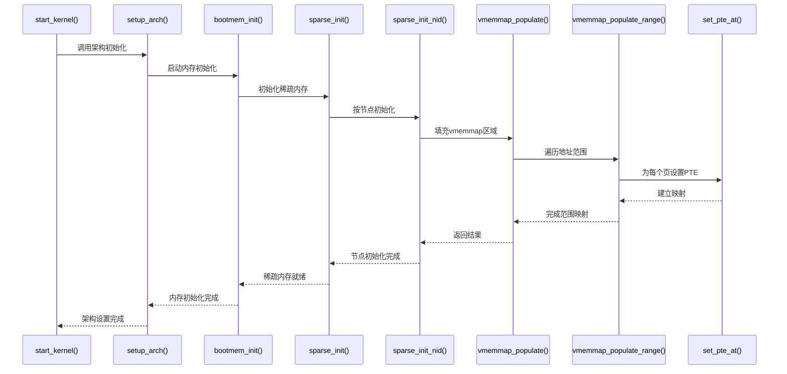

# 1、内存模型

## 1.0、内核中三种内存模型的page与pfn转换

```c
// include/asm-generic/memory_model.h
/*
 * supports 3 memory models.
 */
#if defined(CONFIG_FLATMEM)

#ifndef ARCH_PFN_OFFSET
#define ARCH_PFN_OFFSET		(0UL)
#endif

#define __pfn_to_page(pfn)	(mem_map + ((pfn) - ARCH_PFN_OFFSET))
#define __page_to_pfn(page)	((unsigned long)((page) - mem_map) + \
				 ARCH_PFN_OFFSET)

#ifndef pfn_valid
static inline int pfn_valid(unsigned long pfn)
{
	/* avoid <linux/mm.h> include hell */
	extern unsigned long max_mapnr;
	unsigned long pfn_offset = ARCH_PFN_OFFSET;

	return pfn >= pfn_offset && (pfn - pfn_offset) < max_mapnr;
}
#define pfn_valid pfn_valid
#endif

#elif defined(CONFIG_SPARSEMEM_VMEMMAP)

/* memmap is virtually contiguous.  */
#define __pfn_to_page(pfn)	(vmemmap + (pfn))
#define __page_to_pfn(page)	(unsigned long)((page) - vmemmap)

#elif defined(CONFIG_SPARSEMEM)
/*
 * Note: section's mem_map is encoded to reflect its start_pfn.
 * section[i].section_mem_map == mem_map's address - start_pfn;
 */
#define __page_to_pfn(pg)					\
({	const struct page *__pg = (pg);				\
	int __sec = page_to_section(__pg);			\
	(unsigned long)(__pg - __section_mem_map_addr(__nr_to_section(__sec)));	\
})

#define __pfn_to_page(pfn)				\
({	unsigned long __pfn = (pfn);			\
	struct mem_section *__sec = __pfn_to_section(__pfn);	\
	__section_mem_map_addr(__sec) + __pfn;		\
})
#endif /* CONFIG_FLATMEM/SPARSEMEM */

```


## 1.1、平坦内存模型（Flat Memory Model）


内存示意图：VAS <==> PAS


## 1.2、不连续内存模型（Discontiguous Memory Model）


内存示意图：VAS <==> PAS


## 1.3、稀疏内存模型（Sparse Memory Model）


内存示意图：VAS <==> PAS

### 1.3.1、实现方案1_经典方案


在经典方案中，page和pfn的转换为如下方式：

1）struct page先找到对应的 mem_section 编号

2）在通过编号找到对应的mem_section结构体

3）之后根据mem_section结构体找到对应的pfn

```bash
/*
 * Note: section's mem_map is encoded to reflect its start_pfn.
 * section[i].section_mem_map == mem_map's address - start_pfn;
 */
#define __page_to_pfn(pg)					\
({	const struct page *__pg = (pg);				\
	int __sec = page_to_section(__pg);			\
	(unsigned long)(__pg - __section_mem_map_addr(__nr_to_section(__sec)));	\
})

#define __pfn_to_page(pfn)				\
({	unsigned long __pfn = (pfn);			\
	struct mem_section *__sec = __pfn_to_section(__pfn);	\
	__section_mem_map_addr(__sec) + __pfn;		\
})
#endif /* CONFIG_FLATMEM/SPARSEMEM */
```


### 1.3.2、实现方案2_Sparse_VMEMMAP方案


在优化方案中：

1）可以直接通过 struct page找到对应的pfn
注意：因为系统额外维护了一个 vmemmap 结构，将所有struct page结构体放在这个当中进行索引

```java
// include/asm-generic/memory_model.h

#elif defined(CONFIG_SPARSEMEM_VMEMMAP)

/* memmap is virtually contiguous.  */
#define __pfn_to_page(pfn)	(vmemmap + (pfn))
#define __page_to_pfn(page)	(unsigned long)((page) - vmemmap)

```

```java
// arch/arm64/include/asm/pgtable.h
/*
 * VMALLOC range.
 *
 * VMALLOC_START: beginning of the kernel vmalloc space
 * VMALLOC_END: extends to the available space below vmemmap
 */
#define VMALLOC_START		(MODULES_END)
#if VA_BITS == VA_BITS_MIN
#define VMALLOC_END		(VMEMMAP_START - SZ_8M)
#else
#define VMEMMAP_UNUSED_NPAGES	((_PAGE_OFFSET(vabits_actual) - PAGE_OFFSET) >> PAGE_SHIFT)
#define VMALLOC_END		(VMEMMAP_START + VMEMMAP_UNUSED_NPAGES * sizeof(struct page) - SZ_8M)
#endif

#define vmemmap			((struct page *)VMEMMAP_START - (memstart_addr >> PAGE_SHIFT))

```

可以看到其中 vmemmap 是一个 全局的 `struct page*` 指针，指向内核虚拟地址空间中一个**连续的 struct page 数组**

vmemmap 通过页表建立**虚拟连续视图**：struct page <--> pfn

启用 CONFIG_SPARSEMEM 时 vmemmap的struct page*的页表建立初始化路径：



函数调用链为：

```bash
// 这个是启用 CONFIG_SPARSEMEM的路径
// init/main.c
start_kernel
    setup_arch(&command_line);
        bootmem_init();
            sparse_init();
                sparse_init_nid(nid_begin, pnum_begin, pnum_end, map_count);
                    map = __populate_section_memmap(pfn, PAGES_PER_SECTION,nid, NULL, NULL);	// CONFIG_SPARSEMEM
                        r = vmemmap_populate(start, end, nid, altmap);

// 这个是启用 CONFIG_SPARSEMEM_VMEMMAP 的路径
ret = __add_pages(nid, start >> PAGE_SHIFT, size >> PAGE_SHIFT,params);
    err = sparse_add_section(nid, pfn, cur_nr_pages, altmap,params->pgmap);
        memmap = section_activate(nid, start_pfn, nr_pages, altmap, pgmap);	
            memmap = populate_section_memmap(pfn, nr_pages, nid, altmap, pgmap);
                return __populate_section_memmap(pfn, nr_pages, nid, altmap, pgmap);		// CONFIG_SPARSEMEM_VMEMMAP
                    r = vmemmap_populate(start, end, nid, altmap);
```


```c
// arch/arm64/mm/mmu.c
int __meminit vmemmap_populate(unsigned long start, unsigned long end, int node,
		struct vmem_altmap *altmap)
{
	WARN_ON((start < VMEMMAP_START) || (end > VMEMMAP_END));
	/* [start, end] should be within one section */
	WARN_ON_ONCE(end - start > PAGES_PER_SECTION * sizeof(struct page));

	if (!IS_ENABLED(CONFIG_ARM64_4K_PAGES) ||
	    (end - start < PAGES_PER_SECTION * sizeof(struct page)))
		return vmemmap_populate_basepages(start, end, node, altmap);
	else
		return vmemmap_populate_hugepages(start, end, node, altmap);
}
```


# 2、memblock分配器

## 2.1、memblock分配器出现

### 2.1.1、解决内核启动时内存管理的自举问题


### 2.1.2、适应现代硬件架构的复杂性


### 2.2.3、统一跨架构的内存管理基础


### 2.2.4、支持新的内核特性和标准


## 2.2、关键结构体和接口

### 2.2.1、struct memblock

```c
// include/linux/memblock.h
struct memblock {
	bool bottom_up;					// 内存分配方向，自底向上、自顶向下
	phys_addr_t current_limit;		// 当前物理内存分配限制地址
	struct memblock_type memory;	// 可用物理内存区域管理结构
	struct memblock_type reserved;	// 已保留的物理内存区域管理结构
};
```

### 2.2.2、struct memblock_type

```c
// include/linux/memblock.h
/*
 * memory类型: 管理所有可用的物理内存区域
 * reserved类型：管理所有被保留的内存区域（kernel code、kernel data、initrd .etc）
 */
struct memblock_type {
	unsigned long cnt;					// 当前内存区域数量
	unsigned long max;					// 区域数组的最大容量
	phys_addr_t total_size;				// 所有区域的总大小
	struct memblock_region *regions;	// 内存区域数组指针
	char *name;							// 内存类型名称标识
};
```

### 2.2.3、struct memblock_region

```c
// include/linux/memblock.h
struct memblock_region {
	phys_addr_t base;			// base address of the region
	phys_addr_t size;			// size of the region
	enum memblock_flags flags;	// memory region attributes
#ifdef CONFIG_NUMA
	int nid;					// NUMA node id
#endif
};
```

### 2.2.4、enum memblock_flags

```c
// include/linux/memblock.h
enum memblock_flags {
	MEMBLOCK_NONE		= 0x0,		/* No special request */
	MEMBLOCK_HOTPLUG	= 0x1,		/* hotpluggable region */
	MEMBLOCK_MIRROR		= 0x2,		/* mirrored region */
	MEMBLOCK_NOMAP		= 0x4,		/* don't add to kernel direct mapping */
	MEMBLOCK_DRIVER_MANAGED = 0x8,	/* always detected via a driver */
	MEMBLOCK_RSRV_NOINIT	= 0x10,	/* don't initialize struct pages */
};
```

### 2.2.5、memblock_add

添加可用内存区域

```c
// mm/memblock.c
// base: base address of the new region
// size: size of the new region
int __init_memblock memblock_remove(phys_addr_t base, phys_addr_t size)
```

### 2.2.6、memblock_remove

从可用内存中移除指定区域

```c
// mm/memblock.c
// base: 要移除区域的起始物理地址
// size: 要移除区域的大小
int __init_memblock memblock_remove(phys_addr_t base, phys_addr_t size)
```

### 2.2.7、memblock_free

释放之前分配的内存区域

```c
// mm/memblock.c
// ptr: starting address of the  boot memory allocation
// size: size of the boot memory block in bytes
void __init_memblock memblock_free(void *ptr, size_t size)
```

### 2.2.8、memblock_reserve

```c
// mm/memblock.c
// base: 要保留区域的起始物理地址
// size: 要保留区域的大小
int __init_memblock memblock_reserve(phys_addr_t base, phys_addr_t size)
```

### 2.2.9、memblock_free_all

```c
// mm/memblock.c
/**
 * memblock_free_all - release free pages to the buddy allocator
 */
void __init memblock_free_all(void)
```

## 2.3、memblock分配器初始化


```c
// memblock初始化的函数调用栈
start_kernel
	setup_arch
		setup_machine_fdt
			early_init_dt_scan
				early_init_dt_scan_nodes
					early_init_dt_scan_memory	// memblock.memory初始化
    					early_init_dt_add_memory_arch
    						memblock_add		// 将内存区域添加到 memblock.memory当中
		arm64_memblock_init
			early_init_fdt_scan_reserved_mem	// memblock.reserved初始化
    			memblock_reserve				// 将内存区域添加到 memblock.reserved当中
```

### 2.3.1、初始化memblock.memory数组

```c
// drivers/of/fdt.c
/*
 * early_init_dt_scan_memory - Look for and parse memory nodes
 */
int __init early_init_dt_scan_memory(void)
{
	int node, found_memory = 0;
	const void *fdt = initial_boot_params;

	fdt_for_each_subnode(node, fdt, 0) {
...
		/* We are scanning "memory" nodes only */
		if (type == NULL || strcmp(type, "memory") != 0)	// 只扫描 memory 类型
			continue;
...
			early_init_dt_add_memory_arch(base, size);	// 添加到 membloc.memory数组中
...
		}
	}
	return found_memory;
}

// drivers/of/fdt.c
void __init __weak early_init_dt_add_memory_arch(u64 base, u64 size)
{
	...
    
	memblock_add(base, size);
}

// mm/memblock.c
int __init_memblock memblock_add(phys_addr_t base, phys_addr_t size)
{
	phys_addr_t end = base + size - 1;

	memblock_dbg("%s: [%pa-%pa] %pS\n", __func__,
		     &base, &end, (void *)_RET_IP_);
	// 传入的参数是 &memblock.memory ，即 memblock.memory数组
	return memblock_add_range(&memblock.memory, base, size, MAX_NUMNODES, 0);
}
```

### 2.3.2、初始化memblock.reserved数组

```c
// drivers/of/fdt.c
void __init early_init_fdt_scan_reserved_mem(void)
{
	int n;
	int res;
	u64 base, size;

	if (!initial_boot_params)
		return;

	fdt_scan_reserved_mem();
	fdt_reserve_elfcorehdr();

	/* Process header /memreserve/ fields */
	for (n = 0; ; n++) {
		res = fdt_get_mem_rsv(initial_boot_params, n, &base, &size);
		if (res) {
			pr_err("Invalid memory reservation block index %d\n", n);
			break;
		}
		if (!size)
			break;
        // // 添加到 membloc.reserved数组中
		memblock_reserve(base, size);
	}
}

// mm/memblock.c
int __init_memblock memblock_reserve(phys_addr_t base, phys_addr_t size)
{
	phys_addr_t end = base + size - 1;

	memblock_dbg("%s: [%pa-%pa] %pS\n", __func__,
		     &base, &end, (void *)_RET_IP_);

    // 传入的参数是 &memblock.reserved ，即 memblock.reserved
	return memblock_add_range(&memblock.reserved, base, size, MAX_NUMNODES, 0);
}
```

## 2.4、memblock的释放

将memblock当中的内存释放到buddy当中


```c
start_kernel
    mm_core_init
    	mem_init
    		memblock_free_all	// 释放到buddy system
	rest_init					// 这里会fork一个Task，Task的入口函数就是kernel_init
    	kernel_init
    		free_initmem		// 释放 .init内存
```

### 2.4.1、memblock_free_all

这是释放的是memblock.memory当中的内存

```c
// mm/memblock.c
/**
 * memblock_free_all - release free pages to the buddy allocator
 * 将 memblock 管理器中的空闲页面释放到 buddy 页面分配器
 * 
 * 这是内存初始化阶段的关键函数，标志着从早期内存管理（memblock）向
 * 正式内存管理（buddy 分配器）的过渡。在系统初始化完成后，memblock
 * 管理的内存需要转交给 buddy 分配器进行精细化、长期化的管理。
 */
void __init memblock_free_all(void)
{
	unsigned long pages;  // pages: 记录释放的内存页数量

	/*
	 * 释放未使用的内存映射（memmap）结构所占用的内存。
	 * 内存映射是用于描述每个物理页面的 page 结构体数组，
	 * 但在某些架构上，部分内存区域可能没有对应的 page 结构体，
	 * 或者 page 结构体本身占用的内存可以回收利用。
	 */
	free_unused_memmap();

	/*
	 * 重置所有内存区域（zones）的管理页面计数。
	 * 在 buddy 分配器接管前，需要清空之前的统计信息，
	 * 确保 zone->managed_pages 等计数器从零开始，
	 * 避免重复计算或统计错误。
	 */
	reset_all_zones_managed_pages();

	/*
	 * 将低端内存（low memory）核心区域释放给 buddy 分配器。
	 * 这是转换的核心操作，遍历 memblock 中的空闲内存块，
	 * 为每个页面初始化 page 结构体，并添加到 buddy 分配器的空闲列表中。
	 * 返回值是实际释放的页面数量。
	 */
	pages = free_low_memory_core_early();

	/*
	 * 将释放的页面数量添加到系统的总内存页面统计中。
	 * totalram_pages 是系统总可用内存页面的全局计数器，
	 * 这里将新释放的页面加入统计，用于后续的内存管理决策。
	 */
	totalram_pages_add(pages);
}
```

### 2.4.2、free_initmem

这里释放的是用于释放标记为 __init 的代码和数据段。

在内核启动时，有一个print信息：Freeing unused kernel memory，就在 free_initmem 函数中打印。


```c
// arch/arm64/mm/init.c
/**
 * free_initmem - 释放内核初始化代码和数据占用的内存
 * 
 * 这个函数在系统初始化完成后被调用，用于释放标记为 __init 的代码和数据段。
 * __init 段包含的代码和数据只在系统启动时需要，启动完成后可以回收这些内存。
 * 这是内核内存优化的重要手段，通常可以回收几 MB 到几十 MB 的内存。
 */
void free_initmem(void)
{
	/* 
	 * 获取 __init 段的起始和结束地址的线性映射（Linear Map）别名。
	 * 
	 * __init_begin 和 __init_end 是内核链接脚本定义的符号，标记 __init 段的边界。
	 * 在 ARM64 中，内核镜像有多个虚拟地址视图：
	 * - __init_begin/__init_end: 可能是内核镜像映射地址（KIMAGE_VADDR）
	 * - lm_alias(): 转换为线性映射地址，用于物理内存的直接操作
	 * 
	 * 线性映射区（Linear Map）是 ARM64 内存管理的关键特性，将物理地址直接映射到
	 * 虚拟地址空间，便于直接操作物理页面。
	 */
	void *lm_init_begin = lm_alias(__init_begin);
	void *lm_init_end = lm_alias(__init_end);

	/* 
	 * 检查 __init 区域的起始和结束地址是否按页面大小对齐。
	 * 内存释放操作必须以页面为单位进行，不对齐的地址会导致问题。
	 * WARN_ON() 在条件为真时打印警告信息，用于发现潜在的bug。
	 */
	WARN_ON(!IS_ALIGNED((unsigned long)lm_init_begin, PAGE_SIZE));
	WARN_ON(!IS_ALIGNED((unsigned long)lm_init_end, PAGE_SIZE));

	/* Delete __init region from memblock.reserved. */
	/* 从 memblock.reserved 中删除 __init 区域 */
	/* 
	 * 在系统早期初始化阶段，__init 区域被标记为保留（reserved），防止被误用。
	 * 现在初始化完成，需要从 memblock 的保留列表中移除，使其可以被释放。
	 * 这一步是释放内存的前提，确保内存不再被标记为保留状态。
	 */
	memblock_free(lm_init_begin, lm_init_end - lm_init_begin);

	/*
	 * 释放 __init 区域的物理页面到伙伴系统（buddy allocator）。
	 * 
	 * 参数说明：
	 * - lm_init_begin/lm_init_end: 要释放的内存区域范围
	 * - POISON_FREE_INITMEM: 填充值，用于标记已释放的内存（通常为 0x poison 值）
	 * - "unused kernel": 区域名称，用于 /proc/meminfo 中的展示
	 * 
	 * 该函数会：
	 * 1. 为每个页面初始化 page 结构体
	 * 2. 清除页面的保留标志（Reserved flag）
	 * 3. 将页面添加到伙伴系统的空闲列表中
	 * 4. 增加 zone 的可用页面计数
	 */
	free_reserved_area(lm_init_begin, lm_init_end,
			   POISON_FREE_INITMEM, "unused kernel");

	/*
	 * Unmap the __init region but leave the VM area in place. This
	 * prevents the region from being reused for kernel modules, which
	 * is not supported by kallsyms.
	 * 
	 * 取消映射 __init 区域的页表，但保留 VM 区域。这样可以防止该区域被
	 * 内核模块重用，而 kallsyms 不支持内核模块使用该区域的地址。
	 * 
	 * 详细说明：
	 * 1. vunmap_range(): 解除虚拟地址到物理地址的页表映射
	 *    - 清除页表项（PTE）
	 *    - 刷新 TLB 缓存
	 * 2. 保留 VM 区域（VMA）：防止该区域被模块加载器使用
	 *    - 内核模块加载时需要连续的虚拟地址空间
	 *    - 如果释放 __init 区域的虚拟地址空间，模块加载器可能会重用这些地址
	 *    - 但 kallsyms（内核符号表）不支持对这些地址的符号解析
	 *    - 保留 VM 区域可以确保这些地址不会被模块使用，避免 kallsyms 问题
	 * 
	 * 注意：这里使用 __init_begin/__init_end（非线性映射地址）进行取消映射，
	 * 因为页表映射是基于虚拟地址的，与物理操作无关。
	 */
	vunmap_range((u64)__init_begin, (u64)__init_end);
}
```

```c
// mm/page_alloc.c
unsigned long free_reserved_area(void *start, void *end, int poison, const char *s)
{
	void *pos;
	unsigned long pages = 0;

	start = (void *)PAGE_ALIGN((unsigned long)start);
	end = (void *)((unsigned long)end & PAGE_MASK);
	for (pos = start; pos < end; pos += PAGE_SIZE, pages++) {
		struct page *page = virt_to_page(pos);
		void *direct_map_addr;

		/*
		 * 'direct_map_addr' might be different from 'pos'
		 * because some architectures' virt_to_page()
		 * work with aliases.  Getting the direct map
		 * address ensures that we get a _writeable_
		 * alias for the memset().
		 */
		direct_map_addr = page_address(page);
		/*
		 * Perform a kasan-unchecked memset() since this memory
		 * has not been initialized.
		 */
		direct_map_addr = kasan_reset_tag(direct_map_addr);
		if ((unsigned int)poison <= 0xFF)
			memset(direct_map_addr, poison, PAGE_SIZE);

		free_reserved_page(page);
	}

    // 这里将 free_initmem 函数传入的 unused kernel 打印出来，即：
    // ...
    // [    2.010499] Freeing unused kernel memory: 10880K
    // ...
	if (pages && s)
		pr_info("Freeing %s memory: %ldK\n", s, K(pages));

	return pages;
}
```

## 2.5、调试

### 2.5.1、debugfs命令行

先挂在debugfs，在查看memblock.memory、memblock.reserved信息

```c
~ # 
~ # mount -t debugfs none /sys/kernel/debug
~ # 
~ # ls -l /sys/kernel/debug/memblock/
total 0
-r--r--r--    1 0        0                0 Jan  1  1970 memory
-r--r--r--    1 0        0                0 Jan  1  1970 reserved
~ # cat /sys/kernel/debug/memblock/memory 
   0: 0x0000000040000000..0x000000007fffffff    0 NONE
   1: 0x0000000080000000..0x00000000bfffffff    1 NONE
~ # 
~ # cat /sys/kernel/debug/memblock/reserved  
   0: 0x0000000040210000..0x0000000041f2ffff    0 NONE
   1: 0x00000000429d0000..0x0000000042faffff    0 NONE
   2: 0x0000000048200000..0x00000000482fffff    0 NONE
   3: 0x000000007ee00000..0x000000007fdfffff    0 NONE
   4: 0x000000007ff96000..0x000000007fffbfff    0 NONE
   5: 0x000000007fffc800..0x000000007fffffff    0 NONE
   6: 0x00000000bc800000..0x00000000bf9fffff    1 NONE
   7: 0x00000000bfb7b000..0x00000000bfb80fff    1 NONE
   8: 0x00000000bfb81400..0x00000000bfb81907    1 NONE
   9: 0x00000000bfb81940..0x00000000bfb81e07    1 NONE
  10: 0x00000000bfb81e40..0x00000000bfb81fc7    1 NONE
  11: 0x00000000bfb82000..0x00000000bfbe5fff    1 NONE
  12: 0x00000000bfbe8000..0x00000000bfbe80df    1 NONE
  13: 0x00000000bfbe8100..0x00000000bfbe8347    1 NONE
  14: 0x00000000bfbe8380..0x00000000bfbe849f    1 NONE
  15: 0x00000000bfbe84c0..0x00000000bfbe851f    1 NONE
  16: 0x00000000bfbe8540..0x00000000bfbe854f    1 NONE
  17: 0x00000000bfbe8580..0x00000000bfbe858f    1 NONE
  18: 0x00000000bfbe85c0..0x00000000bfbe85f6    1 NONE
  19: 0x00000000bfbe8600..0x00000000bfbfaf36    1 NONE
  20: 0x00000000bfbfaf38..0x00000000bfc09ffb    1 NONE
  21: 0x00000000bfc0a000..0x00000000bfffffff    1 NONE
~ # 
```

### 2.5.2、memblock=debug启动参数

其中时添加 memblock=debug 参数

```c
// 开启NUMA，两个Node，不调试，添加memblock=debug，，增大日志内存到16M，记录启动日志到complete_boot.log
sudo qemu-system-aarch64 \
  -machine virt,virtualization=true,gic-version=3 \
  -nographic \，
  -m 2G \
  -cpu cortex-a57 \
  -smp cores=8,threads=1 \
  -object memory-backend-ram,id=mem0,size=1G \
  -object memory-backend-ram,id=mem1,size=1G \
  -numa node,memdev=mem0,cpus=0-3,nodeid=0 \
  -numa node,memdev=mem1,cpus=4-7,nodeid=1 \
  -kernel ~/linux_old1/arch/arm64/boot/Image \
  -initrd ~/toolchain/busybox-1.36.1/rootfs.img.gz \
  -append "root=/dev/ram console=ttyAMA0 init=/linuxrc loglevel=8 memblock=debug log_buf_len=16M" 2>&1 | tee complete_boot.log

```

- `2>&1` 将标准错误也重定向到标准输出
- `| tee` 同时显示在终端并保存到文件
- **所有输出都在一个文件中**

在memblock_reserve函数中的memblock_dbg：

```c
// mm/memblock.c
int __init_memblock memblock_reserve(phys_addr_t base, phys_addr_t size)
{
	phys_addr_t end = base + size - 1;

	memblock_dbg("%s: [%pa-%pa] %pS\n", __func__,
		     &base, &end, (void *)_RET_IP_);

    // 传入的参数是 &memblock.reserved ，即 memblock.reserved
	return memblock_add_range(&memblock.reserved, base, size, MAX_NUMNODES, 0);
}
```

启动时会输出 memblock_reserve 函数的日志信息：

```bash
...

[    0.000000] memblock_reserve: [0x00000000bfdb5000-0x00000000bfdb5fff] memblock_alloc_range_nid+0xcc/0x198
[    0.000000] memblock_phys_alloc_range: 4096 bytes align=0x1000 from=0x0000000000000000 max_addr=0x0000000000000001 early_pgtable_alloc+0x20/0x3c
[    0.000000] memblock_reserve: [0x00000000bfdb4000-0x00000000bfdb4fff] memblock_alloc_range_nid+0xcc/0x198
[    0.000000] memblock_phys_alloc_range: 4096 bytes align=0x1000 from=0x0000000000000000 max_addr=0x0000000000000001 early_pgtable_alloc+0x20/0x3c
[    0.000000] memblock_reserve: [0x00000000bfdb3000-0x00000000bfdb3fff] memblock_alloc_range_nid+0xcc/0x198
[    0.000000] memblock_phys_alloc_range: 4096 bytes align=0x1000 from=0x0000000000000000 max_addr=0x0000000000000001 early_pgtable_alloc+0x20/0x3c
[    0.000000] memblock_reserve: [0x00000000bfdb2000-0x00000000bfdb2fff]

...
```

