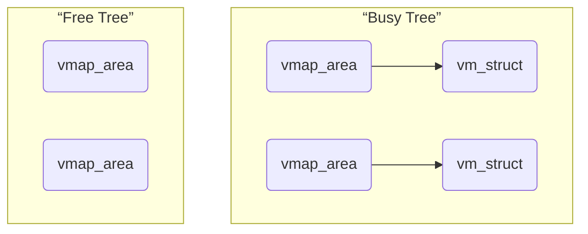

# 1、虚拟内存大纲

## 1.1、kernel space


在内核启动时可以添加日志：（我是用的linux-6.14已被移除，在linux-5.0版本包含）可以看到内核空间的虚拟内存布局：


## 1.2、user space


启动内核之后查看到某个进程的用户态虚拟内存区域布局：

```c
~ # ps
  ...
   99 0         0:00 [jbd2/ram0-8]
  100 0         0:00 [kworker/R-ext4-]
  108 0         0:00 [kworker/1:1H]
  109 0         0:00 -/bin/sh
  114 0         0:00 ps
~ # 
~ # cat /proc/109/maps
00400000-00607000 r-xp 00000000 01:00 13                                 /bin/busybox
00618000-00620000 r--p 00208000 01:00 13                                 /bin/busybox
00620000-00622000 rw-p 00210000 01:00 13                                 /bin/busybox
00622000-00629000 rw-p 00000000 00:00 0 
0e786000-0e7a8000 rw-p 00000000 00:00 0                                  [heap]
ffffa6b0f000-ffffa6b11000 r--p 00000000 00:00 0                          [vvar]
ffffa6b11000-ffffa6b13000 r-xp 00000000 00:00 0                          [vdso]
fffff677f000-fffff67a0000 rw-p 00000000 00:00 0                          [stack]
~ # 
~ # 
```

# 2、虚拟空间大小

## 2.1、空间大小示意


## 2.2、测试

1）源码

/home/xxx/test/vabits_test.c

```c
#include <linux/module.h>
#include <linux/kernel.h>
#include <linux/proc_fs.h>
#include <linux/seq_file.h>
#include <asm/sysreg.h>

#define MODULE_NAME "vabits_test"

// 用户空间和内核空间地址大小信息
struct va_space_info {
    u64 user_va_bits;
    u64 kernel_va_bits;
    u64 user_va_size;   // 用户空间大小 (bytes)
    u64 kernel_va_size; // 内核空间大小 (bytes)
};

static struct va_space_info va_info;

// 从TCR寄存器提取T0SZ/T1SZ
static void get_va_bits_from_tcr(void)
{
    u64 tcr = read_sysreg_s(SYS_TCR_EL1);
    
    // 提取T0SZ (用户空间) 和 T1SZ (内核空间)
    va_info.user_va_bits = 64 - (tcr & 0x3F);
    va_info.kernel_va_bits = 64 - ((tcr >> 16) & 0x3F);
    
    // 计算地址空间大小
    va_info.user_va_size = 1ULL << va_info.user_va_bits;
    va_info.kernel_va_size = 1ULL << va_info.kernel_va_bits;
}

// 格式化输出大数字
static void format_size(struct seq_file *m, u64 size)
{
    const char *units[] = {"B", "KB", "MB", "GB", "TB", "PB", "EB"};
    int idx = 0;
    u64 rem = 0;
    
    while (size >= 1024 && idx < 6) {
        rem = size % 1024;
        size /= 1024;
        idx++;
    }
    
    if (idx == 0) {
        seq_printf(m, "%llu %s", size, units[idx]);
    } else {
        seq_printf(m, "%llu.%03llu %s", size, (rem * 1000) / 1024, units[idx]);
    }
}

// /proc接口显示函数
static int vabits_test_proc_show(struct seq_file *m, void *v)
{
    seq_printf(m, "ARM64 Virtual Address Space Report\n");
    seq_printf(m, "==================================\n");
    
    seq_printf(m, "User Space (T0SZ):\n");
    seq_printf(m, "  Address Bits: %llu bits\n", va_info.user_va_bits);
    seq_printf(m, "  Address Space: ");
    format_size(m, va_info.user_va_size);
    seq_printf(m, "\n\n");
    
    seq_printf(m, "Kernel Space (T1SZ):\n");
    seq_printf(m, "  Address Bits: %llu bits\n", va_info.kernel_va_bits);
    seq_printf(m, "  Address Space: ");
    format_size(m, va_info.kernel_va_size);
    seq_printf(m, "\n\n");
    
    seq_printf(m, "TCR_EL1 Value: 0x%llx\n", read_sysreg_s(SYS_TCR_EL1));
    seq_printf(m, "==================================\n");
    
    return 0;
}

static int vabits_test_proc_open(struct inode *inode, struct file *file)
{
    return single_open(file, vabits_test_proc_show, NULL);
}

static const struct proc_ops vabits_test_proc_fops = {
    .proc_open = vabits_test_proc_open,
    .proc_read = seq_read,
    .proc_lseek = seq_lseek,
    .proc_release = single_release,
};

static int __init vabits_test_init(void)
{
    struct proc_dir_entry *proc_entry;
    
    printk(KERN_INFO "Initializing %s module\n", MODULE_NAME);
    
    // 获取地址空间信息
    get_va_bits_from_tcr();
    
    // 创建/proc接口
    proc_entry = proc_create("vabits_test", 0444, NULL, &vabits_test_proc_fops);
    if (!proc_entry) {
        printk(KERN_ERR "Failed to create /proc/vabits_test\n");
        return -ENOMEM;
    }
    
    printk(KERN_INFO "Created /proc/vabits_test\n");
    return 0;
}

static void __exit vabits_test_exit(void)
{
    remove_proc_entry("vabits_test", NULL);
    printk(KERN_INFO "Unloaded %s module\n", MODULE_NAME);
}

module_init(vabits_test_init);
module_exit(vabits_test_exit);

MODULE_LICENSE("GPL");
MODULE_AUTHOR("Virtual Address Bits Test");
MODULE_DESCRIPTION("ARM64 VA Space Bits Test Module");

```

2）Makefile

```makefile
KERNEL_DIR := /home/xxx/linux_old1

# 编译所有测试模块
obj-m := buddy_test.o slab_test.o kmalloc_test.o vabits_test.o

ARCH := arm64
CROSS_COMPILE := aarch64-linux-gnu-

all:
	$(MAKE) -C $(KERNEL_DIR) M=$(PWD) ARCH=$(ARCH) CROSS_COMPILE=$(CROSS_COMPILE) modules

clean:
	$(MAKE) -C $(KERNEL_DIR) M=$(PWD) ARCH=$(ARCH) CROSS_COMPILE=$(CROSS_COMPILE) clean
	rm -rf *.ko *.o *.mod* *.cmd modules.order Module.symvers .tmp_versions

# 快捷方式
buddy:
	$(MAKE) -C $(KERNEL_DIR) M=$(PWD) ARCH=$(ARCH) CROSS_COMPILE=$(CROSS_COMPILE) obj-m=buddy_test.o

slab:
	$(MAKE) -C $(KERNEL_DIR) M=$(PWD) ARCH=$(ARCH) CROSS_COMPILE=$(CROSS_COMPILE) obj-m=slab_test.o

kmalloc:
	$(MAKE) -C $(KERNEL_DIR) M=$(PWD) ARCH=$(ARCH) CROSS_COMPILE=$(CROSS_COMPILE) obj-m=kmalloc_test.o

vabits:
	$(MAKE) -C $(KERNEL_DIR) M=$(PWD) ARCH=$(ARCH) CROSS_COMPILE=$(CROSS_COMPILE) obj-m=vabits_test.o
 
help:
	@echo "Usage:"
	@echo "  make all     - Build all test modules"
	@echo "  make buddy   - Build buddy_test.ko only"
	@echo "  make slab    - Build slab_test.ko only"
	@echo "  make kmalloc - Build kmalloc_test.ko only"
	@echo "  make vabits  - Build vabits_test.ko only"
	@echo "  make clean   - Clean all build files"

```

3）编译ko、制作文件系统

同之前

4）执行

```bash
/tmp #
/tmp # ls -l vabits_test.ko 
-rw-r--r--    1 0        0            43472 Feb 20 09:53 vabits_test.ko
/tmp #
/tmp # insmod vabits_test.ko 
[   24.140425] vabits_test: loading out-of-tree module taints kernel.
[   24.149104] Initializing vabits_test module
[   24.149495] Created /proc/vabits_test
/tmp # 
/tmp # cat /proc/vabits_test
ARM64 Virtual Address Space Report
==================================
User Space (T0SZ):
  Address Bits: 48 bits
  Address Space: 256.000 TB

Kernel Space (T1SZ):
  Address Bits: 48 bits
  Address Space: 256.000 TB

TCR_EL1 Value: 0x500074b5503510
==================================
/tmp #
/tmp # rmmod vabits_test
[   62.920893] Unloaded vabits_test module
/tmp # 
/tmp # 
```

# 3、线性映射区


线性映射区的大小取决于物理内存的大小。如上图中qemu中设置了DDR RAM的大小是1GB。

```c
// arch/arm64/include/asm/memory.h

/*
 * Physical vs virtual RAM address space conversion.  These are
 * private definitions which should NOT be used outside memory.h
 * files.  Use virt_to_phys/phys_to_virt/__pa/__va instead.
 */


/*
 * Check whether an arbitrary address is within the linear map, which
 * lives in the [PAGE_OFFSET, PAGE_END) interval at the bottom of the
 * kernel's TTBR1 address range.
 */
#define __is_lm_address(addr)	(((u64)(addr) - PAGE_OFFSET) < (PAGE_END - PAGE_OFFSET))

#define __lm_to_phys(addr)	(((addr) - PAGE_OFFSET) + PHYS_OFFSET)
#define __kimg_to_phys(addr)	((addr) - kimage_voffset)

#define __virt_to_phys_nodebug(x) ({					\
	phys_addr_t __x = (phys_addr_t)(__tag_reset(x));		\
	__is_lm_address(__x) ? __lm_to_phys(__x) : __kimg_to_phys(__x);	\
})

#define __pa_symbol_nodebug(x)	__kimg_to_phys((phys_addr_t)(x))

#ifdef CONFIG_DEBUG_VIRTUAL
extern phys_addr_t __virt_to_phys(unsigned long x);
extern phys_addr_t __phys_addr_symbol(unsigned long x);
#else
#define __virt_to_phys(x)	__virt_to_phys_nodebug(x)
#define __phys_addr_symbol(x)	__pa_symbol_nodebug(x)
#endif /* CONFIG_DEBUG_VIRTUAL */

#define __phys_to_virt(x)	((unsigned long)((x) - PHYS_OFFSET) | PAGE_OFFSET)
#define __phys_to_kimg(x)	((unsigned long)((x) + kimage_voffset))

/*
 * Note: Drivers should NOT use these.  They are the wrong
 * translation for translating DMA addresses.  Use the driver
 * DMA support - see dma-mapping.h.
 */
#define virt_to_phys virt_to_phys
static inline phys_addr_t virt_to_phys(const volatile void *x)
{
	return __virt_to_phys((unsigned long)(x));
}

#define phys_to_virt phys_to_virt
static inline void *phys_to_virt(phys_addr_t x)
{
	return (void *)(__phys_to_virt(x));
}
```

在线性映射区中，VA和PA的转换是直接减去一个偏移。（如 VA = PA + offset、PA = VA - offset）

- **VA → PA**：`PA = (VA - PAGE_OFFSET) + PHYS_OFFSET`
- **PA → VA**：`VA = (PA - PHYS_OFFSET) | PAGE_OFFSET`
- **转换特点**：固定偏移量 `(PHYS_OFFSET - PAGE_OFFSET)`

其中 VA到PA使用加法、PA到VA使用或运算：

1. **数学等价性**：当`PAGE_OFFSET`低位全0时，|和+结果相同
2. **性能优化**：按位或操作在硬件上更快
3. **意图清晰**：明确表示高位+低位的组合操作

# 4、vmemmap

## 4.1、内存模型

https://lwn.net/Articles/134804/（引入稀疏内存模型）


## 4.2、SPARSEMEM_VMEMMAP方案


```c
// arch/arm64/include/asm/memory.h
/*
 * VMEMMAP_SIZE - allows the whole linear region to be covered by
 *                a struct page array
 *
 * If we are configured with a 52-bit kernel VA then our VMEMMAP_SIZE
 * needs to cover the memory region from the beginning of the 52-bit
 * PAGE_OFFSET all the way to PAGE_END for 48-bit. This allows us to
 * keep a constant PAGE_OFFSET and "fallback" to using the higher end
 * of the VMEMMAP where 52-bit support is not available in hardware.
 */
#define VMEMMAP_RANGE	(_PAGE_END(VA_BITS_MIN) - PAGE_OFFSET)
#define VMEMMAP_SIZE	((VMEMMAP_RANGE >> PAGE_SHIFT) * sizeof(struct page))
```

特点：高效、省内存


```c
// include/asm-generic/memory_model.h
/*
 * supports 3 memory models.
 */
#if defined(CONFIG_FLATMEM)

#ifndef ARCH_PFN_OFFSET
#define ARCH_PFN_OFFSET		(0UL)
#endif

#define __pfn_to_page(pfn)	(mem_map + ((pfn) - ARCH_PFN_OFFSET))
#define __page_to_pfn(page)	((unsigned long)((page) - mem_map) + \
				 ARCH_PFN_OFFSET)

#ifndef pfn_valid
static inline int pfn_valid(unsigned long pfn)
{
	/* avoid <linux/mm.h> include hell */
	extern unsigned long max_mapnr;
	unsigned long pfn_offset = ARCH_PFN_OFFSET;

	return pfn >= pfn_offset && (pfn - pfn_offset) < max_mapnr;
}
#define pfn_valid pfn_valid
#endif

#elif defined(CONFIG_SPARSEMEM_VMEMMAP)

/* memmap is virtually contiguous.  */
#define __pfn_to_page(pfn)	(vmemmap + (pfn))
#define __page_to_pfn(page)	(unsigned long)((page) - vmemmap)

#elif defined(CONFIG_SPARSEMEM)
/*
 * Note: section's mem_map is encoded to reflect its start_pfn.
 * section[i].section_mem_map == mem_map's address - start_pfn;
 */
#define __page_to_pfn(pg)					\
({	const struct page *__pg = (pg);				\
	int __sec = page_to_section(__pg);			\
	(unsigned long)(__pg - __section_mem_map_addr(__nr_to_section(__sec)));	\
})

#define __pfn_to_page(pfn)				\
({	unsigned long __pfn = (pfn);			\
	struct mem_section *__sec = __pfn_to_section(__pfn);	\
	__section_mem_map_addr(__sec) + __pfn;		\
})
#endif /* CONFIG_FLATMEM/SPARSEMEM */

/*
 * Convert a physical address to a Page Frame Number and back
 */
#define	__phys_to_pfn(paddr)	PHYS_PFN(paddr)
#define	__pfn_to_phys(pfn)	PFN_PHYS(pfn)
```

在`CONFIG_SPARSEMEM`稀疏内存模型下，`struct page`和物理页帧号(pfn)之间的转换通过内存区段(section)机制实现。以下是关键代码分析：

```c
// 内存区段结构体
struct mem_section {
	unsigned long section_mem_map;
	// ...
};
```

**page → pfn 转换 (`page_to_pfn`)**

```c
#define __page_to_pfn(pg)					\
({	const struct page *__pg = (pg);				\
	int __sec = page_to_section(__pg);			\
	(unsigned long)(__pg - __section_mem_map_addr(__nr_to_section(__sec))); \
})
```

转换步骤：

1. `page_to_section()` 从`page->flags`中提取区段ID

   `#define page_to_section(page) ((page)->flags >> SECTIONS_SHIFT)`

2. `__nr_to_section()` 通过区段ID获取`mem_section`结构

3. `__section_mem_map_addr()` 获取区段的`mem_map`基地址

4. 计算页面对基址的偏移量：`page - base_address`

5. 偏移量即为此区段内的局部pfn

**pfn → page 转换 (`pfn_to_page`)**

```c
#define __pfn_to_page(pfn)				\
({	unsigned long __pfn = (pfn);			\
	struct mem_section *__sec = __pfn_to_section(__pfn);	\
	__section_mem_map_addr(__sec) + (__pfn & SECTION_PFN_MASK); \
})
```

转换步骤：

1. `__pfn_to_section()` 通过pfn计算区段ID

   `#define __pfn_to_section(pfn) ((pfn) >> PFN_SECTION_SHIFT)`

2. 获取区段的`mem_map`基地址

3. 计算区段内的偏移量：`pfn & SECTION_PFN_MASK`

4. 基地址 + 偏移量 = `struct page`地址

**转换示例**

假设：

- 系统有2个内存区段
- 区段0：pfn 0~32767 (128MB)
- 区段1：pfn 32768~65535

**pfn → page**：

```c
pfn = 33000
区段ID = 33000 >> 15 = 1
区段内偏移 = 33000 & 0x7FFF = 232
page = section[1].mem_map + 232
```

**page → pfn**：

```c
page地址 = section[1].mem_map + 500
区段ID = section_index(page) = 1
区段内偏移 = 500
pfn = (1 << 15) + 500 = 32768 + 500 = 33268
```

# 5、PIC、I/O


# 6、fixed


fixmap机制出现就是为了在启动MMU之后，临时将需要使用的物理地址映射成虚拟地址以供使用的。

至于为什么不在启用MMU之前把所有的地址全部映射完成的原因有：

* 内核启动时通过传入的fdt来解析，此时并不知道所有的物理地址；
* 按需映射，提升性能。

## 6.1、大小

```c
// arch/arm64/include/asm/fixmap.h
#define FIXADDR_SIZE		(__end_of_permanent_fixed_addresses << PAGE_SHIFT)
#define FIXADDR_START		(FIXADDR_TOP - FIXADDR_SIZE)
```

## 6.2、类型

```c
// arch/arm64/include/asm/fixmap.h
/*
 * Here we define all the compile-time 'special' virtual
 * addresses. The point is to have a constant address at
 * compile time, but to set the physical address only
 * in the boot process.
 *
 * Each enum increment in these 'compile-time allocated'
 * memory buffers is page-sized. Use set_fixmap(idx,phys)
 * to associate physical memory with a fixmap index.
 */
enum fixed_addresses {
	FIX_HOLE,

	/*
	 * Reserve a virtual window for the FDT that is a page bigger than the
	 * maximum supported size. The additional space ensures that any FDT
	 * that does not exceed MAX_FDT_SIZE can be mapped regardless of
	 * whether it crosses any page boundary.
	 */
	FIX_FDT_END,
	FIX_FDT = FIX_FDT_END + DIV_ROUND_UP(MAX_FDT_SIZE, PAGE_SIZE) + 1,

	FIX_EARLYCON_MEM_BASE,
	FIX_TEXT_POKE0,

#ifdef CONFIG_ACPI_APEI_GHES
	/* Used for GHES mapping from assorted contexts */
	FIX_APEI_GHES_IRQ,
	FIX_APEI_GHES_SEA,
#ifdef CONFIG_ARM_SDE_INTERFACE
	FIX_APEI_GHES_SDEI_NORMAL,
	FIX_APEI_GHES_SDEI_CRITICAL,
#endif
#endif /* CONFIG_ACPI_APEI_GHES */

#ifdef CONFIG_UNMAP_KERNEL_AT_EL0
#ifdef CONFIG_RELOCATABLE
	FIX_ENTRY_TRAMP_TEXT4,	/* one extra slot for the data page */
#endif
	FIX_ENTRY_TRAMP_TEXT3,
	FIX_ENTRY_TRAMP_TEXT2,
	FIX_ENTRY_TRAMP_TEXT1,
#define TRAMP_VALIAS		(__fix_to_virt(FIX_ENTRY_TRAMP_TEXT1))
#endif /* CONFIG_UNMAP_KERNEL_AT_EL0 */
	__end_of_permanent_fixed_addresses,

	/*
	 * Temporary boot-time mappings, used by early_ioremap(),
	 * before ioremap() is functional.
	 */
#define NR_FIX_BTMAPS		(SZ_256K / PAGE_SIZE)
#define FIX_BTMAPS_SLOTS	7
#define TOTAL_FIX_BTMAPS	(NR_FIX_BTMAPS * FIX_BTMAPS_SLOTS)

	FIX_BTMAP_END = __end_of_permanent_fixed_addresses,
	FIX_BTMAP_BEGIN = FIX_BTMAP_END + TOTAL_FIX_BTMAPS - 1,

	/*
	 * Used for kernel page table creation, so unmapped memory may be used
	 * for tables.
	 */
	FIX_PTE,
	FIX_PMD,
	FIX_PUD,
	FIX_P4D,
	FIX_PGD,

	__end_of_fixed_addresses
};
```

## 6.3、early_fixmap_init

虚拟地址是固定的，物理地址可以映射过来，页表是编译时就建立好的，我们只需要填充就可以。

```c
// arch/arm64/include/asm/pgtable.h
static inline void set_pmd(pmd_t *pmdp, pmd_t pmd)
{
#ifdef __PAGETABLE_PMD_FOLDED
	if (in_swapper_pgdir(pmdp)) {
		set_swapper_pgd((pgd_t *)pmdp, __pgd(pmd_val(pmd)));
		return;
	}
#endif /* __PAGETABLE_PMD_FOLDED */

	WRITE_ONCE(*pmdp, pmd);

	if (pmd_valid(pmd)) {
		dsb(ishst);
		isb();
	}
}
```

```c
// arch/arm64/include/asm/pgalloc.h
static inline void __pmd_populate(pmd_t *pmdp, phys_addr_t ptep,
				  pmdval_t prot)
{
	set_pmd(pmdp, __pmd(__phys_to_pmd_val(ptep) | prot));
}
```

```c
// arch/arm64/mm/fixmap.c
static void __init early_fixmap_init_pte(pmd_t *pmdp, unsigned long addr)
{
	pmd_t pmd = READ_ONCE(*pmdp);
	pte_t *ptep;

	if (pmd_none(pmd)) {
		ptep = bm_pte[BM_PTE_TABLE_IDX(addr)];
		__pmd_populate(pmdp, __pa_symbol(ptep),
			       PMD_TYPE_TABLE | PMD_TABLE_AF);
	}
}

static void __init early_fixmap_init_pmd(pud_t *pudp, unsigned long addr,
					 unsigned long end)
{
	unsigned long next;
	pud_t pud = READ_ONCE(*pudp);
	pmd_t *pmdp;

	if (pud_none(pud))
		__pud_populate(pudp, __pa_symbol(bm_pmd),
			       PUD_TYPE_TABLE | PUD_TABLE_AF);

	pmdp = pmd_offset_kimg(pudp, addr);
	do {
		next = pmd_addr_end(addr, end);
		early_fixmap_init_pte(pmdp, addr);
	} while (pmdp++, addr = next, addr != end);
}


static void __init early_fixmap_init_pud(p4d_t *p4dp, unsigned long addr,
					 unsigned long end)
{
	p4d_t p4d = READ_ONCE(*p4dp);
	pud_t *pudp;

	if (CONFIG_PGTABLE_LEVELS > 3 && !p4d_none(p4d) &&
	    p4d_page_paddr(p4d) != __pa_symbol(bm_pud)) {
		/*
		 * We only end up here if the kernel mapping and the fixmap
		 * share the top level pgd entry, which should only happen on
		 * 16k/4 levels configurations.
		 */
		BUG_ON(!IS_ENABLED(CONFIG_ARM64_16K_PAGES));
	}

	if (p4d_none(p4d))
		__p4d_populate(p4dp, __pa_symbol(bm_pud),
			       P4D_TYPE_TABLE | P4D_TABLE_AF);

	pudp = pud_offset_kimg(p4dp, addr);
	early_fixmap_init_pmd(pudp, addr, end);
}


void __init early_fixmap_init(void)
{
	unsigned long addr = FIXADDR_TOT_START;
	unsigned long end = FIXADDR_TOP;

	pgd_t *pgdp = pgd_offset_k(addr);
	p4d_t *p4dp = p4d_offset_kimg(pgdp, addr);

	early_fixmap_init_pud(p4dp, addr, end);
}
```

从 early_fixmap_init 函数开始，逐层进行pud、pmd、pte的填充，最终在 set_pmd 函数中调用 WRITE_ONCE(*pmdp, pmd); 将页表项写入。

## 6.3、early_ioremap

### 6.3.1、介绍

这是对ioremap准备工作，7*256k，7个槽位，每个槽位可以接受一个早期的ioremap。

```c
// init/main.c
start_kernel
    setup_arch(&command_line);
		early_ioremap_init();
			early_ioremap_setup();
```

```c
// mm/early_ioremap.c
void __init early_ioremap_setup(void)
{
	int i;
    /*
     * 为每个槽位计算虚拟地址：
     * 1. FIX_BTMAP_BEGIN: BTMAP区域的起始固定映射索引
     * 2. NR_FIX_BTMAPS: 每个槽位的页面数（256KB/4KB=64页）
     * 3. 计算方式：从高地址向低地址分配槽位
     *    槽位0: FIX_BTMAP_BEGIN - 0*64
     *    槽位1: FIX_BTMAP_BEGIN - 1*64
     *    ...
     */
	for (i = 0; i < FIX_BTMAPS_SLOTS; i++) {
		WARN_ON_ONCE(prev_map[i]);
		slot_virt[i] = __fix_to_virt(FIX_BTMAP_BEGIN - NR_FIX_BTMAPS*i);
	}
}
```

上述函数中设置的 slot_virt 在下面使用：


```c
early_ioremap
    __early_ioremap(phys_addr, size, FIXMAP_PAGE_IO);
        prev_map[slot] = (void __iomem *)(offset + slot_virt[slot]);
        return prev_map[slot];
```

**核心目的：在启动早期提供临时内存映射**

1. **时机问题**：
   - 在内核完全初始化前（`mem_init`之前）
   - 标准`ioremap`不可用（依赖完整的内存管理子系统）
   - 但某些硬件（如串口/UART）需要立即访问
2. **解决方案**：
   - 预分配固定虚拟地址槽位（`slot_virt`）
   - 动态关联物理地址（`__early_ioremap`）


关键设计原理如下：

### 6.3.2、虚拟地址池（`slot_virt`）

```c
// 初始化槽位虚拟地址
slot_virt[i] = __fix_to_virt(FIX_BTMAP_BEGIN - NR_FIX_BTMAPS*i);
```

- **固定位置**：位于内核固定映射区域（FIXADDR空间）
- **预先分配**：启动时一次性分配所有槽位地址
- **不可变**：虚拟地址在系统生命周期中固定不变

### 6.3.3. 动态物理映射（`__early_ioremap`）

```c
/*
 * 核心早期I/O重映射函数
 * 在启动阶段将物理地址映射到预分配的虚拟地址槽位
 */
static void __init __iomem *
__early_ioremap(resource_size_t phys_addr, unsigned long size, pgprot_t prot)
{
    unsigned long offset;
    resource_size_t last_addr;
    unsigned int nrpages;
    enum fixed_addresses idx;
    int i, slot;

    // 安全验证：确保仅在启动阶段调用
    WARN_ON(system_state >= SYSTEM_RUNNING);

    /* 1：寻找可用槽位 */
    slot = -1;
    for (i = 0; i < FIX_BTMAPS_SLOTS; i++) {
        if (!prev_map[i]) {  // 槽位空闲
            slot = i;
            break;
        }
    }

    // 错误处理：无可用槽位
    if (WARN(slot < 0, "%s(%pa, %08lx) not found slot\n",
             __func__, &phys_addr, size))
        return NULL;

    /* 验证地址参数 */
    last_addr = phys_addr + size - 1;
    // 防止地址回绕和零大小
    if (WARN_ON(!size || last_addr < phys_addr))
        return NULL;

    // 记录此槽位映射的大小
    prev_size[slot] = size;

    /* 地址对齐处理 */
    offset = offset_in_page(phys_addr);  // 获取页内偏移
    phys_addr &= PAGE_MASK;              // 物理地址页对齐
    size = PAGE_ALIGN(last_addr + 1) - phys_addr;  // 计算对齐后大小

    /* 计算所需页数 */
    nrpages = size >> PAGE_SHIFT;  // 总页数 = size / PAGE_SIZE
    // 验证不超过单个槽位容量（NR_FIX_BTMAPS=64页）
    if (WARN_ON(nrpages > NR_FIX_BTMAPS))
        return NULL;

    /* 步骤2：建立页表映射 */
    idx = FIX_BTMAP_BEGIN - NR_FIX_BTMAPS*slot;  // 计算起始固定索引
    while (nrpages > 0) {
        // 根据启动阶段选择映射函数
        if (after_paging_init)
            __late_set_fixmap(idx, phys_addr, prot);  // 后期映射
        else
            __early_set_fixmap(idx, phys_addr, prot); // 早期映射
        
        phys_addr += PAGE_SIZE;  // 下一物理页
        --idx;                   // 前一固定索引
        --nrpages;               // 减少剩余页数
    }

    /* 记录映射信息 */
    WARN(early_ioremap_debug, "%s(%pa, %08lx) [%d] => %08lx + %08lx\n",
         __func__, &phys_addr, size, slot, offset, slot_virt[slot]);

    // 步骤3：计算最终虚拟地址 = 槽位基址 + 页内偏移
    prev_map[slot] = (void __iomem *)(offset + slot_virt[slot]);
    return prev_map[slot];
}

```

## 6.4、earlycon

earlycon初始化，利用了FIX_EARLYCON_MEM_BASE

```c
// drivers/tty/serial/earlycon.c
setup_earlycon
    register_earlycon(buf, match);
        if (port->mapbase)
            port->membase = earlycon_map(port->mapbase, 64);
```

```c
// drivers/tty/serial/earlycon.c
/*
 * 早期控制台内存映射函数
 * 用于在启动阶段映射串口/UART等控制台设备的物理地址
 */
static void __iomem * __init earlycon_map(resource_size_t paddr, size_t size)
{
    void __iomem *base;  // 返回的虚拟地址指针

    // 条件编译：使用固定映射机制
#ifdef CONFIG_FIX_EARLYCON_MEM
    /*
     * 步骤1：建立固定映射
     * - set_fixmap_io：设置固定IO映射
     * - FIX_EARLYCON_MEM_BASE：专用早期控制台固定映射索引
     * - paddr & PAGE_MASK：物理地址页对齐
     */
    set_fixmap_io(FIX_EARLYCON_MEM_BASE, paddr & PAGE_MASK);
    
    /*
     * 步骤2：获取固定映射虚拟基址
     * - __fix_to_virt：将固定索引转换为虚拟地址
     */
    base = (void __iomem *)__fix_to_virt(FIX_EARLYCON_MEM_BASE);
    
    /*
     * 步骤3：添加页内偏移
     * - 处理非页对齐的物理地址
     * - 示例：paddr=0x3F201004 → 基址+4字节偏移
     */
    base += paddr & ~PAGE_MASK;

// 条件编译：使用标准ioremap
#else
    /*
     * 备选方案：标准ioremap
     * - 适用于内存管理子系统已初始化的场景
     * - 注意：早期启动阶段可能不可用
     */
    base = ioremap(paddr, size);
#endif

    // 错误处理：映射失败
    if (!base)
        pr_err("%s: Couldn't map %pa\n", __func__, &paddr);

    return base;
}

```

## 6.5、FDT

dtb的映射本质就是填充了两个表项，映射了2M的大小，使用的段映射
fixmap做完后，映射设备树只读
当我们设备树映射完之后，我们可以通过虚拟地址访问设备树了，从设备树解析内存布局

```c
// init/main.c
start_kernel
    setup_arch(&command_line);
		setup_machine_fdt(__fdt_pointer);
```

```c
// arch/arm64/kernel/setup.c
/*
 * 初始化设备树(Device Tree)的核心函数
 * 负责将物理地址的设备树映射到虚拟地址，并进行基本验证
 */
static void __init setup_machine_fdt(phys_addr_t dt_phys)
{
    int size;  // 设备树实际大小
    // 步骤1：映射设备树到虚拟地址
    void *dt_virt = fixmap_remap_fdt(dt_phys, &size, PAGE_KERNEL);
    const char *name;  // 存储从设备树获取的机器名称

    // 保留设备树占用的物理内存
    if (dt_virt)
        memblock_reserve(dt_phys, size);

    /*
     * 重要注意事项：
     * dt_virt是固定映射地址，不能使用__pa(dt_virt)转换回物理地址
     * 必须直接使用原始物理地址dt_phys
     */
    // 步骤2：扫描并验证设备树
    if (!early_init_dt_scan(dt_virt, dt_phys)) {
        // 设备树验证失败处理
        pr_crit("\n"
            "Error: invalid device tree blob at physical address %pa (virtual address 0x%px)\n"
            "The dtb must be 8-byte aligned and must not exceed 2 MB in size\n"
            "\nPlease check your bootloader.",
            &dt_phys, dt_virt);

        /*
         * 在极早期阶段无法使用BUG()或oops
         * 最安全的处理是进入死循环
         * 原因：
         * 1. 避免打印未初始化数据
         * 2. 防止内存管理未就绪时的崩溃
         */
        while (true)
            cpu_relax();  // 空操作循环，等待硬件复位
    }

    /* 
     * 步骤3：重新映射为只读
     * 早期扫描完成，将设备树重新映射为只读保护
     */
    fixmap_remap_fdt(dt_phys, &size, PAGE_KERNEL_RO);

    // 步骤4：获取并打印机器型号
    name = of_flat_dt_get_machine_name();
    if (!name)
        return;  // 未找到机器名称则退出

    pr_info("Machine model: %s\n", name);  // 打印机器型号
    dump_stack_set_arch_desc("%s (DT)", name);  // 设置堆栈跟踪的架构描述
}
```

```c
// arch/arm64/mm/fixmap.c
/*
 * 设备树(FDT)重映射函数
 * 将物理地址的设备树映射到固定映射区域
 */
void *__init fixmap_remap_fdt(phys_addr_t dt_phys, int *size, pgprot_t prot)
{
    // 获取FDT固定映射的基虚拟地址
    const u64 dt_virt_base = __fix_to_virt(FIX_FDT);
    phys_addr_t dt_phys_base;  // 页对齐的物理基址
    int offset;                // 页内偏移
    void *dt_virt;             // 返回的虚拟地址

    /*
     * 步骤1：验证物理地址
     * - MIN_FDT_ALIGN必须≥8字节（保证能访问magic和size字段）
     * - 检查地址非空且满足最小对齐要求
     */
    BUILD_BUG_ON(MIN_FDT_ALIGN < 8);  // 编译时验证
    if (!dt_phys || dt_phys % MIN_FDT_ALIGN)
        return NULL;  // 无效地址

    /* 步骤2：计算对齐地址和偏移 */
    dt_phys_base = round_down(dt_phys, PAGE_SIZE);  // 物理基址页对齐
    offset = dt_phys % PAGE_SIZE;                   // 页内偏移
    dt_virt = (void *)dt_virt_base + offset;        // 最终虚拟地址 = 基址 + 偏移

    /* 
     * 步骤3：映射第一页（最小映射）
     * 目的：读取头部获取设备树总大小
     */
    create_mapping_noalloc(dt_phys_base, dt_virt_base, PAGE_SIZE, prot);

    /* 步骤4：验证设备树魔数 */
    if (fdt_magic(dt_virt) != FDT_MAGIC)  // 0xd00dfeed
        return NULL;  // 无效设备树

    /* 步骤5：获取并验证设备树大小 */
    *size = fdt_totalsize(dt_virt);  // 从设备树头部获取总大小
    if (*size > MAX_FDT_SIZE)        // 超过最大限制（通常2MB）
        return NULL;

    /*
     * 步骤6：按需扩展映射
     * 当设备树跨越多个页面时（offset + size > PAGE_SIZE）
     */
    if (offset + *size > PAGE_SIZE) {
        // 映射完整设备树区域
        create_mapping_noalloc(dt_phys_base, dt_virt_base, 
                              offset + *size, prot);
    }

    return dt_virt;  // 返回可访问的设备树虚拟地址
}
```

# 7、moudules

## 7.1、insmod一个ko文件的流程


在insmod时触发syscall，内核进入finit_module流程：


加载ko时会从modules区、vmalloc区中申请。

```c
// kernel/module/main.c
SYSCALL_DEFINE3(finit_module,
	idempotent_init_module(fd_file(f), uargs, flags);
		init_module_from_file(f, uargs, flags);
        	load_module(&info, uargs, flags);
                layout_and_allocate(info, flags);
                	move_module(info->mod, info);
```

```c
// kernel/module/main.c
// 移动模块到最终内存位置
static int move_module(struct module *mod, struct load_info *info)
{
    int i;
    enum mod_mem_type t = 0;  // 内存类型枚举
    int ret = -ENOMEM;        // 默认返回内存不足错误
    bool codetag_section_found = false;  // 标记是否找到codetag段

    // 遍历所有内存类型（代码、数据、只读数据等）
    for_each_mod_mem_type(type) {
        // 跳过大小为0的内存类型
        if (!mod->mem[type].size) {
            mod->mem[type].base = NULL;
            mod->mem[type].rw_copy = NULL;
            continue;
        }

        // 为当前内存类型分配内存
        ret = module_memory_alloc(mod, type);
        if (ret) {
            t = type;  // 记录失败的内存类型
            goto out_err;  // 跳转到错误处理
        }
    }

    // 打印最终段地址信息（调试用）
    pr_debug("Final section addresses for %s:\n", mod->name);
    
    // 遍历所有段头
    for (i = 0; i < info->hdr->e_shnum; i++) {
        void *dest;          // 目标内存地址
        Elf_Shdr *shdr = &info->sechdrs[i];  // 当前段头
        const char *sname;   // 段名
        unsigned long addr;  // 段地址

        // 跳过不需要分配内存的段，只加载 SHF_ALLOC 类型的 section
        if (!(shdr->sh_flags & SHF_ALLOC))
            continue;

        sname = info->secstrings + shdr->sh_name;  // 获取段名
        
        /*
         * 特殊处理codetag段：
         * 这些段在模块卸载后仍可能被使用
         */
        if (codetag_needs_module_section(mod, sname, shdr->sh_size)) {
            // 为codetag段分配专用内存
            dest = codetag_alloc_module_section(mod, sname, shdr->sh_size,
                    arch_mod_section_prepend(mod, i), shdr->sh_addralign);
            
            // 分配失败检查
            if (WARN_ON(!dest)) {
                ret = -EINVAL;
                goto out_err;
            }
            if (IS_ERR(dest)) {
                ret = PTR_ERR(dest);
                goto out_err;
            }
            
            addr = (unsigned long)dest;  // 记录分配地址
            codetag_section_found = true;  // 标记已找到codetag段
        } else {
            // 普通段处理：从段头提取内存类型和偏移量
            enum mod_mem_type type = shdr->sh_entsize >> SH_ENTSIZE_TYPE_SHIFT;
            unsigned long offset = shdr->sh_entsize & SH_ENTSIZE_OFFSET_MASK;
            
            // 计算目标地址（基址+偏移）
            addr = (unsigned long)mod->mem[type].base + offset;
            dest = mod->mem[type].rw_copy + offset;
        }

        // 复制非NOBITS类型的段内容（有实际数据）
        if (shdr->sh_type != SHT_NOBITS) {
            /*
             * 特殊检查：确保mod段的大小正确
             * 这是内核模块结构体的关键段
             */
            if (i == info->index.mod &&
               (WARN_ON_ONCE(shdr->sh_size != sizeof(struct module)))) {
                ret = -ENOEXEC;  // 格式错误
                goto out_err;
            }
            // 执行实际数据复制
            memcpy(dest, (void *)shdr->sh_addr, shdr->sh_size);
        }
        
        /*
         * 更新段头中的地址指向新分配的内存
         * 方便后续处理使用新地址
         */
        shdr->sh_addr = addr;
        
        // 调试输出：段地址、大小和名称
        pr_debug("\t0x%lx 0x%.8lx %s\n", (long)shdr->sh_addr,
                 (long)shdr->sh_size, info->secstrings + shdr->sh_name);
    }

    return 0;  // 成功返回

// 错误处理路径
out_err:
    // 逆向释放已分配的内存（后分配的先释放）
    for (t--; t >= 0; t--)
        module_memory_free(mod, t);
    
    // 如果分配过codetag段，需要特殊释放
    if (codetag_section_found)
        codetag_free_module_sections(mod);

    return ret;  // 返回错误码
}

```

ko文件是一个elf类型的文件，其中 Flags 为 A 类型的section就是 SHF_ALLOC 类型，即需要分配内存并拷贝的，比如下列ko文件中的：

* [ 9] .init.plt 
* [12] .rodata 
* 等等

```bash
xxx@DESKTOP-3QNUG9S ~/test
$ readelf -S vabits_test.ko 
There are 44 section headers, starting at offset 0x9ed0:

Section Headers:
  [Nr] Name              Type             Address           Offset
       Size              EntSize          Flags  Link  Info  Align
  [ 0]                   NULL             0000000000000000  00000000
       0000000000000000  0000000000000000           0     0     0
  [ 1] .text             PROGBITS         0000000000000000  00000040
       0000000000000234  0000000000000000  AX       0     0     8
  [ 2] .rela.text        RELA             0000000000000000  000061a8
       0000000000000438  0000000000000018   I      41     1     8
  [ 3] .init.text        PROGBITS         0000000000000000  00000274
       00000000000000b0  0000000000000000  AX       0     0     4
  [ 4] .rela.init.text   RELA             0000000000000000  000065e0
       0000000000000198  0000000000000018   I      41     3     8
  [ 5] .exit.text        PROGBITS         0000000000000000  00000324
       0000000000000044  0000000000000000  AX       0     0     4
  [ 6] .rela.exit.text   RELA             0000000000000000  00006778
       0000000000000090  0000000000000018   I      41     5     8
  [ 7] .codetag.all[...] PROGBITS         0000000000000480  00000368
       0000000000000000  0000000000000000   W       0     0     1
  [ 8] .plt              PROGBITS         0000000000000000  00000368
       0000000000000001  0000000000000000  AX       0     0     1
  [ 9] .init.plt         PROGBITS         0000000000000000  00000369
       0000000000000001  0000000000000000   A       0     0     1
  [10] .text.ftrace[...] PROGBITS         0000000000000000  0000036a
       0000000000000001  0000000000000000  AX       0     0     1
  [11] .rodata.str1.8    PROGBITS         0000000000000000  00000370
       00000000000001b3  0000000000000001 AMS       0     0     8
  [12] .rodata           PROGBITS         0000000000000000  00000528
       0000000000000098  0000000000000000   A       0     0     8
  [13] .rela.rodata      RELA             0000000000000000  00006808
       0000000000000108  0000000000000018   I      41    12     8
  [14] .modinfo          PROGBITS         0000000000000000  000005c0
       00000000000000a2  0000000000000000   A       0     0     1
  [15] .note.gnu.pr[...] NOTE             0000000000000000  00000668
       0000000000000020  0000000000000000   A       0     0     8
  [16] .note.gnu.bu[...] NOTE             0000000000000000  00000688
       0000000000000024  0000000000000000   A       0     0     4
  [17] .note.Linux       NOTE             0000000000000000  000006ac
       0000000000000030  0000000000000000   A       0     0     4
  [18] .bss              NOBITS           0000000000000000  000006e0
       0000000000000020  0000000000000000  WA       0     0     8
  [19] .note.GNU-stack   PROGBITS         0000000000000000  000006e0
       0000000000000000  0000000000000000           0     0     1
  [20] .comment          PROGBITS         0000000000000000  000006e0
       0000000000000084  0000000000000001  MS       0     0     1
  [21] .data             PROGBITS         0000000000000044  00000764
       0000000000000000  0000000000000000  WA       0     0     1
  [22] .exit.data        PROGBITS         0000000000000000  00000768
       0000000000000008  0000000000000000  WA       0     0     8
  [23] .rela.exit.data   RELA             0000000000000000  00006910
       0000000000000018  0000000000000018   I      41    22     8
  [24] .init.data        PROGBITS         0000000000000000  00000770
       0000000000000008  0000000000000000  WA       0     0     8
  [25] .rela.init.data   RELA             0000000000000000  00006928
       0000000000000018  0000000000000018   I      41    24     8
  [26] .gnu.linkonc[...] PROGBITS         0000000000000000  00000780
       0000000000000480  0000000000000000  WA       0     0     64
  [27] .rela.gnu.li[...] RELA             0000000000000000  00006940
       0000000000000030  0000000000000018   I      41    26     8
  [28] .debug_info       PROGBITS         0000000000000000  00000c00
       00000000000012fd  0000000000000000           0     0     1
  [29] .rela.debug_info  RELA             0000000000000000  00006970
       00000000000028f8  0000000000000018   I      41    28     8
  [30] .debug_abbrev     PROGBITS         0000000000000000  00001efd
       000000000000053e  0000000000000000           0     0     1
  [31] .debug_aranges    PROGBITS         0000000000000000  0000243b
       0000000000000090  0000000000000000           0     0     1
  [32] .rela.debug_[...] RELA             0000000000000000  00009268
       0000000000000090  0000000000000018   I      41    31     8
  [33] .debug_rnglists   PROGBITS         0000000000000000  000024cb
       000000000000003d  0000000000000000           0     0     1
  [34] .rela.debug_[...] RELA             0000000000000000  000092f8
       0000000000000060  0000000000000018   I      41    33     8
  [35] .debug_line       PROGBITS         0000000000000000  00002508
       0000000000000401  0000000000000000           0     0     1
  [36] .rela.debug_line  RELA             0000000000000000  00009358
       00000000000008d0  0000000000000018   I      41    35     8
  [37] .debug_str        PROGBITS         0000000000000000  00002909
       000000000000284e  0000000000000001  MS       0     0     1
  [38] .debug_line_str   PROGBITS         0000000000000000  00005157
       00000000000005f3  0000000000000001  MS       0     0     1
  [39] .debug_frame      PROGBITS         0000000000000000  00005750
       0000000000000108  0000000000000000           0     0     8
  [40] .rela.debug_frame RELA             0000000000000000  00009c28
       00000000000000f0  0000000000000018   I      41    39     8
  [41] .symtab           SYMTAB           0000000000000000  00005858
       00000000000006f0  0000000000000018          42    60     8
  [42] .strtab           STRTAB           0000000000000000  00005f48
       000000000000025f  0000000000000000           0     0     1
  [43] .shstrtab         STRTAB           0000000000000000  00009d18
       00000000000001b6  0000000000000000           0     0     1
Key to Flags:
  W (write), A (alloc), X (execute), M (merge), S (strings), I (info),
  L (link order), O (extra OS processing required), G (group), T (TLS),
  C (compressed), x (unknown), o (OS specific), E (exclude),
  D (mbind), p (processor specific)

xxx@DESKTOP-3QNUG9S ~/test
$ 
```

## 7.2、insmod的syscall流程

insmod 命令是 Linux 用户空间工具，属于 kmod 软件包的一部分，而不是内核源代码的一部分。

kmod软件包在：https://git.kernel.org/pub/scm/utils/kernel/kmod/kmod.git

这里我使用 [v34.2](https://git.kernel.org/pub/scm/utils/kernel/kmod/kmod.git/tag/?h=v34.2) 版本，inmod文件：

```c
// tools\insmod.c
do_insmod
    kmod_module_insert_module(mod, flags, opts);
		do_finit_module(mod, flags, args);
			finit_module(kmod_file_get_fd(mod->file), args, kernel_flags);
				syscall(__NR_finit_module, fd, uargs, flags);
```

可以看到最终调用的是 __NR_finit_module 这个syscall。

同时在linux内核中，aarch64架构下的 __NR_finit_module 对应的函数为：

```c
// include/uapi/asm-generic/unistd.h
#define __NR_finit_module 273
__SYSCALL(__NR_finit_module, sys_finit_module)
```

```c
// arch/arm64/tools/syscall_64.tbl
273	common	finit_module			sys_finit_module
```

即 finit_module 这个符号：

```c
// kernel/module/main.c
SYSCALL_DEFINE3(finit_module, int, fd, const char __user *, uargs, int, flags)
{
	int err = may_init_module();
	if (err)
		return err;

	pr_debug("finit_module: fd=%d, uargs=%p, flags=%i\n", fd, uargs, flags);

	if (flags & ~(MODULE_INIT_IGNORE_MODVERSIONS
		      |MODULE_INIT_IGNORE_VERMAGIC
		      |MODULE_INIT_COMPRESSED_FILE))
		return -EINVAL;

	CLASS(fd, f)(fd);
	if (fd_empty(f))
		return -EBADF;
	return idempotent_init_module(fd_file(f), uargs, flags);
}
```

# 8、vmalloc

## 8.1、简介


## 8.2、数据结构

struct vm_struct(vmalloc描述符)
struct vmap_area(记录在vmap_area_root中的vmalooc分配情况和vmap_area_list列表中)
内核在管理虚拟内存中的vmalloc区域时，必须跟踪哪些区域被使用，哪些是空闲的，为此定义了一
个数据结构，将所有的部分保存在一个链表中。

两者对应关系：




https://www.cnblogs.com/LoyenWang/p/11965787.html


### 8.2.1、struct vm_struct

```c
// include/linux/vmalloc.h
/*
 * 虚拟内存区域描述结构体（vm_struct）
 * 描述一个通过vmalloc分配的内存区域
 */
struct vm_struct {
    struct vm_struct    *next;      // 指向下一个vm_struct，形成链表
    void                *addr;      // 区域的起始虚拟地址
    unsigned long       size;       // 区域大小（字节）
    unsigned long       flags;      // 区域标志位（VM_ALLOC, VM_MAP等）
    struct page         **pages;    // 指向物理页描述符数组的指针
#ifdef CONFIG_HAVE_ARCH_HUGE_VMALLOC
    unsigned int        page_order; // 大页分配时的阶数（2^page_order个页面）
#endif
    unsigned int        nr_pages;   // 区域包含的页面数量
    phys_addr_t         phys_addr;  // 物理地址（用于ioremap等物理映射）
    const void          *caller;    // 分配该区域的调用者地址（调试用）
};
```

### 8.2.2、struct vmap_area

```c
// include/linux/vmalloc.h
/*
 * 虚拟地址映射区域描述结构体（vmap_area）
 * 管理vmalloc地址空间的分配单元
 */
struct vmap_area {
    unsigned long va_start;   // 区域起始地址（包含）
    unsigned long va_end;     // 区域结束地址（不包含）
    
    // 红黑树节点：按地址排序，用于快速查找
    struct rb_node rb_node;   /* address sorted rbtree */
    // 链表节点：按地址排序
    struct list_head list;    /* address sorted list */
    
    /*
     * 联合体：根据区域状态复用存储空间
     * 区域只能是以下两种状态之一：
     *  1. 空闲状态（在free_vmap_area_root树中）
     *  2. 占用状态（在vmap_area_root树中）
     */
    union {
        unsigned long subtree_max_size; // 在"free"树中使用：子树中最大空闲块大小
        struct vm_struct *vm;           // 在"busy"树中使用：指向关联的vm_struct
    };
    unsigned long flags;      // 区域标志（标记vm_map_ram区域的类型）
};
```

## 8.3、初始化

```c
// init/main.c
start_kernel
	mm_core_init();
		vmalloc_init();
```

```c
// mm/vmalloc.c
/*
 * vmalloc子系统初始化函数
 * 在内核启动过程中调用，负责初始化vmalloc所需的各种数据结构
 */
void __init vmalloc_init(void)
{
    struct shrinker *vmap_node_shrinker;  // 用于内存回收的shrinker
    struct vmap_area *va;                 // 虚拟地址区域指针
    struct vmap_node *vn;                 // vmap节点指针
    struct vm_struct *tmp;                // 临时vm_struct指针
    int i;                                // 循环计数器

    /*
     * 创建vmap_area对象的SLAB缓存
     * SLAB_PANIC表示分配失败时内核panic
     */
    vmap_area_cachep = KMEM_CACHE(vmap_area, SLAB_PANIC);

    /* 遍历每个可能的CPU核心 */
    for_each_possible_cpu(i) {
        struct vmap_block_queue *vbq;  // 每个CPU的vmap块队列
        struct vfree_deferred *p;      // 延迟释放结构

        /* 初始化当前CPU的vmap_block_queue */
        vbq = &per_cpu(vmap_block_queue, i);
        spin_lock_init(&vbq->lock);    // 初始化自旋锁
        INIT_LIST_HEAD(&vbq->free);    // 初始化空闲链表
        
        /* 初始化当前CPU的延迟释放机制 */
        p = &per_cpu(vfree_deferred, i);
        init_llist_head(&p->list);     // 初始化链表头
        INIT_WORK(&p->wq, delayed_vfree_work);  // 初始化延迟释放工作队列
        xa_init(&vbq->vmap_blocks);    // 初始化vmap块的xarray
    }

    /* 
     * 设置vmap节点
     * 为NUMA系统准备节点结构
     */
    vmap_init_nodes();

    /* 
     * 导入现有的vmlist条目
     * vmlist是早期启动阶段分配的vmalloc区域的链表
     */
    for (tmp = vmlist; tmp; tmp = tmp->next) {
        /* 分配新的vmap_area对象 */
        va = kmem_cache_zalloc(vmap_area_cachep, GFP_NOWAIT);
        if (WARN_ON_ONCE(!va))  // 分配失败警告
            continue;

        /* 填充vmap_area信息 */
        va->va_start = (unsigned long)tmp->addr;  // 起始地址
        va->va_end = va->va_start + tmp->size;    // 结束地址
        va->vm = tmp;  // 关联vm_struct

        /* 找到对应的vmap节点 */
        vn = addr_to_node(va->va_start);
        /* 将新区块插入到busy树中 */
        insert_vmap_area(va, &vn->busy.root, &vn->busy.head);
    }

    /*
     * 初始化空闲空间管理
     * 构建空闲区域的RB树
     */
    vmap_init_free_space();
    
    /* 标记vmalloc子系统已完成初始化 */
    vmap_initialized = true;

    /*
     * 创建并注册vmap节点的shrinker
     * 用于内存压力下的自动回收
     */
    vmap_node_shrinker = shrinker_alloc(0, "vmap-node");
    if (!vmap_node_shrinker) {
        pr_err("Failed to allocate vmap-node shrinker!\n");
        return;
    }
    
    /* 设置shrinker的回调函数 */
    vmap_node_shrinker->count_objects = vmap_node_shrink_count;
    vmap_node_shrinker->scan_objects = vmap_node_shrink_scan;
    
    /* 向内核注册shrinker */
    shrinker_register(vmap_node_shrinker);
}

```


## 8.4、分配函数

```c
// include/linux/vmalloc.h
#define vmalloc(...)		alloc_hooks(vmalloc_noprof(__VA_ARGS__))
```

```c
// mm/vmalloc.c


void *__vmalloc_node_noprof(unsigned long size, unsigned long align,
			    gfp_t gfp_mask, int node, const void *caller)
{
	return __vmalloc_node_range_noprof(size, align, VMALLOC_START, VMALLOC_END,
				gfp_mask, PAGE_KERNEL, 0, node, caller);
}

void *vmalloc_noprof(unsigned long size)
{
	return __vmalloc_node_noprof(size, 1, GFP_KERNEL, NUMA_NO_NODE,
				__builtin_return_address(0));
}
EXPORT_SYMBOL(vmalloc_noprof);
```

__vmalloc_node_range_noprof 这里传入的 就是vmalloc区域的地址范围[VMALLOC_START, VMALLOC_END]

```c
// arch/arm64/include/asm/pgtable.h
/*
 * VMALLOC range.
 *
 * VMALLOC_START: beginning of the kernel vmalloc space
 * VMALLOC_END: extends to the available space below vmemmap
 */
#define VMALLOC_START		(MODULES_END)
#if VA_BITS == VA_BITS_MIN
#define VMALLOC_END		(VMEMMAP_START - SZ_8M)
#else
#define VMEMMAP_UNUSED_NPAGES	((_PAGE_OFFSET(vabits_actual) - PAGE_OFFSET) >> PAGE_SHIFT)
#define VMALLOC_END		(VMEMMAP_START + VMEMMAP_UNUSED_NPAGES * sizeof(struct page) - SZ_8M)
#endif
```

```c
// mm/vmalloc.c
/**
 * __vmalloc_node_range - 分配虚拟连续内存
 * @size:          分配大小
 * @align:         期望的对齐方式
 * @start:         VM区域起始地址
 * @end:           VM区域结束地址
 * @gfp_mask:      页分配器标志
 * @prot:          分配页的保护掩码
 * @vm_flags:      额外的VM区域标志（如%VM_NO_GUARD）
 * @node:          用于分配的NUMA节点或NUMA_NO_NODE
 * @caller:        调用者返回地址
 *
 * 从页分配器分配足够覆盖@size的页面，映射到连续的虚拟地址空间。
 * 注意：仅支持部分gfp标志：
 *  支持：GFP_KERNEL、GFP_NOFS、GFP_NOIO
 *  不支持：区域修饰符
 *  回收修饰符：仅支持__GFP_NOFAIL（不支持GFP_NOWAIT）
 *
 * 返回：分配区域的地址，失败时返回%NULL
 */
void *__vmalloc_node_range_noprof(unsigned long size, unsigned long align,
            unsigned long start, unsigned long end, gfp_t gfp_mask,
            pgprot_t prot, unsigned long vm_flags, int node,
            const void *caller)
{
    struct vm_struct *area;   // 虚拟内存区域描述符
    void *ret;                // 返回地址
    kasan_vmalloc_flags_t kasan_flags = KASAN_VMALLOC_NONE;  // KASAN标志
    unsigned long real_size = size;  // 原始请求大小
    unsigned long real_align = align;  // 原始对齐要求
    unsigned int shift = PAGE_SHIFT;  // 页大小移位（默认4K）

    /* 安全检查：禁止零大小分配 */
    if (WARN_ON_ONCE(!size))
        return NULL;

    /* 检查请求是否超过总物理内存 */
    if ((size >> PAGE_SHIFT) > totalram_pages()) {
        warn_alloc(gfp_mask, NULL,
            "vmalloc error: size %lu, exceeds total pages",
            real_size);
        return NULL;
    }

    /*
     * 大页分配支持
     * 当启用大页映射且设置VM_ALLOW_HUGE_VMAP标志时尝试
     */
    if (vmap_allow_huge && (vm_flags & VM_ALLOW_HUGE_VMAP)) {
        /*
         * 尝试使用PMD级大页（2MB）的条件：
         * 1. 架构支持PMD映射
         * 2. 大小至少为PMD_SIZE（2MB）
         */
        if (arch_vmap_pmd_supported(prot) && size >= PMD_SIZE)
            shift = PMD_SHIFT;  // 使用2MB页
        else
            shift = arch_vmap_pte_supported_shift(size);  // 架构特定的页大小

        /* 调整对齐和大小为选定页大小的整数倍 */
        align = max(real_align, 1UL << shift);
        size = ALIGN(real_size, 1UL << shift);
    }

/* 重试标签：分配失败时可能回到这里 */
again:
    /*
     * 1、获取虚拟内存区域
     * 关键参数：
     *   VM_ALLOC | VM_UNINITIALIZED - 标准vmalloc分配，未初始化
     *   start, end - 允许的地址范围
     */
    area = __get_vm_area_node(real_size, align, shift, VM_ALLOC |
                  VM_UNINITIALIZED | vm_flags, start, end, node,
                  gfp_mask, caller);
    if (!area) {
        bool nofail = gfp_mask & __GFP_NOFAIL;  // 是否允许失败
        warn_alloc(gfp_mask, NULL,
            "vmalloc error: size %lu, vm_struct allocation failed%s",
            real_size, (nofail) ? ". Retrying." : "");
        /* 当设置了__GFP_NOFAIL时重试 */
        if (nofail) {
            schedule_timeout_uninterruptible(1);  // 等待1jiffy
            goto again;  // 重试分配
        }
        goto fail;  // 跳转到失败处理
    }

    /*
     * KASAN内存标记处理
     * 仅当保护为PAGE_KERNEL时处理
     */
    if (pgprot_val(prot) == pgprot_val(PAGE_KERNEL)) {
        /* 硬件标签支持 */
        if (kasan_hw_tags_enabled()) {
            /* 修改保护位以允许标记 */
            prot = arch_vmap_pgprot_tagged(prot);
            
            /* 跳过页分配器中的毒化和清零 */
            gfp_mask |= __GFP_SKIP_KASAN | __GFP_SKIP_ZERO;
        }
        /* 标记映射为PAGE_KERNEL类型 */
        kasan_flags |= KASAN_VMALLOC_PROT_NORMAL;
    }

    /* 2、核心步骤：分配物理页并映射到vmalloc空间 */
    ret = __vmalloc_area_node(area, gfp_mask, prot, shift, node);
    if (!ret)
        goto fail;  // 分配失败

    /*
     * KASAN相关处理：标记页面可访问
     * 根据条件设置额外的KASAN标志
     */
    kasan_flags |= KASAN_VMALLOC_VM_ALLOC;
    if (!want_init_on_free() && want_init_on_alloc(gfp_mask) &&
        (gfp_mask & __GFP_SKIP_ZERO))
        kasan_flags |= KASAN_VMALLOC_INIT;
    
    /* 对分配的内存进行KASAN去毒化处理 */
    area->addr = kasan_unpoison_vmalloc(area->addr, real_size, kasan_flags);

    /* 清除VM_UNINITIALIZED标志，表示区域已完全初始化 */
    clear_vm_uninitialized_flag(area);

    /* 大小页面对齐 */
    size = PAGE_ALIGN(size);
    /* 除非指定延迟处理，否则报告给kmemleak */
    if (!(vm_flags & VM_DEFER_KMEMLEAK))
        kmemleak_vmalloc(area, size, gfp_mask);

    return area->addr;  // 返回分配地址

/* 失败处理路径 */
fail:
    /* 如果之前尝试了大页分配，回退到标准4K页重试 */
    if (shift > PAGE_SHIFT) {
        shift = PAGE_SHIFT;  // 回退到4K页
        align = real_align;  // 恢复原始对齐
        size = real_size;    // 恢复原始大小
        goto again;          // 用较小页重试
    }

    return NULL;  // 最终失败返回NULL
}

```

关键步骤有两个：

* 1、获取虚拟内存区域：__get_vm_area_node
* 2、分配物理页并映射到vmalloc空间：__vmalloc_area_node


## 8.5、思考

为什么不直接使用struct vmap_area关联struct page结构体，而是再封装一层struct vm_struct来关联struct page？

**设计对比：合并 vs 分离**

| 方面           | 合并方案 (vmap_area 直接管理 page) | 当前分离方案       |
| -------------- | ---------------------------------- | ------------------ |
| **内存开销**   | 每个 vmap_area 都需 page 指针      | 空闲区域无额外开销 |
| **代码复杂度** | 需处理多种内存类型的条件判断       | 职责清晰分离       |
| **性能**       | 物理页分配阻塞地址空间操作         | 地址空间分配无阻塞 |
| **灵活性**     | 难以支持新的内存类型               | 易于扩展新功能     |
| **NUMA 优化**  | 地址和物理页绑定同一节点           | 可分别优化         |

**结论**

这种设计是 Linux 内核经过长期演化的结果，它：

1. **优化内存使用**：通过联合体节省大量内存
2. **提高性能**：地址空间分配不受物理页分配影响
3. **增强扩展性**：支持多种内存映射类型
4. **简化维护**：清晰的职责分离降低代码复杂度
5. **支持高级特性**：如延迟释放、NUMA优化等

虽然增加了一层间接性，但在处理复杂的内存管理场景时，这种分离设计带来的优势远远超过了微小的性能开销，是工程实践中典型的"以空间换清晰度"的优化策略。
