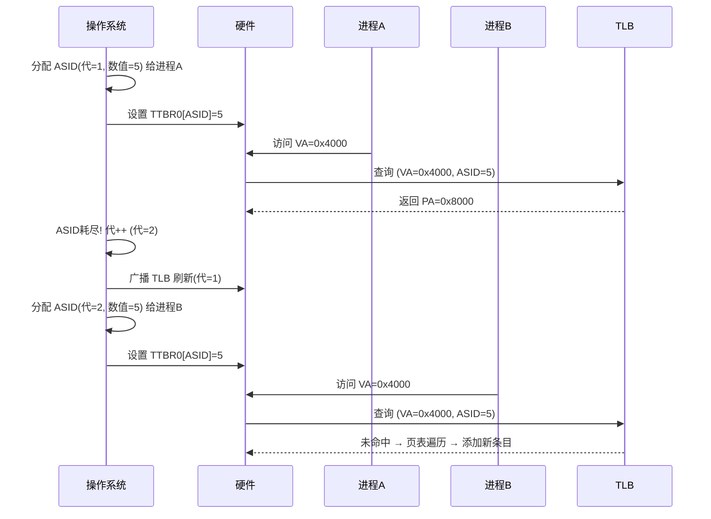
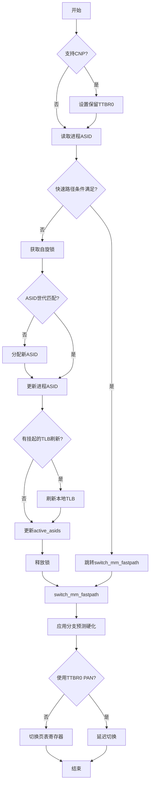
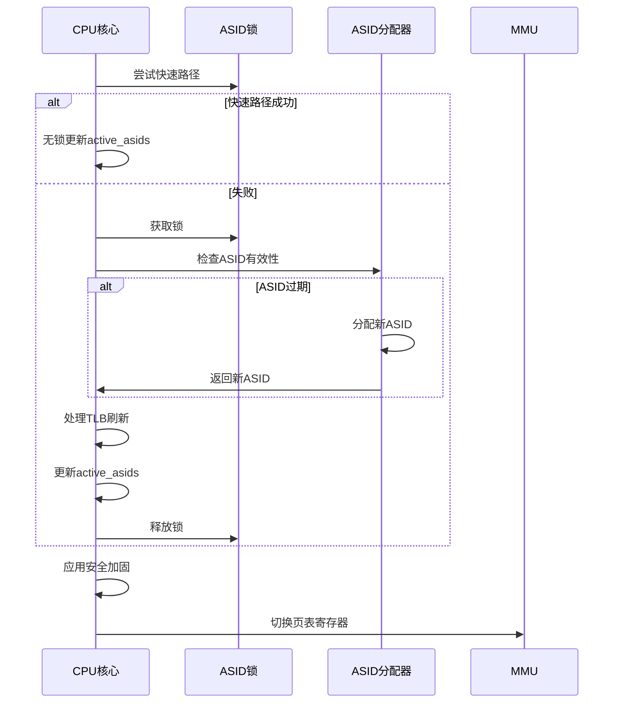

# 1、MMU-TLB


## 1.1、TLB的基本定义和作用


## 1.2、TLB的工作流程


## 1.3、TLB条目内容


## 1.4、TLB Flush在aarch64上的实现


## 1.5、TLB Flush aarch64 kernel接口

```java
// arch/arm64/include/asm/tlbflush.h
#define __TLBI_0(op, arg) asm (ARM64_ASM_PREAMBLE			       \
			       "tlbi " #op "\n"				       \
		   ALTERNATIVE("nop\n			nop",		       \
			       "dsb ish\n		tlbi " #op,	       \
			       ARM64_WORKAROUND_REPEAT_TLBI,		       \
			       CONFIG_ARM64_WORKAROUND_REPEAT_TLBI)	       \
			    : : )

#define __TLBI_1(op, arg) asm (ARM64_ASM_PREAMBLE			       \
			       "tlbi " #op ", %0\n"			       \
		   ALTERNATIVE("nop\n			nop",		       \
			       "dsb ish\n		tlbi " #op ", %0",     \
			       ARM64_WORKAROUND_REPEAT_TLBI,		       \
			       CONFIG_ARM64_WORKAROUND_REPEAT_TLBI)	       \
			    : : "r" (arg))
```


### 1,5,1、__TLBI_0(op, arg)


### 1.5.2、__TLBI_1(op, arg) 


# 2、MMU-ASID

## 2.1、为什么会有ASID


## 2.2、ASID长度和存放位置


以上的 ID_AA64MMFR0_EL1 寄存器的bits[7:4] 用来表示ASID的位数：

* 0b0000 表示ASID为8位
* 0b0010 表示ASID为16位


以上的 TCR_EL1寄存器bit[36] 用来选择ASID的位数：

* 0b0000 表示ASID为8位
* 0b0010 表示ASID为16位

## 2.3、ASID内核实现

### 2.3.1、相关变量

```c
// arch/arm64/mm/context.c
static u32 asid_bits;  // 当前系统支持的ASID（地址空间ID）位数
static DEFINE_RAW_SPINLOCK(cpu_asid_lock);  // 保护ASID分配的自旋锁（原始版本，无抢占）

static atomic64_t asid_generation;  // ASID代号的全局原子计数器（64位）
static unsigned long *asid_map;     // ASID分配位图指针

// 每CPU变量：当前CPU上活跃的ASID（包含代信息）
static DEFINE_PER_CPU(atomic64_t, active_asids);
// 每CPU变量：为前CPU保留的ASID（用于ASID回绕处理）
static DEFINE_PER_CPU(u64, reserved_asids);
// CPU掩码：记录需要TLB刷新的CPU集合
static cpumask_t tlb_flush_pending;
```


### 2.3.2、ASID结构

```bash
+------------------------+---------------------+
|       代 (Generation)   |    数值 (ASID Index) |
+------------------------+---------------------+
|    64 - asid_bits 位    |    asid_bits 位     |
+------------------------+---------------------+
```

示例 (8位 ASID 系统)：

```bash
0x00000001_00000101  // 第1代，ASID数值=5
0x00000002_00000101  // 第2代，ASID数值=5（相同数值，不同代）
```

Generation 和 ASID Index 工作流程示意图：



### 2.3.2、ASID分配器初始化

```c
start_kernel
    early_initcall
    	asids_init // 使用 early_initcall(asids_init); 注册
```

```c
// arch/arm64/mm/context.c
/* ASID 分配系统初始化函数 */
static int asids_init(void)
{
    // 获取 CPU 支持的 ASID 位数（通常为8或16位）
    asid_bits = get_cpu_asid_bits();
    
    // 初始化 ASID 代计数器为第一个版本
    atomic64_set(&asid_generation, ASID_FIRST_VERSION);
    
    // 分配 ASID 位图（每个位表示一个 ASID 的分配状态）
    asid_map = bitmap_zalloc(NUM_USER_ASIDS, GFP_KERNEL);
    if (!asid_map)
        // 分配失败导致内核恐慌（无法继续）
        panic("Failed to allocate bitmap for %lu ASIDs\n",
              NUM_USER_ASIDS);

    // 为内核 ASID 分配位图（KPTI 使用）
    pinned_asid_map = bitmap_zalloc(NUM_USER_ASIDS, GFP_KERNEL);
    // 初始化为没有固定 ASID
    nr_pinned_asids = 0;

    /*
     * 注意：我们不能在此处调用 set_reserved_asid_bits()
     * 因为 CPU 特性尚未完全确定。
     * 
     * 安全起见，假设启用 KPTI（内核页表隔离）
     * 并从一开始就保留内核 ASID
     */
    if (IS_ENABLED(CONFIG_UNMAP_KERNEL_AT_EL0))
        // 设置 KPTI 相关的 ASID 位
        set_kpti_asid_bits(asid_map);
    
    return 0;  // 初始化成功
}

```

### 2.3.3、init_new_context

fork时初始化ASID

```c
kernel_clone
	copy_process
    	copy_mm(clone_flags, p);
			dup_mm(tsk, current->mm);
				mm_init(mm, tsk, mm->user_ns)
                    init_new_context(p, mm)
```

```c
// arch/arm64/include/asm/mmu_context.h
#define init_new_context(tsk, mm) init_new_context(tsk, mm)
static inline int init_new_context(struct task_struct *tsk, struct mm_struct *mm)
{
	atomic64_set(&mm->context.id, 0);
	refcount_set(&mm->context.pinned, 0);

	/* pkey 0 is the default, so always reserve it. */
	mm->context.pkey_allocation_map = BIT(0);

	return 0;
}
```

### 2.3.4、check_and_switch_context

```c
__schedule // 内核进行Task调度时
    context_switch(rq, prev, next, &rf);
		switch_mm_irqs_off(prev->active_mm, next->mm, next);
			switch_mm
                __switch_mm(next);
					check_and_switch_context(next); 	
```

其中

```java
// include/linux/mmu_context.h
/* Architectures that care about IRQ state in switch_mm can override this. */
#ifndef switch_mm_irqs_off
# define switch_mm_irqs_off switch_mm
#endif
```

检查当前进程的ASID是否有效，果需要则分配新的ASID，并切换到目标进程的内存映射上下文。

* 6、进程切换时分配ASID new_context
* 7、ASID分配满之后刷tib local_flush_tIb_all
* 11、切换地址空间 cpu_switch_mm

其中 check_and_switch_context 函数：

```c
// arch/arm64/mm/context.c
/* 检查并切换进程上下文（内存地址空间） */
void check_and_switch_context(struct mm_struct *mm)
{
    unsigned long flags;
    unsigned int cpu;
    u64 asid, old_active_asid;  // ASID：地址空间标识符

    /* 1. 如果系统支持 CNP（Common Not Private 特性），设置保留的 TTBR0 */
    if (system_supports_cnp())
        cpu_set_reserved_ttbr0();

    /* 2. 获取当前进程的 ASID */
    asid = atomic64_read(&mm->context.id);

    /*
     * 3. 快速路径检查：尝试无锁切换
     * 条件：
     *   a) 当前CPU有活跃的ASID
     *   b) 进程ASID与当前世代匹配
     *   c) 原子比较交换成功更新active_asids
     */
    old_active_asid = atomic64_read(this_cpu_ptr(&active_asids));
    if (old_active_asid && asid_gen_match(asid) &&
        atomic64_cmpxchg_relaxed(this_cpu_ptr(&active_asids),
                     old_active_asid, asid))
        goto switch_mm_fastpath;  // 满足条件则跳过快路径

    /* 4. 慢速路径：需要加锁处理 */
    raw_spin_lock_irqsave(&cpu_asid_lock, flags);
    
    /* 5. 重新检查ASID是否过期（获取锁后） */
    asid = atomic64_read(&mm->context.id);
    if (!asid_gen_match(asid)) {
        /* 6. ASID已过期：分配新ASID */
        asid = new_context(mm);
        atomic64_set(&mm->context.id, asid);
    }

    /* 7. 处理挂起的TLB刷新 */
    cpu = smp_processor_id();
    if (cpumask_test_and_clear_cpu(cpu, &tlb_flush_pending))
        local_flush_tlb_all();  // 刷新当前CPU的TLB

    /* 8. 更新当前CPU的活跃ASID */
    atomic64_set(this_cpu_ptr(&active_asids), asid);
    raw_spin_unlock_irqrestore(&cpu_asid_lock, flags);

/* 9. 公共路径：执行实际的内存管理单元切换 */
switch_mm_fastpath:

    /* 10. 应用分支预测硬化（Spectre缓解） */
    arm64_apply_bp_hardening();

    /*
     * 11. 切换页表寄存器
     * 注意：当模拟PAN（特权访问永不）时，延迟到uaccess_enable()
     */
    if (!system_uses_ttbr0_pan())
        cpu_switch_mm(mm->pgd, mm);  // 设置TTBR0寄存器
}
```




